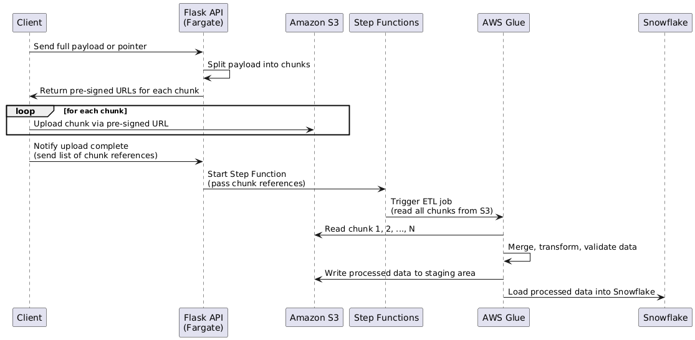

# Caso-3-Diseno-de-Software

Members: Pablo Mesén, Alonso Durán Muñoz, Ana Hernández Muñoz, Jesus Valverde


# INDEX
- [DESCRIPTION](#DESCRIPTION)
- [STRATEGY AND PLANNING](#STRATEGY-AND-PLANNING)
- [DEFINITION OF REQUIREMENTS](#DEFINITION-OF-REQUIREMENTS)
- [SYSTEM ANALYSIS](#SYSTEM-ANALYSIS)
- [LEGAL AND REGULATORY FRAMEWORK](#LEGAL-AND-REGULATORY-FRAMEWORK)
- [STACK](#STACK)


# DESCRIPTION

# STRATEGY AND PLANNING
## Roadmap


## Milestones
- M1: Validated architecture

- M2: Core technical infrastructure deployed (data lake, backend, encryption)

- M3: Secure user registration system with advanced validation and IP control

- M4: First datasets published with granular control, metadata, and pricing

- M5: AI-powered, non-downloadable data exploration dashboards operational

- M6: Ecosystem validated through security audits and regulatory compliance

- M7: 10+ integrated institutions, 100+ active datasets, first monetization revenue

## Technical Team

| **Role**                  | **Quantity** | **Responsibilities**                                                       |
|---------------------------|--------------|-----------------------------------------------------------------------------|
| Cloud Solutions Architect | 1            | Designs cloud infrastructure, security, scalability                        |
| DevOps Engineers          | 2            | Deployment automation, CI/CD, versioning                                   |
| Backend Developers        | 3            | API development, encryption, access control, authentication                |
| Frontend Developers       | 2            | User portals (registration, dashboards, admin interface)                   |
| Security Specialists      | 2            | Key management, MFA, audits, legal compliance                              |
| AI & ETDL Specialists     | 2            | Document validation, data flow automation, AI dashboards                   |
| Data Engineers            | 2            | Modeling, metadata, data quality                                           |
| Product Manager           | 1            | Agile delivery coordination, documentation                                 |
| UI/UX Designer            | 1            | Portal and backoffice interface design                                     |
| Legal & Compliance Advisor| 1            | Legal analysis, data protection, IP/data ownership                         |
## UX Journeys


##  Risks Assesment 
| ID  | Risk Description                                                              | Likelihood | Impact   | Risk Level | Control/Mitigation Measures                                                    | Owner                |
|-----|----------------------------------------------------------------------------------|------------|----------|------------|----------------------------------------------------------------------------------|----------------------|
| R1  | Failure in biometric identity validation due to poor image/document quality     | Medium     | High     | **High**   | Implement quality filters, retry mechanism, and fallback to manual validation   | DevOps / Identity    |
| R2  | Unauthorized access due to improper IP restriction configuration                | Low        | High     | **Medium** | Enforce IP whitelist checks, automate validation tests on deploy                | Security Team        |
| R3  | Data breach of confidential datasets marked as “restricted”                     | Low        | Critical | **High**   | Encrypt at rest with AWS KMS, enable row-level access policies in Snowflake     | Security / Infra     |
| R4  | Misuse of uploaded datasets due to incorrect permissioning                      | Medium     | High     | **High**   | Create permission configuration wizard with preview and rollback                | Data Engineering     |
| R5  | System downtime during batch ingestion or data validation                       | Medium     | Medium   | **Medium** | Queue-based ingestion (SQS), retry logic, alerting via EventBridge              | Platform Ops         |
| R6  | Reputational damage due to publication of inaccurate or unverified data         | Medium     | High     | **High**   | Enforce ML validation and mandatory manual QA for public datasets               | Data Governance      |
| R7  | Frustration due to poor UX in uploading or dashboarding tools                   | High       | Medium   | **Medium** | Add progress indicators, previews, guided steps and clear errors                | UX / Frontend Team   |
| R8  | Breach of user personal data from onboarding                                    | Low        | Critical | **High**   | Encrypted transmission, audit logs, token masking, PII redaction                | Infra / Security     |
| R9  | Regulatory non-compliance                                                       | Low        | Critical | **High**   | Regular audits, privacy policy updates, DPIA documentation                      | Legal / Compliance   |
| R10 | Excessive cost due to inefficient cloud resource usage                          | Medium     | Medium   | **Medium** | Cost monitoring dashboards, job timeouts, quotas                                | Cloud FinOps         |

#### Likelihood
- **Low**: Rare or unlikely to occur  
- **Medium**: Could occur occasionally under certain conditions  
- **High**: Expected to occur frequently  

#### Impact
- **Medium**: Moderate disruption, user complaints, minor SLA breach  
- **High**: Major disruption, sensitive data exposure, trust loss  
- **Critical**: Legal implications, national-level breach, irreversible damage
## Code, CI/CD, and Cloud Deployment Practices
The team must use Git as the version control system, with repositories hosted on GitHub.
The following branching model must be implemented based on Git Flow:
### 1.1 Git Flow Branching Strategy

| Branch        | Purpose                                 | Merges into           | Created from         |
|---------------|------------------------------------------|------------------------|-----------------------|
| `main`        | Stable code in production                | –                      | `release/*`, `hotfix/*` |
| `develop`     | Development and integration branch       | `release/*`            | `feature/*`           |
| `feature/*`   | New features or enhancements             | `develop`              | `develop`             |
| `release/*`   | Prepares code for production release     | `main` and `develop`   | `develop`             |
| `hotfix/*`    | Urgent fixes applied to production       | `main` and `develop`   | `main`      

### 1.2 Commit Message Convention

All commit messages must follow a standardized structure for clarity and traceability:

<type>(component): short description in present tense

# Examples:
feat(api): add validation to donation endpoint
fix(auth): resolve login timeout issue
chore(ci): update deployment script for staging

The development team must use the following commit types for consistency and clarity in version control:

| Type      | Description                           |
|-----------|---------------------------------------|
| `feat`    | New feature                           |
| `fix`     | Bug fix                               |
| `docs`    | Documentation changes                 |
| `style`   | Formatting only (no code logic change)|
| `refactor`| Code restructuring (no behavior change)|
| `test`    | Adding or updating tests              |
| `chore`   | Maintenance tasks, tooling, CI/CD     |

## 2. Coding Standards

All code must follow predefined standards to ensure readability, consistency, and quality.

### 2.1 Frontend (React)

- Use Prettier for automatic formatting
- Use React Testing Library for testing
- Components: PascalCase
- Variables/Functions: camelCase
- Avoid inline styles; use TailwindCSS or component-scoped styles

### 2.2 Backend (Python)

- Use Black for formatting
- Linting: Pylint 
- Testing: pytest
- Validate APIs using OpenAPI specifications

### 2.3 Database

### 2.3 Database (Snowflake and Amazon S3)

- Snowflake models and tables must include data quality tests such as uniqueness, not_null constraints, and referential integrity validations, implemented via Snowflake tasks.
- Use clear naming conventions and prefixes for Snowflake objects:
  - `stg_` for staging tables (raw data imported from sources)
  - `dim_` for dimension tables (reference data)
  - `fct_` for fact tables (transactional or measurable data)
- All Snowflake object names (tables, schemas, views, columns) must use snake_case naming conventions.
- Data stored in Amazon S3 must follow a clear folder and file naming structure aligned with project requirements, including environment and date partitions (`s3://bucket-name/project/env/date=YYYY-MM-DD/`).
- When ingesting data from S3 into Snowflake, ensure data formats are consistent, with schemas enforced via Snowflake external tables or COPY commands with file format definitions.

## 3. Pull Requests and Code Review

Every change must be reviewed through a pull request (PR):

- All PRs must be based on a feature, hotfix, or release branch
- At least one approval is required before merging
- All checks must pass (CI, linting, tests)
- PR descriptions must explain what was changed and why
- Screenshots or test output must be included for UI or API changes
- Large PRs must be split into smaller, manageable commits

## 4. Continuous Integration (CI)

GitHub Actions must be configured for CI on every pull request to `develop` or `main`.

### CI Pipeline Steps

- Checkout repository
- Install dependencies
- Run linters
- Execute unit and integration tests

## 5. Continuous Deployment (CD)

Automatic deployments must be configured for both staging and production environments using GitHub Actions.

| Environment | Branch  | Trigger                | Requires Approval |
|-------------|---------|------------------------|-------------------|
| staging     | develop | Push to develop        | No                |
| production  | main    | Merge or manual trigger| Yes               |

Deployment must include steps for:

- Environment variable injection
- Health checks post-deployment
- Rollback mechanism in case of failure


## Comprehensive Strategy
## KPIs and Metrics

KPIs: System availability (≥99.9%), query latency (<200ms), error rate (<0.1%), data ingestion time (<2 min), security compliance (100%), active datasets (≥100), user satisfaction (≥4.5), recovery time (<2 hours).


Data Collection: CloudWatch logs availability, latency, and errors; Snowflake tracks queries and datasets; S3/Snowpipe measures ingestion; Okta logs authentication; surveys capture satisfaction; WAF/KMS monitor security—all in real-time or per event.

Calculation Methods: Availability = uptime/total time (M2); latency = P95 query time (M5); error rate = failed/total requests (M1); ingestion time = processing duration (M4); compliance = audit pass rate (M6); datasets = table count (M7); satisfaction = survey average (M7); recovery = test duration (M6).

Dashboard: QuickSight displays gauges (availability, satisfaction), line charts (latency), bar charts (errors), scatter plots (ingestion), tables (compliance), and counters (datasets), with filters, SNS alerts, and RBAC/RLS security, ensuring no data exports and auditability.

## Deployment and Operations Strategy

The deployment strategy for Data Pura Vida utilizes Blue-Green Deployment to ensure zero-downtime updates, meeting the 99.9% SLA and supporting scalability for millions of records and thousands of concurrent users. New versions are deployed to a "Green" environment, mirroring the production "Blue" environment, using AWS Fargate for the monolithic Node.js/Express backend and React Native frontend. GitHub Actions and Terraform automate CI/CD, provisioning infrastructure like Snowflake, AWS S3, and VPC endpoints. Comprehensive tests (unit, integration, security via OWASP ZAP, and load) validate performance (<200ms query latency, <0.1% errors) in Green. AWS WAF restricts access to Costa Rica-based IPs, and a Node.js service with AWS KMS manages tripartite keys (one part with Data Pura Vida, two with custodians). Traffic shifts to Green via AWS Application Load Balancer after validation, with Blue retained for 24 hours for rollback, ensuring <2-hour recovery. This approach supports future microservices migration and complies with Law 8968, GDPR, and ISO 27001.

## Monitoring and Operations

Observability: AWS CloudWatch captures structured logs from all system layers, complemented by Snowflake query history for data access audits, ensuring traceability per Law 8968 and GDPR. CloudWatch Metrics track latency, errors, traffic, and per-user/entity dataset usage. AWS SNS sends alerts for downtime, errors, or security incidents (e.g., unauthorized IP access). Amazon QuickSight dashboards provide real-time insights into system health, dataset usage, and backoffice operations like user management and audits.

High Availability: Snowflake’s multi-cluster architecture and Fargate auto-scaling handle usage spikes and 10TB/year data growth. AWS Application Load Balancer with WAF distributes traffic. Daily full backups and 4-hour incremental backups in S3 with versioning, plus Snowflake snapshots, ensure data integrity. Automated disaster recovery playbooks using Terraform and S3/Snowflake restore the system in <2 hours, tested quarterly. Snowflake Snowpark drives AI for data normalization and dashboards, with AWS SageMaker as a fallback, and CloudWatch optimizes costs for Snowflake and Fargate usage.

# DEFINITION OF REQUIREMENTS
## Functional Requirements

### User Management and Registration

- Allow registration of natural persons, legal entities, institutions, chambers, groups, and companies, and adapt the system (forms) based on the user type.

- Digital identity, biometrics, liveness detection, and MFA (Multi-Factor Authentication).

- Assign tripartite security keys to organizations for access delegation/revocation.

- Capture IBAN and/or credit card data during registration.

- Email notification system.

- Generate symmetric and asymmetric keys with a tripartite system.

### Data Management

- Support for Excel, CSV, JSON APIs, SQL and NoSQL databases.

- Define data as public/private, free/paid, temporary/permanent.

- Access control by institution, individual, or specific group (granular control).

- Allow selection of specific fields to encrypt.

- Specify columns that relate datasets to each other.

- Extraction, transformation, cleaning, context detection, modeling, and loading (ETDL).

- Avoid duplication and optimize existing relationships.

- Configuration of differential fields and update frequency.

### Commercialization and Payments

- Free data up to a certain size, with charges for additional space.

- Platform fee/commission on paid data based on size and duration.

- Multiple payment methods: credit cards, debit cards, and national mechanisms.

- Automatic permission assignment upon payment confirmation.

- Consumption control, real-time monitoring of paid data usage.

### Visualization and Analysis

- Custom dashboards, built manually or through AI prompts.

- Multiple visualizations: tables, graphs, counts, trends, and predictions.

- Share dashboards among users or allow internal public visibility.

- The system must implement data delivery mechanisms that minimize the possibility of indirect extraction of information, especially for unauthorized uses such as AI model training. When necessary to deliver visual representations of data, formats like SVG or PDF may be considered, as long as they prevent automated reconstruction or reverse engineering of the underlying data.

- Log all transactions and data usage in a user-accessible history for consultation and internal audit.

### Backoffice

- User management: maintenance of identities, memberships, and roles.

- Configuration of rules, formats, validations, and structures by entity type.

- Administration of API connectivity, databases, and external callbacks.

- Key management: revocation and regeneration of security keys.

- Full audit trail: details by user, action, date, and effect.

- Usage reports, access logs, consumption data, metrics, data quality, and anomalies.

- Operational monitoring: service status, tasks, transfers, and processes.

## Non-Funtional Requirements

### Performance

- The dashboard query engine must deliver results in under 200 milliseconds for 95% of requests under normal load.
  
- The platform shall support at least 200 concurrent users with no noticeable performance degradation. All of this the fifth year of operation.
  
- Data ingestion pipelines must process files up to 1GB in size within 2 minutes, including ETDL stages.

### Scalability

- The infrastructure must support automatic horizontal scaling in response to usage spikes.

- The data lake architecture must accommodate growth of up to 10TB per year without manual intervention.

- The system must allow onboarding of new data providers without modifying core services.

### Reliability

- The system must not exceed 43.2 minutes of downtime per month, aligning with a 99.9% SLA.

- All transactions must be ACID-compliant, and service errors must trigger automated retries with rollback capabilities.

- Full backups of all datasets and user metadata must be taken daily, with incremental backups every 4 hours.

- In the event of a critical failure, full system recovery must be achieved within 2 hours, using predefined playbooks and automated infrastructure recovery.

### Availability

- The system must maintain 99.9% availability, with high availability configurations and load balancers.

- The system infrastructure (including core services, APIs, and Snowflake-based data operations) must demonstrate a minimum mean time between failures of 30 days, ensuring fault tolerance at both the compute and storage layers.

- In the event of any service interruption or system failure, the system must be recoverable and operational within a maximum mean time to repair of 2 hours, supported by automated diagnostics and recovery scripts.

- Scheduled maintenance activities must:
	- Be limited to predefined windows.
	- Be communicated to stakeholders at least 72 hours in advance.
	- Include health verification steps and after the execution to ensure service continuity.

- The system must include Snowflake’s automatic multi-cluster architecture to ensure high availability and fault isolation for queries and pipelines and real time monitoring and alerting to trigger failover workflows.

### Security 

- All data in transit and at rest must be enceypted using AES-256. All APIs must enforce TLS 1.3 for secure communications.

- PENDIENTE HABLAR SOBRE auth y verification

### Usability

- Screen reader support, keyboard navigation, and contrast options must be available to ensure compliance with inclusive design principles.

- Some of the inclusive design principles to follow are: 
	- Give control: Allow users to personalize their experience (font size, colors, contrast)
	- Offer choices: Offer multiple choices to interact (voice, clicks, keyboard)
	- Provide equivalent experiences: Ensure the same experience to all users in despite of their capabilities

- Use of UX principles for a better user interaction with the UI.
	- Consistency: Use familiar patterns, layouts, and terminology throughout the interface so users can predict interactions and learn quickly.
	- Feedback: Provide immediate, clear responses to user actions (e.g., button clicks, form submissions, errors) so users understand what is happening.
	- Simplicity: Eliminate unnecessary steps, clutter, or features. Focus on helping users complete tasks with minimal effort and cognitive load.
	- Visibility of System Status: Keep users informed about what’s going on with timely and appropriate status indicators (e.g., loading spinners, progress bars, confirmation messages).

### Maintainability

- All system components must emit structured logs to a centralized logging system. Metrics must be exposed via Prometheus, with real time dashboards in Amazon Quicksight.

- Source code must be managed using Github with GitFlow branching. All deployments are automated via CI/CD pipelines with infrastructure defined via Terraform.

- All code must adhere to industry recognized standards and best practices:
	- Follow the SOLID principles for maintainable software.
	- Maintain at least 90% unit test coverage across all business logic and services.
	- All pull requests must be peer-reviewed, and merged only after passing all automated tests.
	- Commit messages must follow the Conventional Commits specification for traceability.

### Interoperability

- All data exchange and system interaction must comply with open standards to ensure broad interoperability across institutional and technological boundaries.

- The system must support seamless integration with:
	- External public data systems (government registries, public entities databases)
	- Private sector API’s
	- Both SQL and NoSQL connectors for ingesting structured and semi-structured data.

- API’s must be:
	- RESTful, stateless, and resource-oriented.
	- Secured with rate limiting, IP whitelisting, token-based auth, and MFA.
	- Equipped with detailed versioned documentation (e.g., Swagger UI).
	- Designed to expose only the minimum viable data based on roles and permissions (RBAC/RLS).

### Compliance

- The system must fully comply with Law 8968 – Protection of the Person Regarding the Processing of Personal Data (Costa Rica), including provisions for:
	- Informed consent and purpose limitation.
	- Data subject rights such as access, rectification, and deletion.
	- Registration of personal data databases with PRODHAB (Agencia de Protección de Datos de los Habitantes).

- All personal and sensitive data handling must adhere to the General Data Protection Regulation (GDPR).

- The platform must implement and maintain an Information Security Management System (ISMS) aligned with ISO/IEC 27001.

- OECD Recommendation on Data Governance for the Public Sector. Data Pura Vida must reflect principles of:
	- Openness and reusability of public data.
	- Trust, transparency, and accountability in data use.
	- Clear roles and responsibilities for data stewardship.

- Related to security industry standards to follow:
	- Use of TLS 1.3 for encrypted communications.
	- End-to-end encryption of sensitive data using AES-256.
	- Implementation of Role-Based Access Control (RBAC) and Row-Level Security (RLS).

### Extensibility

- The platform must allow modular addition of new AI models, data connectors, and dashboard templates without affecting existing operations. APIs and services must be designed to support future migration to microservices.

### Documentation

- End-user guides must be provided Spanish, accessible directly within the portal.

- System administration manuals, backup and recovery guides, and access control procedures must be maintained in a secure internal wiki.

- Full API documentation (Swagger), architecture diagrams, CI/CD guidelines, and code style references must be available in the repository.

- Documentation must be version-controlled alongside the codebase and updated with each release as part of the definition of done in Scrum tasks.

# SYSTEM ANALYSIS
## DETAILED DECOMPOSITION BY COMPONENTS


# LEGAL AND REGULATORY FRAMEWORK

## Regulatory Compliance and Privacy Policies
For years, Costa Rica has faced a significant structural limitation: the absence of a centralized data system that facilitates access, analysis, and utilization of information by diverse actors. Currently, there is no national ecosystem that allows individuals, public institutions, state branches, social organizations, and the private sector to share, reuse, and market information in a structured manner. This fragmentation has hindered evidence-based decision-making, slowed institutional processes, and limited the development of innovative solutions that could emerge from the strategic use of data.
One of the main obstacles to overcoming this gap is not only technical but also political and institutional. Many state organizations do not feel comfortable sharing information with other government entities or private actors, whether due to mistrust, institutional jealousy, concerns about misuse, or a lack of regulatory clarity. This reluctance creates data silos that prevent the construction of an integrated view of the country and limits the potential for cross-sector solutions. Faced with this challenge, DataPuraVida proposes a flexible and controlled approach to overcome this political problem. Participating organizations would not be required to share all their data; instead, they would be allowed to choose which data to share, under what conditions, and with whom. This creates a transparent and regulated data market, where institutional autonomy is respected, but collaboration is encouraged through clear rules, incentives, and trust. By offering control, privacy, and traceability mechanisms, the system reduces political resistance and lays the groundwork for true data governance at the country level.

## User-centric data governance and regulatory compliance
Link to view Law 8968: http://www.pgrweb.go.cr/scij/Busqueda/Normativa/Normas/nrm_texto_completo.aspx?param1=NRTC&nValor1=1&nValor2=70975
The system must be developed in compliance with the principles established in Law 8968. This includes:
- Informed consent: All collection and processing of personal data must have the free, specific, and documented authorization of the data subject, with the possibility of easy revocation.
- Clear purpose: Each use of data must be justified, informed, and limited to its original purpose.
- Data subject rights: Interfaces will be enabled so users can securely review, correct, or request deletion of their data.
- Quality and updating: The system will incorporate automatic validations and periodic reviews to keep the data accurate and relevant.
- Protection of sensitive data: If information such as health or religious information is handled, enhanced security measures will be applied and explicit consent will be required.
- Data processing responsibility: Each database must have a clearly identified and trained person responsible for ensuring legal and technical compliance.
- Robust security: Encryption, access control, and monitoring protocols will be implemented to prevent security breaches.

## Integration of international standards
Link to view GDPR (Spanish): https://eur-lex.europa.eu/legal-content/ES/TXT/?uri=CELEX%3A32016R0679
In addition to national legislation, DataPuraVida aligns with the European Union's General Data Protection Regulation (GDPR), which establishes advanced standards for the ethical handling of information. Among its key contributions to the system:

- Privacy by design and by default: The system will only collect the minimum data necessary, ensuring anonymization, access segmentation, and minimization through its architecture.
- Data Impact Assessments (DPIA): A formal risk analysis will be conducted when the system processes personal data on a large scale or sensitive data.
- Data Protection Officer (DPO): It is recommended to designate a person responsible for regulatory compliance, technical advice, and contact with users.
- Portability: Users will be able to obtain and transfer their data in standard formats, fostering their autonomy.
- Incident Management: Mechanisms will be implemented to detect and report security breaches within 72 hours, meeting transparency and immediate action requirements.
- Accountability: The system will document all actions involving personal data, conducting audits and maintaining traceability to demonstrate compliance. Fines of up to €20 million or 4% of global annual turnover, whichever is greater. According to the following article: https://time.com/5290043/nazi-history-eu-data-privacy-gdpr/?.com

## Security and interoperability as pillars
The implementation of ISO/IEC 27001 will ensure a rigorous approach to information security. The following will be established:
- Clearly defined roles and permissions.
- Cryptographic controls and strong authentication.
- Regular audits to verify data integrity, confidentiality, and availability.
- Continuous improvement plans for security management.

The OECD Guidelines on Data Governance provide a holistic view. For DataPuraVida, this means:
- Data quality and interoperability: Establishing standards for metadata, formats, and version control.
- Clear and accountable governance: Defining inclusive governance structures that promote the participation of public, private, and social sectors.
- Data lineage documentation: Enabling the tracing of data origin, use, and transformations.
- Transparency and public trust: Ensuring that all system processes are visible and auditable.

DataPuraVida is not simply a technological infrastructure, but a platform for the political, institutional, and social transformation of the country. By enabling voluntary yet secure management of data exchange and complying with the most demanding national and international standards, the system can break decades of fragmentation and become the catalyst for an economy based on knowledge, innovation, and trust. Data governance is no longer an option, but a necessity for the sustainable, transparent, and equitable development of Costa Rica.


# STACK

- Amazon Web Service as the designated Cloud Service

- Snowflake for data analytics and data processing, also for for MFA, IP whitelist and token validation (session validation)

Frontend:

    React Native 18.2.x – Provides high performance and scalability for web and mobile interactions.

Backend:

    Python: Handles all incoming REST requests. Connects to the PostgreSQL database. Implements general business logic (authentication, user management, file uploads, task creation) implementing external services such as AWS services.

    Flask: Web framework for Node.js, used to handle REST, manage middleware, routing, and request/response lifecycle.

    REST: For structured, not state-dependant operation and service-oriented operations. Authentication and registration, use of AWS services, etc... 

Database:

    Snowflake --> Definir más 

AI & Machine Learning:

    Snowflake can be integrated with LLM's, in relation with the choosen model of the LLM a training for ETDL flow management is required. This AI will be used as well for documents revision.
    Reference Link: https://www.youtube.com/watch?app=desktop&v=9FejjGVZrPg&t=0s

Cloud & Hosting:   
 
    Amazon Web Services: Ensures good communication and compatbility with Snowflake and multiple useful services. 

DevOps & CI/CD:

    GitHub Actions: Automates integration and deployment workflows.

Quality Assurance:

# FRONTEND
## Authentication platform
To ensure secure access across Snowflake, AWS, and Amazon S3, the development and operations team must implement Multi-Factor Authentication (MFA) and support biometric authentication where possible.
### Technologies Involved
- Frontend: React + Okta SDK (OIDC + biometrics via WebAuthn)
- Backend: Python Flask + Okta JWT Verification

### Workflow  
React frontend is integrated with Okta’s Auth JS SDK, which simplifies OpenID Connect (OIDC) login flows.
When the user clicks “Log In,” your app:

When the user clicks login:
1. Redirects the user to Okta’s hosted login page.
2. Specifies scopes like `openid`, `profile`, and `email`.
3. Adds a redirect_uri to bring them back after login.

In the Okta's page:
1. The user enters their credentials
2. MFA is enforced based on the user's policy (SMS, Google, Okta Verify)
3. Biometric Login (WebAuthn) prompts the user to use FaceID, or TouchID.

The user gets redirected by Okta back to the platform with an authorization code after succesfully login in. This redirection URL isn’t random, it contains a temporary, one-time-use authorization code in the query string. Example:
`https://yourapp.com/login/callback?code=AUTH_CODE&state=xyz`
- `code=AUTH_CODE`: This is the temporary authorization code.
- `state=xyz`: A value used to verify that the response is tied to the initial login request (protects against CSRF attacks).

At this point there no tokens yet, just a temporary code. So the next step is to exchange that code for real tokens. Using the Okta SDK, your app sends a secure request directly to Okta’s token endpoint. This request contains:
- The authorization code you just received
- A client identifier (so Okta knows which app is asking)
- The redirect URI (to match it against the one registered)
- A proof of identity, such as a client secret or PKCE challenge

Okta validates everything and responds with:

- Access Token (JWT): This is the most important token for the backend. It's a signed JSON Web Token (JWT) that proves the user is authenticated. It includes what the user is allowed to do, expiry, and user ID. The platform uses this to call your Flask backend API in a secure way.
- ID Token (JWT): This token contains user identity details, like their name, email, and roles. Used by the frontend to display profile info or make UI decisions. Not sent to the backend.

These tokens are stored securely in the frontend, in memory or browser session (not local storage). Okta SDK can manage session renewal automatically. Once the platform has successfully received the Access Token (JWT) from Okta, it now uses this token to make authenticated API requests to the backend (Python Flask). Each API request includes the access token in the Authorization header of the HTTP request like this:
`Authorization: Bearer <access_token>`
This access token contains embedded information, including:
- The user’s unique ID (sub)
- The user's email address
- The groups or roles the user belongs to
- Token issuance time (iat) and expiration time (exp)
- The audience (aud), who the token is meant for (API)
- The issuer (iss), Okta domain

For the backend to verify the token, it follows the next steps:
- Step 1: Fetch Okta's Public Signing Keys (JWKS): Okta signs all access tokens using a private key. It publishes the corresponding public keys at a secure endpoint. The backend uses these public keys to validate that the token signature is authentic and unmodified. This ensures no one could have faked or altered the token.
- Step 2: Decode and Validate the Token, the backend checks:
	-Signature: Is it valid and signed by a known Okta key?
	- Expiration (exp): Has the token expired?
	- Audience (aud): Was this token meant for this backend?
	- Issuer (iss): Was this token really issued by your Okta tenant?
If any check fails, the request is rejected.
Once the token is verified, your Flask backend can authorize the request based on the token contents. The groups claim inside the token may say for example:
`["admin", "donor"]`
The backend can map these to your platform’s internal permissions. This mapping controls which endpoints each user can reach and what actions they can perform. Now that the backend knows who the user is and what they’re allowed to do, it can allow or deny access to the specific route, return secure, personalized data and continue processing the business logic.


### POC MFA


# BACKEND
Data Pura Vida is a secure data platform for Costa Rican institutions, providing dataset management, AI-powered analytics, and governed data sharing with enterprise-grade security controls.

### Core Capabilities
- **Secure Dataset Management**: Upload, encrypt, and manage sensitive datasets
- **AI-Powered Analytics**: Natural language queries and automated insights
- **Governed Data Sharing**: Multi-party approval workflows with custodian controls
- **Geographic Compliance**: Costa Rica-specific access controls and data residency
- 
### API Design and Architecture


The chosen approach for the API architecture is a Monolithic architecture. Meaning, the entire application (UI, business logic, data access, integrations) is built, deployed and managed as a single, cohesive unit. Components within the monolith typically communicate directly through method calls or internal APIs.
The monolith will run on AWS Fargate; this moves closer to serverless for the container execution, as AWS manages the underlying EC2 instances for Fargate. However, the system takes advantage of AWS services for specific functionalities like authentication, storage, ETL, monitoring and security; this enables modern scalability, resilience, security, and observability, common features in cloud-native and decoupled architectures.
The API will follow the principles of Representational State Transfer (REST). Rest APIs use standard HTTP methods (like GET, POST, PUT, DELETE) to communicate with the servers, enabling clients to access and maniúlate data. Taking in consideration that “Data Pura Vida” is mainly a data consultation service the approach is ideal. For example:

- CRUD operations
- File uploads 
- Authentication and user management

##### Logical division for workload distribution

The monolithic architecture chosen for this project contains layers designed to be responsible for different tasks, ensuring good separation of concerns and maintainability. The general responsabilities of each layer are describe in the following table. Ahead of the table each layer will be explained in detail.

| **Layer**          | **Responsibilities**                                                                                                                                                                                                                                              |
|--------------------|--------------------------------------------------------------------------------------------------------------------------------------------------------------------------------------------------------------------------------------------------------------------|
| **Handler Layer**  | 1. HTTP request/response handling and endpoint orchestration. <br> 2. The entry point for all API requests. Handlers parse HTTP inputs, delegate to services, and format responses. Each handler focuses on a specific domain area. <br> **Key Responsibilities**:<br> - HTTP request parsing and validation <br>- Authentication context extraction <br>- Service layer coordination <br>- Response formatting <br>- Error handling
|
| **Middleware Layer** | Cross-cutting concerns applied to request/response pipeline.<br> Middleware components execute in a chain before and after handlers, implementing shared functionality across all endpoints. <br>**Key Components**:<br> - `SecurityContextMiddleware`: Creates security context for every request<br>- `GeoRestrictionMiddleware`: Enforces Costa Rica IP restrictions<br>- `AuthenticationMiddleware`: Validates JWT tokens and sessions <br> - `UsageLimitMiddleware`: Enforces subscription and query limits <br>- `AuditMiddleware`: Logs all operations for compliance                                                                                                                                        |
| **Service Layer**  | 1. Contains the core application logic and business rules. <br> 2. Coordinates operations and validations before or after database and external system interactions. <br> 3. Serves as the intermediary between the Handler Layer and the Repository Layer. <br> **Key Responsibilities**:<br>- Business rule enforcement<br>- Multi-repository coordination<br>- External service integration <br>- Transaction management <br> - Domain-specific validations              |
| **Security Layer** | 1. Handles authentication and authorization. <br> 2. Manages access control for system functionalities, data, logs, and user administration. <br> 3. Encapsulates logic for token management (e.g., JWT).                                                           |
| **Repository Layer** | 1. Encapsulates all database interactions. <br> 2. Provides a clean interface for querying, inserting, updating, or deleting records without exposing database internals to other layers.<br> **Key Components**: <br>- `SFRepository`: Snowflake data warehouse operations <br>- `S3Repository`: Object storage for datasets and artifacts <br>- `AWSVaultRepository`: Secrets/Cognito and key management                                                                          |
| **AI Data Tranformation Layer**       | 1. Contains logic powered by Artificial Intelligence. <br> 2. Analyzes large volumes of data and metadata to detect patterns. <br> 3. Makes autonomous or administrator-assisted decisions to modify or enhance system data. <br> 4. Integrates with AI/ML agents.       |


## API Endpoints

### Authentication & Sessions
```
POST   /auth/login              # User authentication
POST   /auth/logout             # Session termination
POST   /auth/refresh            # Token refresh
GET    /auth/session/validate   # Session validation
```

**Example Login Request**:
```json
{
  "email": "analyst@itcr.ac.cr",
  "password": "vivalaliga",
  "organization_id": "itcr_pollito"
}
```

**Example Login Response**:
```json
{
  "access_token": "sdgklhaeouirhgpaorgergh...",
  "refresh_token": "erthertwhwertgerg...",
  "expires_in": 3600,
  "user": {
    "id": "alonso",
    "email": "alduran@estudiantec.cr",
    "organizations": ["itcr_pollito"],
    "permissions": ["dataset.read", "query.execute"]
  }
}
```

### Dataset Management
```
POST   /datasets/upload/init            		# Initialize dataset upload
POST   /datasets/upload/{session}/chunk 		# Upload data chunk
POST   /datasets/upload/{session}/finalize 		# Complete upload
GET    /datasets                        		# List available datasets
GET    /datasets/{id}                   		# Get dataset details
DELETE /datasets/{id}                   		# Delete dataset
GET    /datasets/{id}/preview           		# Get data sample
GET    /datasets/{id}/schema            		# Get dataset schema
```

**Example Dataset Upload Initialization**:
```json
{
  "name": "Costa Rica Padron Electoral",
  "description": "blah blah blah",
  "classification": "SENSITIVE",
  "file_size": 420,
  "file_hash": "...",
  "schema": {
    "columns": [
      {"name": "province", "type": "string", "nullable": false},
      {"name": "population", "type": "integer", "nullable": false}
    ]
  }
}
```

### Query Execution
```
POST   /queries/execute         # Execute SQL query
GET    /queries/{id}/status     # Check query status
GET    /queries/{id}/results    # Get query results
DELETE /queries/{id}            # Cancel running query
GET    /queries/history         # Get user's query history
```

**Example Query Execution**:
```json
{
  "sql": "SELECT province, AVG(population) FROM padron_2025 GROUP BY province",
  "dataset_ids": ["dataset_vivalaliga"],
  "output_format": "json",
  "limit": 1000
}
```

### AI-Powered Analytics
```
POST   /ai/chat                 # Natural language query
POST   /ai/schema/analyze       # AI schema analysis
POST   /ai/insights/generate    # Generate data insights
GET    /ai/suggestions          # Get query suggestions
```

### Data Sharing & Permissions
```
POST   /sharing/datasets/{id}/share     # Share dataset access
POST   /sharing/datasets/{id}/revoke    # Revoke dataset access
GET    /sharing/datasets/{id}/access    # Get access list
POST   /sharing/approve/{request_id}    # Custodian approval
```

### Monetization
```
GET    /pricing/datasets/{id}           # Get dataset pricing
POST   /purchase/datasets/{id}          # Purchase dataset access
GET    /billing/usage                   # Get usage metrics
GET    /subscriptions                   # Get user subscriptions
```

## Key Workflows

### 1. Dataset Upload & Encryption


The AI Layer handles large-scale data and metadata processing to determine and apply intelligent system transformations. It leverages machine learning techniques, both supervised and unsupervised, to identify patterns, classify relevant stimuli, and delegate transformation actions. These actions are executed by a coordinated set of agents, each designed for specific data operations such as merging, splitting, or appending. To ensure transformation integrity, proposed actions undergo a review process using a compensating transactions mechanism. This approach validates each action and ensures reversibility, enabling consistent rollback in case of errors or partial execution. For operations involving significant data volumes, the claim check pattern is used to temporarily externalize payloads and replace them with lightweight references within the processing flow.

After validation, transformations are committed to the production environment through a high-throughput, cloud-native data warehousing solution, ensuring durable and performant integration.
 
**Design Patterns:** Learning based patttern for AI, claim check pattern, compensating transaction pattern
**Principles Applied:** Single Responsability Principle, DRY

##### Core Components

- **Stimuli**  
  Represent contextualized input elements within the system. Each instance holds associated metadata and runtime values, providing interfaces to access descriptors, verify content integrity, and extract meaningful signals.  
  - `get_metadata() -> Dict`  
  - `is_valid() -> bool`

- **StimulusSelector**  
  Defines classification strategies to isolate meaningful input candidates. It maintains a registry of rules and supports dynamic updates.  
  - `classifyAction(inputs: List[Stimuli]) -> List[Stimuli]`  
  - `add_rule(rule: Rule) -> void`  
  - `clear_rules() -> void`

- **Executor**  
  Orchestrates the full lifecycle of transformation. It evaluates stimuli, determines the required transformation type, and delegates execution to the appropriate agent.  
  - `execute(inputs: List[Stimuli]) -> Output`  
  - `detect_action(inputs: List[Stimuli]) -> str`  
  - `select_agent(action: str) -> Agent`

- **Agent**  
  Encapsulates operational intelligence for a specific transformation. These units consume selected stimuli and apply a bounded action informed by a learning model.  
  - `action(data: List[Stimuli]) -> Output`

- **UnionAgent / AppendAgent / SplitAgent / ...**  
  Specializations of `Agent`, each tailored to a defined category of transformation logic.

- **MLModel**  
  Abstracts the learning engine used within agents. It specifies the learning approach and model configuration.

- **SupervisedLearning**  
  Supports labeled data processing to detect recurring patterns and correlate inputs to known outcomes.

- **UnsupervisedLearning**  
  Explores unlabeled inputs to reveal latent clusters and infer relationships through similarity analysis.

- **DataProcessor**  
  Intermediates between the AI Layer and the broader system. It extracts structured metadata and operational data required for contextual learning and transformation.
  
### 2. Secure Data Sharing with Custodian Approval


### 3. AI-Powered Query Translation


### 4. Geographic Access Control


## Important Classes & Components

### Core Services

#### **DatasetService**
Central orchestrator for dataset lifecycle management.
- **Key Methods**: `initializeUpload()`, `finalizeUpload()`, `getDatasetMetadata()`
- **Dependencies**: StorageService, ValidationService, MetadataService
- **Responsibilities**: Dataset CRUD, metadata management, lifecycle coordination

#### **AccessControlService**
Manages permissions and access policies.
- **Key Methods**: `validateAccess()`, `grantPermission()`, `revokeAccess()`
- **Dependencies**: SecurityManager, SFRepository
- **Responsibilities**: RBAC enforcement, row-level security, policy evaluation

#### **AIChatService**
Handles natural language query processing.
- **Key Methods**: `translateQuery()`, `executeNLQuery()`, `generateInsights()`
- **Dependencies**: QueryExecutionService, AccessControlService
- **Responsibilities**: NL-to-SQL translation, query optimization, result interpretation

### Security Components

#### **SecurityManager**
Central security coordinator for all operations.
- **Key Methods**: `createSecurityContext()`, `validateOperation()`
- **Dependencies**: TripartiteKeyManager, CustodianManager, GeoAccessValidator
- **Responsibilities**: Security orchestration, context management, operation validation

#### **TripartiteKeyManager**
Manages three-party key splitting and reconstruction.
- **Key Methods**: `generateEntityKeys()`, `reconstructKeyForOperation()`
- **Dependencies**: AWSVaultRepository
- **Responsibilities**: Shamir's Secret Sharing, key lifecycle, secure reconstruction

### Repository Abstractions

#### **SFRepository**
Snowflake data warehouse operations.
- **Key Methods**: `executeQuery()`, `createTemporaryTable()`, `bulkLoadFromStage()`
- **Responsibilities**: SQL execution, warehouse management, performance optimization

#### **S3Repository**
Object storage for datasets and artifacts.
- **Key Methods**: `putObject()`, `initiateMultipartUpload()`, `generatePresignedUrl()`
- **Responsibilities**: File storage, multipart uploads, presigned URL generation

### Custom Middleware

#### **SecurityContextMiddleware**
Creates security context for every request.
- **Execution Order**: First (sets foundation for all other middleware)
- **Responsibilities**: Context creation, user validation, permission extraction

#### **GeoRestrictionMiddleware**
Enforces geographic access controls.
- **Execution Order**: After SecurityContext
- **Responsibilities**: IP validation, institutional whitelist checking, access logging

## Error Handling

### Standard Error Response Format
Example: read a dataset
```
{
  "error": {
    "code": "INSUFFICIENT_PERMISSIONS",
    "message": "User lacks required permissions for this dataset",
    "details": {
      "required_permissions": ["dataset.read"],
      "user_permissions": ["query.execute"]
    },
    "trace_id": "trace_abc123"
  }
}
```

### Common Error Codes
- `AUTHENTICATION_FAILED`: Invalid or expired credentials
- `INSUFFICIENT_PERMISSIONS`: User lacks required permissions
- `GEOGRAPHIC_RESTRICTION`: Access denied due to location
- `USAGE_LIMIT_EXCEEDED`: Subscription limits reached
- `CUSTODIAN_APPROVAL_REQUIRED`: Operation requires custodian approval
- `DATASET_NOT_FOUND`: Requested dataset doesn't exist
- `QUERY_TIMEOUT`: Query execution exceeded time limit

## Security Layer Design

The Security Layer acts as a centralized security orchestrator that enforces authentication, authorization, encryption, and access control across all system components. It integrates seamlessly with the existing Handler, Service, and Repository layers.

### Security Components
1. SecurityManager
This is the central orchestrator that coordinates all security operations across the system.
- Acts as a facade that unifies all security components
- Creates and manages security contexts for requests
- Coordinates between authentication, authorization, key management, and geographic validation
- Provides a single interface for handlers to perform security operations, by being injected into `BaseHandler`

2. SecurityContext
Container object that carries security information throughout the request lifecycle.

- Immutable object created once per request, attached to request objects in SecurityContextMiddleware through securityManager, passed to all service methods that need security validation, and used by repositories for row-level security and access control
- Contains user identity, permissions, IP address, and organization memberships
- Provides security information for authorization decisions

3. TripartiteKeyManager
Manages the three-party key system where keys are split between Data Pura Vida and two custodians.

- Uses Shamir's Secret Sharing  (https://www.geeksforgeeks.org/shamirs-secret-sharing-algorithm-cryptography/) to split keys into 3 parts.
- Generates both symmetric (AES-256) and asymmetric (RSA-4096) keys
- Stores one share with Data Pura Vida, distributes two to custodians
- Reconstructs keys temporarily in secure memory for operations
- Immediately purges reconstructed keys after use

This is used when a new user (org, company, person) registers with `OrganizationSecurityService `, `DataCipherService ` uses it for creating a specific encryption , used by custodians to access or upload data `DataSetHandler` and for key rotation of 90 days. 

4. CustodianManager

Manages custodian assignments, approval workflows, and multi-party authorization during entity registration, dataset sharing and key operations.

- Assigns primary and secondary custodians to entities
- Sends approval requests via notifications through email
- Tracks approval status and validates signatures
- Enforces multi-party approval requirements for sensitive operations
`DatSetSharingHandler` uses it for dataset sharing approvals, `OrganizarionSecurityService` for access delegation, and `AccessControlService` for permission changes.

5. GeoAccessValidator
Enforces geographic restrictions, ensuring access only from Costa Rica or whitelisted institutional IPs by `GeoRestrictionMiddleware` for every request and `SecurityManager` for request validation.

- Maintains IP ranges for Costa Rica
- Manages institutional IP whitelist with custodian approval
- Validates client IP against allowed ranges on every request
- Supports dynamic IP registration for institutions

6. UsageLimitEnforcer
Monitors and enforces usage limits, automatically suspending access when limits are exceeded with `UsageLimitMiddleware` for every request and `QueryExecutionHandler` before query execution.
- Tracks real-time usage per user/dataset
- Compares against subscription plan limits
- Temporarily disables access when limits exceeded
- Provides upgrade options and renewal paths

### Related Services
1. OrganizationSecurityService
Manages multi-organization accounts and security delegation within organizations through organization management handlers during user access delegation workflows. 
- Allows single users to manage multiple organizations
- Enforces custodian approval for access delegation
- Manages organization-specific security keys
- Controls user access assignment and revocation

2. DataProtectionService
Protects sensitive data from unauthorized access, including platform engineers, in `DatasetHandler` during dataset finalization (after upload)  for datasets that are marked as sensitive through policy configuration.
- Encrypts sensitive dataset columns with entity-specific keys
- Creates secure access zones in Snowflake
- Removes direct data access for platform engineers
- Implements controlled data views that prevent bulk downloads

### Related Middleware
1. SecurityContextMiddleware
Creates and attaches security context to every incoming request, triggered before any other security validations because it sets up a security foundation for the entire request.
- Extracts authentication information from request headers
- Validates session and retrieves user information
- Creates `SecurityContext` object with user permissions and metadata
- Attaches context to request for use by subsequent layers

2. GeoRestrictionMiddleware
Right after `SecurityContextMiddleware` validates geographic access restrictions on every request.
- Extracts client IP from request
- Validates IP against Costa Rica ranges and institutional whitelist
- Blocks requests from unauthorized geographic locations
- Logs geographic access attempts for audit

3. UsageLimitMiddleware
Validates usage limits before allowing requests to proceed, applied to requests involving dataset queries or access.
- Checks current user usage against subscription limits
- Prevents operations that would exceed limits
- Provides upgrade options when limits reached
- Tracks usage patterns for billing

### Related Repositories
1. VaultRepository
- Manages **custodian** information storage and retrieval through `CustodianManager` using existing vault infrastructure. Stores custodian configurations in AWS Vault, Manages approval requests and responses, Tracks custodian assignment history, Provides custodian lookup functionality. 
- TripartiteKey: This repo manages tripartite key storage using existing vault infrastructure.

### Serverless Architecture

The project’s serverless structure is based on two main principles: leveraging fully managed cloud services and decoupling infrastructure management from application logic. By using services like AWS Fargate for containerized API execution and a combination of tools such as S3, Glue, Cognito, Step Functions, and Snowflake, the system avoids the need to provision or maintain servers.

This serverless architecture simplifies the need for hardware demands and cloud machine types, as it eliminates the need to manage servers, scaling, or provisioning infrastructure manually—delegating those responsibilities to fully managed cloud services that automatically handle compute, memory, and scaling behind the scenes.

#### Overview of the architecture

This project implements a Serverless Architecture to enable a highly scalable, resilient, and low-maintenance data platform. The system is composed of three primary components:

- Flask-based API hosted on AWS Fargate

- AWS Managed Services (Cognito, S3, Glue, Step Functions, QuickSight, KMS, etc.)

- Snowflake as the centralized data platform

All of this grounded in the following **principles**.

- No infrastucture management

- Event-driven processing

-  Auto-scalling and pay-per-use

#### Architecture Components and Design

##### 1. Flask API with AWS Fargate (Containerized Serverless)

- AWS Fargate enables serverless containers by abstracting EC2 management.
- The Flask API is packaged into a Docker container and deployed with Fargate using ECS, providing:
	- Scalable RESTful endpoints
	- Stateless compute execution
	- Integration with other AWS services

##### 2. AWS Serverless Services

The project uses a suite of AWS services that collectively handle authentication, storage, orchestration, analytics, and encryption—all without managing servers.


| **Service**            | **Purpose**                                                        |
| ---------------------- | ------------------------------------------------------------------ |
| **Amazon Cognito**     | Serverless user authentication and authorization                   |
| **Amazon S3**          | Serverless object storage for files, data inputs, and outputs      |
| **AWS Glue**           | Serverless ETL for processing and transforming data into Snowflake |
| **AWS Step Functions** | Serverless orchestration of ETL and data pipelines                 |
| **Amazon QuickSight**  | Serverless BI for dashboards and data visualization                |
| **AWS KMS**            | Key management for encryption of sensitive data                    |

##### 3. Snowflake – Serverless Data Platform

Snowflake complements the architecture by providing: 

- Serverless SQL query execution
- Automatic scaling of compute warehouses
- Zero-managment data sharing (ability to share live, ready-to-query data across accounts and organizations without needing to manage infrastructure, data movement, or replication manually.)
- Integration with AWS via Snowpipe, external stages, and S3

#### Example workflow for a simple file upload



### AWS services used to complement the design

#### AWS IAM

#### AWS Secrets

#### AWS KMS

#### AWS CloudWatch

#### AWS Vault 
 
#### AWS Fargate
 
#### AWS QuickSight

#### AWS EventBridge

#### AWS StepFunctions

#### AWS Lambda

#### AWS Glue

#### AWS S3

#### AWS Cognito

### Snowflake Integration

#### Cortex

## Data Layer Design

### Data Architecture & Storage

#### a) Data Topology

#### b) Big Data Repository - Data Lake

#### c) Database Engine

#### d) Tenancy and Data Security

#### e) Recovery and Fault Tolerance:

### Object-Oriented Design - Programming

#### a) Transactionality

#### b) Use of ORM

#### c) Connection Pooling

#### d) Use of Cache

#### e) Drivers

#### f) Data Design

```
Qué hacer:
Diseñar arquitectura de almacenamiento masivo
BatchLoad
Implementar IA para normalización de datos
Crear sistema de detección de duplicados
Diseñar gestión de cargas delta
Implementar cifrado en reposo y en tránsito
Crear sistema de trazabilidad de datos
Anotaciones del profesor:
Batch o stream
Evitar repetir datos con LLM? 
Con contexto, se puede dar contexto para crear el modelo dinámico de datos. (Ver patrones de diseno de agentes para AI [Ejercicio 9])
Alteracion de diseno de tablas inteligentemente.
ETL = Extract-Transform-Design-Load
Unificación de datos
Merge de datos
Actualización parcial y deltas
Temas a investigar:
Identidad Digital
DID: Decentralized Identificaction
Diseno de procesos
Diseno de servicios
Tipos de registro: 
Diferente documentación
Diferente proceso de registro
Validaciones diferente: 
Validacion por AI 
Validacion de formatos de datos
Scanners de documentos (Naciona, extrangeros, 3rd party services)
Diseno de DB: Cada cloud tiene al menos una maquina de workflows
```

### Datalake

```
Ideas para el Data Lake, aqui hay un enlace para tener una definición concreta: https://www.geeksforgeeks.org/what-is-data-lake/

A continuación hay varios de los puntos del apartado que investigue y trate de buscar soluciones:

- La API debe desarrollarse en la misma tecnología cloud utilizada para los portales web del sistema.

Se puede utilizar lambda functions, cloud functions, azure functions.
https://docs.aws.amazon.com/lambda/latest/dg/welcome.html

- Toda interacción con la API debe estar protegida por mecanismos de acceso como whitelist de IPs, validación de tokens y MFA.

Esto lo puede manejar snowflake https://docs.snowflake.com/en/user-guide/security-mfa

- Las operaciones API deben cubrir: autenticación, validación de identidad, gestión de usuarios, operaciones sobre datasets, llaves de acceso, métricas, y procesos administrativos

AWS VPC endpoints sirven para whitelisting, etc
AWS secrets para validacion y segmentacion de info, credenciales, tokens

- La lógica de negocio debe garantizar trazabilidad, cumplimiento legal, y control de cada transacción realizada dentro del sistema

Snowflake tiene historial por usuario, por rol, warehouse, etc. Son los query history de snowflake
Para la parte legal, hay que asegurar que todo el historial se guarda, que hay un warehouse especifico, desde un IP especifico....

- Se deben incluir endpoints para gestionar accesos temporales, revocación de permisos, y control granular por rol y contexto.

Snowflake con aws, con middleware.
https://aws.amazon.com/financial-services/partner-solutions/snowflake/

- Aunque se llame “datalake”, puede ser cualquier infraestructura moderna que permita almacenamiento, consulta y gestión masiva de datos

AWS s3 para guardar los datos raw y luego en snowflake con los stages que jala los datos y los guarda. AWS Glue guarda todo raw y luego se pasa a snowflake ya que snowflake no puede almacenar datos raw, pasa por un proceso de ETL a snowflake, estructurado o semiestrucurado. Almacenamiento dentro de GLUE y gestion en snowflake

- Debe soportar millones de registros, miles de usuarios concurrentes, y un crecimiento dinámico de la información.

Snowflake, warehouse mas grande = crecimiento vertical, mas clusters = crecimiento horizontal.

- Usar inteligencia artificial para normalizar los modelos de datos, rediseñarlos según uso y relacionarlos automáticamente con datasets existentes

Snowflake for AI. https://www.snowflake.com/en/product/ai/

- Detectar y evitar duplicidad de datos durante cargas y transferencias

bronce layer (Data raw), silver layer (Para los devs, ing de datos para manipular), gold layer (para el end user). Duplicidad en el silver layer tener un master antes de echar los datos al master del silver layer se verifica si ese dato ya existe y asi no se duplica. AI es una alternativa, pero tambien estan los orquestadores como Apache Airflow (recomendado porque es agnostica que sirve con snowflake), AWS tambien tiene.

- Controlar y gestionar cargas delta, identificando diferencias entre cargas anteriores y actuales

Snowflake y tablas incrementales. Si se actualiza/manipula datos como manter la informacion intacta y no duplicada. Load data that hasn't been loaded yet. Snapshots anteriores, cargas las que van entrando. No es el orquestador. Snapshot de snowflake: https://docs.snowflake.com/en/sql-reference/sql/create-snapshot
dbt cargas delta: https://docs.getdbt.com/docs/build/incremental-models

- Ser eficiente en operaciones de merge de datos, sin perder integridad ni contexto

De nuevo, Bronce, silver y gold layer. Es conservar informacion relevante del goldlayer basicamente. Nulos, ceros, casos atipicos, incongruentes. Esto se maneja con reglas de negocios definidas entre nosotros y las instituciones, pero basicamente definidas anteriormente.

- Llevar trazabilidad continua de datos usados, no usados, descartados y archivados

Trazabilidad de las capas. De la gold toma tablas de la silver y asi, por medio de nodos se puede ver cuales son usados, no usados, descartados y archivados. Gobernanza las las personas deben documentar bien que es lo que hacen. Es como un arbol con nodos e hijos.
DBT gestor de datos, sirve para esto con gobernanza

- Tener monitoreo en tiempo real de estado, salud, tráfico, errores, cuellos de botella y uso por entidad o usuario

Entidad o usuario con snowflake sirve salud, tráfico, errores, cuellos de botella con orquestadores (airflow)

- Permitir múltiples niveles de acceso con control lógico, por usuario, entidad, o tipo de dato

Snowflake

- Implementar RBAC (control de acceso basado en roles) y RLS (restricción a nivel de fila) para segmentación fina

Snowflake https://docs.snowflake.com/en/user-guide/security-access-control-overview

- Toda la data sensible debe estar cifrada en reposo y en tránsito, y sus accesos siempre deben dejar registro auditable

Cualquier cosa que se haga en snowflake se registra y permite encriptacion

- Restringir IP whitelist importante,

hacer el acceso a datos por warehouses para accceder a datos en particular solo en esas tablas y ya.
Limitacion o restricciones a nivel de rol. 

- Por ultimo cifrado, encriptado, hashes, etc.
  https://docs.snowflake.com/en/sql-reference/functions/encrypt 


Buenas noches compañeros y 
@vsurak
.  A continuación voy a hacer una breve explicación de la investigación/análisis que he realizado en relación al diseño solución del caso 3 y algunas sugerencias hechas anteriormente por el profesor. A manera de aclaración la investigación tiene vinculo principalmente con la parte de "Pura Vida DataLake".
Primeramente, proporcionar dos videos que me parecieron de mucha utilidad para entender mejor Snowflake y como integrarlo a nuestro diseño:
1 - Getting Started - Architecture & Key Concepts: https://youtu.be/GtVwChmxdpw?si=4B9XBEY1BkyU4yK4
2- Getting Started: Introduction To Snowflake Virtual Warehouses: https://youtu.be/TeD5zshkdjY?si=9Vz-Y4WBu6H82gci
El segundo video se adentra en uno de los conceptos principales de SF, y el cual se describe en el primer video como una parte fundamental de su arquitectura. Ahora se presentarán algunas ideas para un par de puntos del diseño.

- Debe soportar millones de registros, miles de usuarios concurrentes, y un crecimiento dinámico de la información
Como se mencionó en observaciones pasadas SF solamente ofrece algoritmos y un diseño efectivo, por esto hay diferentes servicios de AWS que podrían servir. Se contempla AWS Lake Formation para construir, asegurar y administrar un data lake centralizado sobre Amazon S3 (Simple Storage Service), el cuál es sumamente escalable y no necesita predefinir limites de espacio.
Lo anterior se basa en separar responsabilidades para que el almacenamiento principal esté en cloud y SF se pueda centrar en otras cosas como análisis y procesamiento de datos a gran escala.
- El sistema estará basado inicialmente en servicios monolíticos con posibilidad de migrar a una arquitectura de microservicios en el futuro
Se tienen dos propuestas para este aspecto:
	1- Utilizar patrones como el "Modular Monolith", donde cada dominio (autenticación, compartición, 	visualización) se desarrolla como un módulo autónomo dentro del mismo despliegue.
	2- Implementar una arquitectura por capas separando handlers, servicios y repositorios.
- Se debe implementar versionamiento en los endpoints de la API y mantener compatibilidad hacia atrás en la medida posible
Hay diferentes prácticas como opciones en esté aspecto. Tanto el versionamiento en URL ó el versionamiento en headers son buenas prácticas pero se ven relacionadas a como se trabajará el backend, se debe de discutir más esto último con el equipo de trabajo.
Una referencia de versionamiento en URL (Norma en API´s REST): https://medium.com/@espinozajge/versionamiento-de-apis-rest-mejores-prácticas-y-consideraciones-4b5021dd0a11
Por último por el momento, para el tema del pricing de Snowflake se ha investigado también. Snowflake utiliza un modelo de pago por consumo, lo que significa que solamente se paga por lo que se usa. Entre las consideraciones de costos están los siguientes:
Almacenamiento de datos -> Se cobra por terabyte (TB) al mes, dependiendo de la región y proveedor de nube.
Fuerza de computación -> Se paga por uso mediante créditos Snowflake. Las unidades principales de cómputo son los "virtual warehouses", agrupados por tamaño.
Funciones Serverless
Servicios en la nubes -> Snowflake coordina autenticación, seguridad y compilación de consultas.
Es importante mencionar que hay diferentes ediciones que corresponden a diferentes perfiles de clientes, los créditos en cada edición cambian en su precio por ejemplo.
Toda la información viene de la guía oficial de SF sobre su pricing, a continuación el link:
https://www.snowflake.com/wp-content/uploads/2023/12/The-Simple-Guide-to-Snowflake-Pricing.pdf
```

## SECURITY
### Prácticas de Codificación Segura
```
Qué hacer:
Implementar estándares OWASP
Aplicar principios SOLID
Seguir Clean Code practices
Implementar Twelve-Factor App methodology

### Seguridad de Datos
Qué hacer:
Diseñar cifrado de extremo a extremo (llaves de uso tiempo limitado)
Implementar gestión segura de llaves
Crear sistema de acceso por roles (RBAC)
Diseñar Row-Level Security (RLS)

Anotaciones del profesor:
Hay que asociar llaves criptograficas para cada usuario
Descifrado en memoria en el FE
ETL
Encontrar como hacer GeoAccess
Tecnologia de data transfer
IP whitelist
Casarnos con un esquema de cifrado
Sistema de logs y monitoreo de lo que esta pasando al procesar las fuentes de datos
```

## INTEGRATIONS 
### APIs y Servicios Externos
```
Qué hacer:
Definir integraciones con sistemas externos
Implementar OAuth2 y JWT
Crear esquemas de autenticación
Diseñar manejo de errores y reintentos

### Protocolos de Comunicación
Qué hacer:
Definir REST/GraphQL APIs
Implementar WebSockets para tiempo real
Crear sistemas de callbacks
Diseñar message queues
```

## QUALITY AND TESTING

### Estrategia de Pruebas
```
Qué hacer:
Definir pruebas unitarias, integración y e2e
Crear casos de prueba por componente
Implementar pruebas de seguridad
Diseñar pruebas de carga y performance
```

## DEVOPS AND DEPLOYMENT
### Gestión de Código
### CI/CD Pipeline

## MONITOREO Y OPERACIONES
### Observabilidad
```
Qué hacer:
Implementar logging centralizado
Crear métricas de aplicación
Configurar alertas y notificaciones
Diseñar dashboards operacionales
```

### Alta Disponibilidad
```
Qué hacer:
Diseñar arquitectura resiliente
Implementar load balancing
Crear estrategias de backup
Definir disaster recovery plans
```

## EVALUACIÓN Y MEJORA
### Architecture Compliance Matrix
### Análisis de Ventajas/Desventajas
```
Qué hacer:
Identificar fortalezas del diseño
Documentar limitaciones conocidas
Proponer mejoras futuras
Crear roadmap de evolución
```
### Principios de Diseño
```
Qué hacer:
Documentar principios arquitectónicos aplicados
Justificar decisiones técnicas
Crear guías de diseño para el equipo
Establecer estándares de calidad
```


