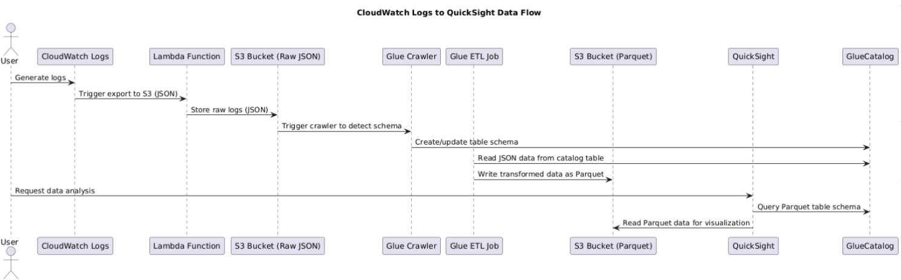
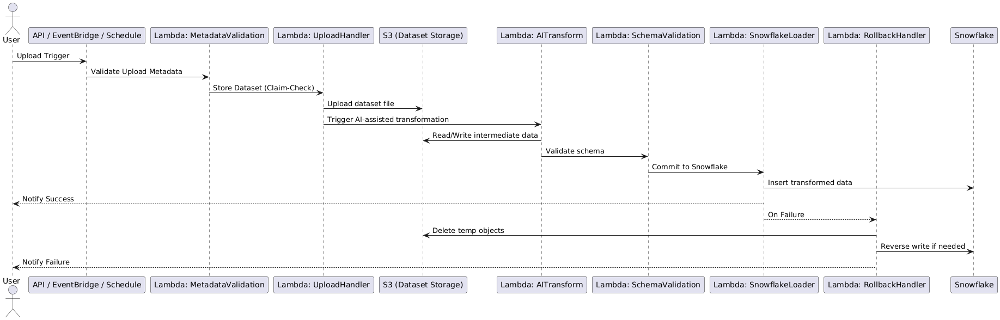
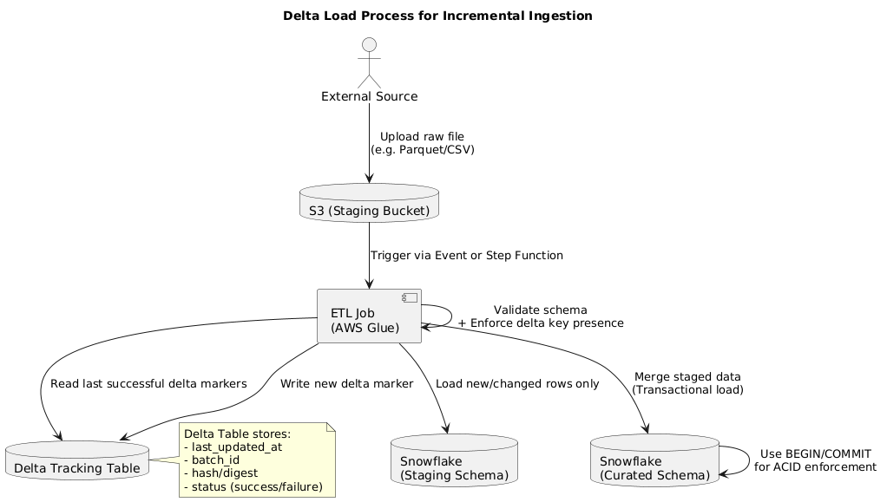

# Caso-3-Diseno-de-Software

Members: Pablo Mesén, Alonso Durán Muñoz, Ana Hernández Muñoz, Jesus Valverde


# INDEX
- [DESCRIPTION](#DESCRIPTION)
- [STRATEGY AND PLANNING](#STRATEGY-AND-PLANNING)
- [DEFINITION OF REQUIREMENTS](#DEFINITION-OF-REQUIREMENTS)
- [SYSTEM ANALYSIS](#SYSTEM-ANALYSIS)
- [LEGAL AND REGULATORY FRAMEWORK](#LEGAL-AND-REGULATORY-FRAMEWORK)
- [STACK](#STACK)
- [FRONTEND](#FRONTEND)
	- [AUTHENTICATION PLATFORM](#Authentication-platform)
	- [POC MFA](#POC-MFA)
- [BACKEND](#BACKEND)
	- [API ENDPOINTS](#API-Endpoints)
   	- [IMPORTANT CLASSES & COMPONENTS](#Important-Classes-&-Components)
   	- [ERROR HANDLING](#Error-Handling)
   	- [SECURITY LAYER DESIGN](#Security-Layer-Design)
   	- [AUDIT & LOGGING](#Audit-&-Logging)
   	- [THIRDPARTY SERVICES](#THIRDPARTY-SERVICES)
   	- [KEY WORKFLOWS](#Key-Workflows)
   	- [DATA LAYER DESIGN](#Data-Layer-Design)


# DESCRIPTION
For years, Costa Rica has faced a significant structural limitation: the absence of a centralized data system that facilitates access, analysis, and utilization of information by various actors. Currently, there is no national ecosystem that allows individuals, public institutions, state branches, social organizations, and the private sector to share, reuse, and market information in a structured manner. This fragmentation has hindered evidence-based decision-making, slowed institutional processes, and limited the development of innovative solutions that could emerge from the strategic use of data.

In response to this challenge, the creation of a national ecosystem of interoperable, secure, and regulated data is proposed, in which both public and private entities can contribute and utilize valuable information. This system would allow data to be classified according to its nature: open or restricted access, free or subject to a fee-based model. Robust security and privacy standards would be established to ensure the protection of sensitive information and regulatory compliance. The goal is to enable an environment in which reliable data can be used to generate new applications, technological products, and services based on data science and artificial intelligence.

With the implementation of this ecosystem, Costa Rica could take a leap toward an economy and government driven by real data. Institutions would optimize their processes, the private sector would find new opportunities for innovation and collaboration, and citizens would have access to useful and transparent information. Furthermore, the coexistence of public and private data, managed under clear and secure frameworks, would open up a dynamic space for technological development and the country's sustainable digital transformation.

# STRATEGY AND PLANNING
## Roadmap


## Milestones
- M1: Validated architecture

- M2: Core technical infrastructure deployed (data lake, backend, encryption)

- M3: Secure user registration system with advanced validation and IP control

- M4: First datasets published with granular control, metadata, and pricing

- M5: AI-powered, non-downloadable data exploration dashboards operational

- M6: Ecosystem validated through security audits and regulatory compliance

- M7: 10+ integrated institutions, 100+ active datasets, first monetization revenue

## Technical Team

| **Role**                  | **Quantity** | **Responsibilities**                                                       |
|---------------------------|--------------|-----------------------------------------------------------------------------|
| Cloud Solutions Architect | 1            | Designs cloud infrastructure, security, scalability                        |
| DevOps Engineers          | 2            | Deployment automation, CI/CD, versioning                                   |
| Backend Developers        | 3            | API development, encryption, access control, authentication                |
| Frontend Developers       | 2            | User portals (registration, dashboards, admin interface)                   |
| Security Specialists      | 2            | Key management, MFA, audits, legal compliance                              |
| AI & ETDL Specialists     | 2            | Document validation, data flow automation, AI dashboards                   |
| Data Engineers            | 2            | Modeling, metadata, data quality                                           |
| Product Manager           | 1            | Agile delivery coordination, documentation                                 |
| UI/UX Designer            | 1            | Portal and backoffice interface design                                     |
| Legal & Compliance Advisor| 1            | Legal analysis, data protection, IP/data ownership                         |
## UX Journeys


##  Risks Assesment 
| ID  | Risk Description                                                              | Likelihood | Impact   | Risk Level | Control/Mitigation Measures                                                    | Owner                |
|-----|----------------------------------------------------------------------------------|------------|----------|------------|----------------------------------------------------------------------------------|----------------------|
| R1  | Failure in biometric identity validation due to poor image/document quality     | Medium     | High     | **High**   | Implement quality filters, retry mechanism, and fallback to manual validation   | DevOps / Identity    |
| R2  | Unauthorized access due to improper IP restriction configuration                | Low        | High     | **Medium** | Enforce IP whitelist checks, automate validation tests on deploy                | Security Team        |
| R3  | Data breach of confidential datasets marked as “restricted”                     | Low        | Critical | **High**   | Encrypt at rest with AWS KMS, enable row-level access policies in Snowflake     | Security / Infra     |
| R4  | Misuse of uploaded datasets due to incorrect permissioning                      | Medium     | High     | **High**   | Create permission configuration wizard with preview and rollback                | Data Engineering     |
| R5  | System downtime during batch ingestion or data validation                       | Medium     | Medium   | **Medium** | Queue-based ingestion (SQS), retry logic, alerting via EventBridge              | Platform Ops         |
| R6  | Reputational damage due to publication of inaccurate or unverified data         | Medium     | High     | **High**   | Enforce ML validation and mandatory manual QA for public datasets               | Data Governance      |
| R7  | Frustration due to poor UX in uploading or dashboarding tools                   | High       | Medium   | **Medium** | Add progress indicators, previews, guided steps and clear errors                | UX / Frontend Team   |
| R8  | Breach of user personal data from onboarding                                    | Low        | Critical | **High**   | Encrypted transmission, audit logs, token masking, PII redaction                | Infra / Security     |
| R9  | Regulatory non-compliance                                                       | Low        | Critical | **High**   | Regular audits, privacy policy updates, DPIA documentation                      | Legal / Compliance   |
| R10 | Excessive cost due to inefficient cloud resource usage                          | Medium     | Medium   | **Medium** | Cost monitoring dashboards, job timeouts, quotas                                | Cloud FinOps         |

#### Likelihood
- **Low**: Rare or unlikely to occur  
- **Medium**: Could occur occasionally under certain conditions  
- **High**: Expected to occur frequently  

#### Impact
- **Medium**: Moderate disruption, user complaints, minor SLA breach  
- **High**: Major disruption, sensitive data exposure, trust loss  
- **Critical**: Legal implications, national-level breach, irreversible damage
## Code, CI/CD, and Cloud Deployment Practices
The team must use Git as the version control system, with repositories hosted on GitHub.
The following branching model must be implemented based on Git Flow:
### Git Flow Branching Strategy

| Branch        | Purpose                                 | Merges into           | Created from         |
|---------------|------------------------------------------|------------------------|-----------------------|
| `main`        | Stable code in production                | –                      | `release/*`, `hotfix/*` |
| `develop`     | Development and integration branch       | `release/*`            | `feature/*`           |
| `feature/*`   | New features or enhancements             | `develop`              | `develop`             |
| `release/*`   | Prepares code for production release     | `main` and `develop`   | `develop`             |
| `hotfix/*`    | Urgent fixes applied to production       | `main` and `develop`   | `main`      

### Commit Message Convention

All commit messages must follow a standardized structure for clarity and traceability:

<type>(component): short description in present tense

#### Examples:
feat(api): add validation to donation endpoint
fix(auth): resolve login timeout issue
chore(ci): update deployment script for staging

The development team must use the following commit types for consistency and clarity in version control:

| Type      | Description                           |
|-----------|---------------------------------------|
| `feat`    | New feature                           |
| `fix`     | Bug fix                               |
| `docs`    | Documentation changes                 |
| `style`   | Formatting only (no code logic change)|
| `refactor`| Code restructuring (no behavior change)|
| `test`    | Adding or updating tests              |
| `chore`   | Maintenance tasks, tooling, CI/CD     |

## Coding Standards

All code must follow predefined standards to ensure readability, consistency, and quality.

### Frontend (React)

- Use Prettier for automatic formatting
- Use React Testing Library for testing
- Components: PascalCase
- Variables/Functions: camelCase
- Avoid inline styles; use TailwindCSS or component-scoped styles

### Backend (Python)

- Use Black for formatting
- Linting: Pylint 
- Testing: pytest
- Validate APIs using OpenAPI specifications

### Database (Snowflake and Amazon S3)

- Snowflake models and tables must include data quality tests such as uniqueness, not_null constraints, and referential integrity validations, implemented via Snowflake tasks.
- Use clear naming conventions and prefixes for Snowflake objects:
  - `stg_` for staging tables (raw data imported from sources)
  - `dim_` for dimension tables (reference data)
  - `fct_` for fact tables (transactional or measurable data)
- All Snowflake object names (tables, schemas, views, columns) must use snake_case naming conventions.
- Data stored in Amazon S3 must follow a clear folder and file naming structure aligned with project requirements, including environment and date partitions (`s3://bucket-name/project/env/date=YYYY-MM-DD/`).
- When ingesting data from S3 into Snowflake, ensure data formats are consistent, with schemas enforced via Snowflake external tables or COPY commands with file format definitions.

## Pull Requests and Code Review

Every change must be reviewed through a pull request (PR):

- All PRs must be based on a feature, hotfix, or release branch
- At least one approval is required before merging
- All checks must pass (CI, linting, tests)
- PR descriptions must explain what was changed and why
- Screenshots or test output must be included for UI or API changes
- Large PRs must be split into smaller, manageable commits

## Continuous Integration (CI)

GitHub Actions must be configured for CI on every pull request to `develop` or `main`.

### CI Pipeline Steps

- Checkout repository
- Install dependencies
- Run linters
- Execute unit and integration tests

## Continuous Deployment (CD)

Automatic deployments must be configured for both staging and production environments using GitHub Actions.

| Environment | Branch  | Trigger                | Requires Approval |
|-------------|---------|------------------------|-------------------|
| staging     | develop | Push to develop        | No                |
| production  | main    | Merge or manual trigger| Yes               |

Deployment must include steps for:

- Environment variable injection
- Health checks post-deployment
- Rollback mechanism in case of failure

## KPIs and Metrics

| Category            | Metric                  | Data Source                          | Calculation Method                          | Visualization       |
|---------------------|-------------------------|--------------------------------------|---------------------------------------------|---------------------|
| **System Availability** | ≥99.9%                 | CloudWatch logs                     | Uptime / Total time (Monthly)               | Gauge               |
| **Query Latency**    | <200ms (P95)           | Snowflake query logs                | 95th percentile query time (Monthly)        | Line chart          |
| **Error Rate**       | <0.1%                  | CloudWatch error logs               | Failed requests / Total requests (Monthly)  | Bar chart           |
| **Data Ingestion**   | <2 minutes             | S3/Snowpipe logs                    | Processing duration (Monthly)               | Scatter plot        |
| **Security Compliance** | 100%                | Okta, WAF, KMS logs                 | Audit pass rate (Semi-annual)               | Table               |
| **Active Datasets**  | ≥100                   | Snowflake metadata                  | Table count (Quarterly)                     | Counter             |
| **User Satisfaction**| ≥4.5 (out of 5)        | User surveys                        | Survey average (Quarterly)                  | Gauge               |
| **Recovery Time**    | <2 hours               | Incident reports                    | Test duration (Semi-annual)                 | -                   |

**Dashboard Features:**
- **Platform:** Amazon QuickSight
- **Visualizations:** Mixed types (gauges, line charts, bar charts, scatter plots, tables, counters)
- **Filters:** Time range, service components
- **Alerts:** SNS notifications for threshold breaches
- **Security:** RBAC/RLS implementation
- **Compliance:** No data exports allowed, full auditability
- **Refresh Rate:** Real-time for operational metrics, periodic for others

## Deployment and Operations Strategy

The deployment strategy for Data Pura Vida utilizes Blue-Green Deployment to ensure zero-downtime updates, meeting the 99.9% SLA and supporting scalability for millions of records and thousands of concurrent users. New versions are deployed to a "Green" environment, mirroring the production "Blue" environment, using AWS Fargate for the monolithic Python3/Flask backend and React Native frontend. GitHub Actions and Terraform automate CI/CD, provisioning infrastructure like Snowflake, AWS S3, and VPC endpoints. Comprehensive tests (unit, integration, security via OWASP ZAP, and load) validate performance (<200ms query latency, <0.1% errors) in Green. AWS WAF restricts access to Costa Rica-based IPs, and a Python 3 service with AWS KMS manages tripartite keys (one part with Data Pura Vida, two with custodians). Traffic shifts to Green via AWS Application Load Balancer after validation, with Blue retained for 24 hours for rollback, ensuring <2-hour recovery. This approach supports future microservices migration and complies with Law 8968, GDPR, and ISO 27001.

## Monitoring and Operations

Observability: AWS CloudWatch captures structured logs from all system layers, complemented by Snowflake query history for data access audits, ensuring traceability per Law 8968 and GDPR. CloudWatch Metrics track latency, errors, traffic, and per-user/entity dataset usage. AWS SNS sends alerts for downtime, errors, or security incidents (e.g., unauthorized IP access). Amazon QuickSight dashboards provide real-time insights into system health, dataset usage, and backoffice operations like user management and audits.

High Availability: Snowflake’s multi-cluster architecture and Fargate auto-scaling handle usage spikes and 10TB/year data growth. AWS Application Load Balancer with WAF distributes traffic. Daily full backups and 4-hour incremental backups in S3 with versioning, plus Snowflake snapshots, ensure data integrity. Automated disaster recovery playbooks using Terraform and S3/Snowflake restore the system in <2 hours, tested quarterly. Snowflake Snowpark drives AI for data normalization and dashboards, with AWS SageMaker as a fallback, and CloudWatch optimizes costs for Snowflake and Fargate usage.

# DEFINITION OF REQUIREMENTS
## Functional Requirements

### User Management and Registration

- Allow registration of natural persons, legal entities, institutions, chambers, groups, and companies, and adapt the system (forms) based on the user type.

- Digital identity, biometrics, liveness detection, and MFA (Multi-Factor Authentication).

- Assign tripartite security keys to organizations for access delegation/revocation.

- Capture IBAN and/or credit card data during registration.

- Email notification system.

- Generate symmetric and asymmetric keys with a tripartite system.

### Data Management

- Support for Excel, CSV, JSON APIs, SQL and NoSQL databases.

- Define data as public/private, free/paid, temporary/permanent.

- Access control by institution, individual, or specific group (granular control).

- Allow selection of specific fields to encrypt.

- Specify columns that relate datasets to each other.

- Extraction, transformation, cleaning, context detection, modeling, and loading (ETDL).

- Avoid duplication and optimize existing relationships.

- Configuration of differential fields and update frequency.

### Commercialization and Payments

- Free data up to a certain size, with charges for additional space.

- Platform fee/commission on paid data based on size and duration.

- Multiple payment methods: credit cards, debit cards, and national mechanisms.

- Automatic permission assignment upon payment confirmation.

- Consumption control, real-time monitoring of paid data usage.

### Visualization and Analysis

- Custom dashboards, built manually or through AI prompts.

- Multiple visualizations: tables, graphs, counts, trends, and predictions.

- Share dashboards among users or allow internal public visibility.

- The system must implement data delivery mechanisms that minimize the possibility of indirect extraction of information, especially for unauthorized uses such as AI model training. When necessary to deliver visual representations of data, formats like SVG or PDF may be considered, as long as they prevent automated reconstruction or reverse engineering of the underlying data.

- Log all transactions and data usage in a user-accessible history for consultation and internal audit.

### Backoffice

- User management: maintenance of identities, memberships, and roles.

- Configuration of rules, formats, validations, and structures by entity type.

- Administration of API connectivity, databases, and external callbacks.

- Key management: revocation and regeneration of security keys.

- Full audit trail: details by user, action, date, and effect.

- Usage reports, access logs, consumption data, metrics, data quality, and anomalies.

- Operational monitoring: service status, tasks, transfers, and processes.

## Non-Funtional Requirements

### Performance

- The dashboard query engine must deliver results in under 200 milliseconds for 95% of requests under normal load.
  
- The platform shall support at least 200 concurrent users with no noticeable performance degradation. All of this the fifth year of operation.
  
- Data ingestion pipelines must process files up to 1GB in size within 2 minutes, including ETDL stages.

### Scalability

- The infrastructure must support automatic horizontal scaling in response to usage spikes.

- The data lake architecture must accommodate growth of up to 10TB per year without manual intervention.

- The system must allow onboarding of new data providers without modifying core services.

### Reliability

- The system must not exceed 43.2 minutes of downtime per month, aligning with a 99.9% SLA.

- All transactions must be ACID-compliant, and service errors must trigger automated retries with rollback capabilities.

- Full backups of all datasets and user metadata must be taken daily, with incremental backups every 4 hours.

- In the event of a critical failure, full system recovery must be achieved within 2 hours, using predefined playbooks and automated infrastructure recovery.

### Availability

- The system must maintain 99.9% availability, with high availability configurations and load balancers.

- The system infrastructure (including core services, APIs, and Snowflake-based data operations) must demonstrate a minimum mean time between failures of 30 days, ensuring fault tolerance at both the compute and storage layers.

- In the event of any service interruption or system failure, the system must be recoverable and operational within a maximum mean time to repair of 2 hours, supported by automated diagnostics and recovery scripts.

- Scheduled maintenance activities must:
	- Be limited to predefined windows.
	- Be communicated to stakeholders at least 72 hours in advance.
	- Include health verification steps and after the execution to ensure service continuity.

- The system must include Snowflake’s automatic multi-cluster archi**tecture to ensure high** availability and fault isolation for queries and pipelines and real time monitoring and alerting to trigger failover **workflows.

### Secur**ity 

- All data in transit and at rest must be enceypted using AES-256.  All APIs must enforce -TLS 1.3 for secure communications.

- All components must comply with OWASP Top 10 security principle- s.

- Implementation of Role-Based Access Control (RBAC) and Row-Leve- l Security (RLS).

- The platform shall implement a three-party key management syste- m in which cryptographic keys are generated using a threshold-based mechanism, distributed securely across independent custodians, and allow for revocation or delegation in compliance with national security standards.

### Usab
## Monitoring and Observability

AWS CloudWatch:

Metrics for Lambdas, API Gateway, and S3 events.

Logs with real-time alerts for errors, latencies, and anomalies.

Prometheus + Grafana (optional):

Dashboards for resource utilization, response times, user activity.

Alerting for thresholds and error rates.
lity

- Screen reader support, keyboard navigation, and contrast options must be available to ensure compliance with inclusive design principles.

- Some of the inclusive design principles to follow are: 
	- Give control: Allow users to personalize their experience (font size, colors, contrast)
	- Offer choices: Offer multiple choices to interact (voice, clicks, keyboard)
	- Provide equivalent experiences: Ensure the same experience to all users in despite of their capabilities

- Use of UX principles for a better user interaction with the UI.
	- Consistency: Use familiar patterns, layouts, and terminology throughout the interface so users can predict interactions and learn quickly.
	- Feedback: Provide immediate, clear responses to user actions (e.g., button clicks, form submissions, errors) so users understand what is happening.
	- Simplicity: Eliminate unnecessary steps, clutter, or features. Focus on helping users complete tasks with minimal effort and cognitive load.
	- Visibility of System Status: Keep users informed about what’s going on with timely and appropriate status indicators (e.g., loading spinners, progress bars, confirmation messages).

### Maintainability

- All system components must emit structured logs to a centralized logging system. Metrics must be exposed via Amazon CloudWatch and Amazaon S3, with real time dashboards in Amazon Quicksight.

- Source code must be managed using Github with GitFlow branching. All deployments are automated via CI/CD pipelines with infrastructure defined via Terraform.

- All code must adhere to industry recognized standards and best practices:
	- Follow the SOLID principles for maintainable software.
	- Maintain at least 90% unit test coverage across all business logic and services.
	- All pull requests must be peer-reviewed, and merged only after passing all automated tests.
	- Commit messages must follow the Conventional Commits specification for traceability.

### Interoperability

- All data exchange and system interaction must comply with open standards to ensure broad interoperability across institutional and technological boundaries.

- The system must support seamless integration with:
	- External public data systems (government registries, public entities databases)
	- Private sector API’s
	- Both SQL and NoSQL connectors for ingesting structured and semi-structured data.

- API’s must be:
	- RESTful, stateless, and resource-oriented.
	- Secured with rate limiting, IP whitelisting, token-based auth, and MFA.
	- Equipped with detailed versioned documentation (e.g., Swagger UI).
	- Designed to expose only the minimum viable data based on roles and permissions (RBAC/RLS).

### Compliance

- The system must fully comply with Law 8968 – Protection of the Person Regarding the Processing of Personal Data (Costa Rica), including provisions for:
	- Informed consent and purpose limitation.
	- Data subject rights such as access, rectification, and deletion.
	- Registration of personal data databases with PRODHAB (Agencia de Protección de Datos de los Habitantes).

- All personal and sensitive data handling must adhere to the General Data Protection Regulation (GDPR).

- The platform must implement and maintain an Information Security Management System (ISMS) aligned with ISO/IEC 27001.

- OECD Recommendation on Data Governance for the Public Sector. Data Pura Vida must reflect principles of:
	- Openness and reusability of public data.
	- Trust, tr**ansparency, and accountability** in data use.
	- Clear roles **and responsibilities for data stewardsh**ip.

- Related to security industry standards to follow:
	- Use of - TLS 1.3 for encrypted communications.
	- End-to-end encryption of sensitive data using AES-256.
	- Impleme- ntation of Role-Based Access Control (RBAC) and Row-Level Security (RLS).

### Extensi- bility

- The platf- orm must allow modular addition of new AI models, data connectors, and dashboard templates without affecting existing operations. APIs and services must be designed to support future migration to microservices.
## Monitoring and Observability

AWS CloudWatch:

Metrics for Lambdas, API Gateway, and S3 events.

Logs with real-time alerts for errors, latencies, and anomalies.

Prometheus + Grafana (optional):

Dashboards for resource utilization, response times, user activity.

Alerting for thresholds and error rates.

### Documentation

- End-user guides must be provided Spanish, accessible directly within the portal.

- System administration manuals, backup and recovery guides, and access control procedures must be maintained in a secure internal wiki.

- Full API documentation (Swagger), architecture diagrams, CI/CD guidelines, and code style references must be available in the repository.

- Documentation must be version-controlled alongside the codebase and updated with each release as part of the definition of done in Scrum tasks.

# SYSTEM ANALYSIS
## DETAILED DECOMPOSITION BY COMPONENTS DIAGRAM
[![](https://mermaid.ink/img/pako:eNqlWf1O28oSfxXL_14oPSkFiq6u5DgOtZqv2g4VNUdoY0-SFbbXZ20H0qrSfZb7aOdJzuzaiddhoe0FgUT2c3Y-fvObyXczYjGYl-aKk3xtBP3bzMCfolrUA7fmwAosYzayguHUGxv-jR8441uzXnaw1Malo-mVb1iTgeFMAje4McbWxLpyxvhJ3XS40ZsPjDEKkhhOVtKSQnG4Wvy4k0HoZjHd0LgiSfHvBT_5z9___Z8xA16wjCTGgJRkP9qnLIWS08hwsyXbD9ssK0lUdgdnnLGlgb8juoT9qBVFUBTGR1qUjG__fCrQyLkKR7Airdj7vfWwO1DuTXOSbY0JSeFglQd5eycvaZRAIYRxs2g_HpBHXBcxHrd3DGlGsojiCX5JSkghKwuNlLN5P5xVi0RqokA5q5KyrD1GGcSjbDTDfmq6XFJ5gUbqIcexB8bvW9mrci0ew6FAUUhJN4pCrKKgqwxio1_FKyh1cnrudTjjdINvadSlahRHUuBSGg9WaBO-3c85EctYig-0IryVltsXddQeCahtfCE5UEjfmpz0SXZPs5X0KY2wV94svOKsyosTe03SBbpga6ttDsJ-cl5VAENB8G1j6K7vbxPyUDx1ir0eWXYgAWRxd-DZ0Gp8mGSx4UNUcdSNLrSsefAxFPbDCxt9tM_hJKaNd4zYirYz46FlOCmhydOgK4whEWrXhdgGMpRpP3MFTEor_HNmXJOExro378T8KuVknH7riulv0_rqE6vY_Wt8gm17kY-34g4jYPegmDtYc4DjGeHltrseP-Af5KqtUMIva1pCgg6oEdCbjhw_9JiIYKFzhKaUyluVSIhTRYcO6pbx_cdrCg_AlZDqTk8fMuAvOUPngxalJaD_EiwL10d0WEEhFK1H5Nk8QEzOq1IAawYRCqsCVALGPE8YifdjnuMHJ_7UmhnWzG2XirsWpIDdMR2NTZj_ebRf0o5_gcWasXsMQZIkCxLd6-Dv2hq5g0bG1rlaGRlPiXbGj9aQEt3MXtgBlLWsCpiWsBJRZthriASCdHYZPoJa2biuLqNMrUE4Qn0JPSzpquIHMuGBqNNNIZJBxXnnfEjwAv2-ANKccYGC-Ki4StR9O-U9s9XJIr7NS4gV0_zfcIQoIPBIAKsID4SWrFhKCzzjYU4wCvEPpUDgAeNfhuW2kj2WnEQ6a3bP7VrATgAnVQVYrmQF8FhqDIpgw8QxUU1QcJ8Ol9y7mTe1Q-V5ipyDKk8EqOr8xYOkzj5rmqt0QVyLfo8vSA6BriZK07yk6RMMRFyjdQbEdxKUZHmI5mMoSSz0cIUozF-XXHyMdrICaUobz0xEdljpzChAx3eCUFiggNIYkww3imzcNc41Yi1K1HHPNUEIkhbiLFG8vYg4zQXJ2L-pc5a4RtWumgcIj9YYqjE8gg4yLNt2fP_ODrwRJnmSVQnhOzZ4KIeC8AZmit3Vh5HHtydiJcnwyc1RLeazpEoBE2NKy0JzMFIt-KuCLNoqT0iEI-HbhxSSeBekPzHmz5PDeDpxAverFbjTiaTxY8v7hCOTqxfyBHK2CBST6hwAyZ2Np4RoTS6cpPZilQM1-Ei_gTrYaD2gaWd4UgkKJejE5wq4ShM_bhecxvXxrbqqReMtaCY99bSdO3s6GbpXYf0cPRjK_Gv0BfbLZa210NEE4BhDgEPDDmgRsUolnnunELQoZTqxfgNTyVZo3WjBR2sA60ak-3C3GmNmzZRiwuaAVONkAAuKuZyodYagwg2kqlRoQhpS6G8LZNaF4SMdcNoYpCuKkGB8wfQC2sIk8KyJH8qDaxjXwcJOXj3pUzdLix1CfgvffZp00p4HyypTXrm7SF_u_bo5UIyiSvOdSAIsdPbASHODqRd6QJJjhHIMIMQ9vFmVsXGg-khoSVTj9KgvpVgTMYKvQj7ewc8aVnCCiNSvMYMzwdLedkK5EJEE3Tjq2qCfMEllDJzCrBsBxIowXwgXF2K20hVTrQE8TDgPSkXgFBGp4bmJ8tdBFzLa0Y3v1t2Ha9efI--rgexFilusFwy9HctSmsTAdaaau-G8wLAX3I4viRL1A0x_x5j9jmPO8kMqj7RCRHdedmrYnMkUMKILEf9KeYQ6XVJRIAtwQL1oM9O1-zW8pkW1ZwWy2FScmG4Y0h-ySNTKGTG31NZbY6KkxU8zV-REYUGVxEu3CjiosSKfhngRvQ65hBtvG2qnU_znuePdhPWqFt1aVP88Ok7oPUIx4YVSNNUbGoKkjHtQVIkANwwEJey5AKgnLAsXs4pHe-Lx5zPi3fmO3Yi4K7B1KVxTRXjs4TiBDXK5JxtlKhyTolM_NKkQS_CVOuw8YioR6I9HZa-icx7Ik1piqLOJ58ymXoA1br34wP1aL67nlam6A7UPOIWOoXtqNswLQS1rNFYTfJ1tRP4SbYZXYsZg7E5cHxPRnvD0LfvTdDhEPvACbEg4eJnwIIeczjHfotVE7teltqaN1UBgnnO2UeBxwKJKJiSt6ySgO7FxEQ827ID2S4l3OK5NAqJdG8o-5lZ39K5_qZFGaSAKAv-05pCNMDyUIoCKdhwoKlC7hc_E2m8UJLVvdLibzjj9OXIVpPhhv0JEkSqrVMRsH_kMDxTkT-S87rZG_TOGnt5tXTatke5pOkrk2B8nrm2NwgCidYaKTCRCpVg4KphszdznBMMMJapGVLJuY6Ogg1Jjhz8vivfrVmiJjKwMZQ_rGVYqvi4IEdGKXTsgArKgiYqFLexpWZ863pSK6pDDOapdHVE1hOO68k-gwt0O6GS7ronTDTyBqUajEq00eV65rRuLoh2NpyKEtS_NkCklWPMgqd4WVNfob25_Hephxpp74ssZdzL0LES_uR3MvZfwzhbFZc0atO3jT87N3fhqHISiZaoBj5_3ZgNOmxasXSHix9tOF9ZjZdfNxSDyR84e2sLPH2txzfZuZgLdZe9BKZQPG1zCmYhoGRSlbopmtdvRUjELlt5NCv_NAhz_MY_MFVaq5uWSJAUcmaloD4jP5nex5tYs16jEW_MS_40Jvxd6_4GbEIW_MpaalyWvcBtC62q9P6TKEbZgQAnaql2CtwG3RRoyLy96F_IM8_K7-Whevj_vvTk7P3_39vyP3sWHt2e9I3NrXp696X04v_jj3cWH3ruz0_dvez-OzG_y0t6b096H0_PT8_cXp73T3sXZ6ZEJkveO6y8S5feJP_4BTCuRMQ?type=png)](https://mermaid.live/edit#pako:eNqlWf1O28oSfxXL_14oPSkFiq6u5DgOtZqv2g4VNUdoY0-SFbbXZ20H0qrSfZb7aOdJzuzaiddhoe0FgUT2c3Y-fvObyXczYjGYl-aKk3xtBP3bzMCfolrUA7fmwAosYzayguHUGxv-jR8441uzXnaw1Malo-mVb1iTgeFMAje4McbWxLpyxvhJ3XS40ZsPjDEKkhhOVtKSQnG4Wvy4k0HoZjHd0LgiSfHvBT_5z9___Z8xA16wjCTGgJRkP9qnLIWS08hwsyXbD9ssK0lUdgdnnLGlgb8juoT9qBVFUBTGR1qUjG__fCrQyLkKR7Airdj7vfWwO1DuTXOSbY0JSeFglQd5eycvaZRAIYRxs2g_HpBHXBcxHrd3DGlGsojiCX5JSkghKwuNlLN5P5xVi0RqokA5q5KyrD1GGcSjbDTDfmq6XFJ5gUbqIcexB8bvW9mrci0ew6FAUUhJN4pCrKKgqwxio1_FKyh1cnrudTjjdINvadSlahRHUuBSGg9WaBO-3c85EctYig-0IryVltsXddQeCahtfCE5UEjfmpz0SXZPs5X0KY2wV94svOKsyosTe03SBbpga6ttDsJ-cl5VAENB8G1j6K7vbxPyUDx1ir0eWXYgAWRxd-DZ0Gp8mGSx4UNUcdSNLrSsefAxFPbDCxt9tM_hJKaNd4zYirYz46FlOCmhydOgK4whEWrXhdgGMpRpP3MFTEor_HNmXJOExro378T8KuVknH7riulv0_rqE6vY_Wt8gm17kY-34g4jYPegmDtYc4DjGeHltrseP-Af5KqtUMIva1pCgg6oEdCbjhw_9JiIYKFzhKaUyluVSIhTRYcO6pbx_cdrCg_AlZDqTk8fMuAvOUPngxalJaD_EiwL10d0WEEhFK1H5Nk8QEzOq1IAawYRCqsCVALGPE8YifdjnuMHJ_7UmhnWzG2XirsWpIDdMR2NTZj_ebRf0o5_gcWasXsMQZIkCxLd6-Dv2hq5g0bG1rlaGRlPiXbGj9aQEt3MXtgBlLWsCpiWsBJRZthriASCdHYZPoJa2biuLqNMrUE4Qn0JPSzpquIHMuGBqNNNIZJBxXnnfEjwAv2-ANKccYGC-Ki4StR9O-U9s9XJIr7NS4gV0_zfcIQoIPBIAKsID4SWrFhKCzzjYU4wCvEPpUDgAeNfhuW2kj2WnEQ6a3bP7VrATgAnVQVYrmQF8FhqDIpgw8QxUU1QcJ8Ol9y7mTe1Q-V5ipyDKk8EqOr8xYOkzj5rmqt0QVyLfo8vSA6BriZK07yk6RMMRFyjdQbEdxKUZHmI5mMoSSz0cIUozF-XXHyMdrICaUobz0xEdljpzChAx3eCUFiggNIYkww3imzcNc41Yi1K1HHPNUEIkhbiLFG8vYg4zQXJ2L-pc5a4RtWumgcIj9YYqjE8gg4yLNt2fP_ODrwRJnmSVQnhOzZ4KIeC8AZmit3Vh5HHtydiJcnwyc1RLeazpEoBE2NKy0JzMFIt-KuCLNoqT0iEI-HbhxSSeBekPzHmz5PDeDpxAverFbjTiaTxY8v7hCOTqxfyBHK2CBST6hwAyZ2Np4RoTS6cpPZilQM1-Ei_gTrYaD2gaWd4UgkKJejE5wq4ShM_bhecxvXxrbqqReMtaCY99bSdO3s6GbpXYf0cPRjK_Gv0BfbLZa210NEE4BhDgEPDDmgRsUolnnunELQoZTqxfgNTyVZo3WjBR2sA60ak-3C3GmNmzZRiwuaAVONkAAuKuZyodYagwg2kqlRoQhpS6G8LZNaF4SMdcNoYpCuKkGB8wfQC2sIk8KyJH8qDaxjXwcJOXj3pUzdLix1CfgvffZp00p4HyypTXrm7SF_u_bo5UIyiSvOdSAIsdPbASHODqRd6QJJjhHIMIMQ9vFmVsXGg-khoSVTj9KgvpVgTMYKvQj7ewc8aVnCCiNSvMYMzwdLedkK5EJEE3Tjq2qCfMEllDJzCrBsBxIowXwgXF2K20hVTrQE8TDgPSkXgFBGp4bmJ8tdBFzLa0Y3v1t2Ha9efI--rgexFilusFwy9HctSmsTAdaaau-G8wLAX3I4viRL1A0x_x5j9jmPO8kMqj7RCRHdedmrYnMkUMKILEf9KeYQ6XVJRIAtwQL1oM9O1-zW8pkW1ZwWy2FScmG4Y0h-ySNTKGTG31NZbY6KkxU8zV-REYUGVxEu3CjiosSKfhngRvQ65hBtvG2qnU_znuePdhPWqFt1aVP88Ok7oPUIx4YVSNNUbGoKkjHtQVIkANwwEJey5AKgnLAsXs4pHe-Lx5zPi3fmO3Yi4K7B1KVxTRXjs4TiBDXK5JxtlKhyTolM_NKkQS_CVOuw8YioR6I9HZa-icx7Ik1piqLOJ58ymXoA1br34wP1aL67nlam6A7UPOIWOoXtqNswLQS1rNFYTfJ1tRP4SbYZXYsZg7E5cHxPRnvD0LfvTdDhEPvACbEg4eJnwIIeczjHfotVE7teltqaN1UBgnnO2UeBxwKJKJiSt6ySgO7FxEQ827ID2S4l3OK5NAqJdG8o-5lZ39K5_qZFGaSAKAv-05pCNMDyUIoCKdhwoKlC7hc_E2m8UJLVvdLibzjj9OXIVpPhhv0JEkSqrVMRsH_kMDxTkT-S87rZG_TOGnt5tXTatke5pOkrk2B8nrm2NwgCidYaKTCRCpVg4KphszdznBMMMJapGVLJuY6Ogg1Jjhz8vivfrVmiJjKwMZQ_rGVYqvi4IEdGKXTsgArKgiYqFLexpWZ863pSK6pDDOapdHVE1hOO68k-gwt0O6GS7ronTDTyBqUajEq00eV65rRuLoh2NpyKEtS_NkCklWPMgqd4WVNfob25_Hephxpp74ssZdzL0LES_uR3MvZfwzhbFZc0atO3jT87N3fhqHISiZaoBj5_3ZgNOmxasXSHix9tOF9ZjZdfNxSDyR84e2sLPH2txzfZuZgLdZe9BKZQPG1zCmYhoGRSlbopmtdvRUjELlt5NCv_NAhz_MY_MFVaq5uWSJAUcmaloD4jP5nex5tYs16jEW_MS_40Jvxd6_4GbEIW_MpaalyWvcBtC62q9P6TKEbZgQAnaql2CtwG3RRoyLy96F_IM8_K7-Whevj_vvTk7P3_39vyP3sWHt2e9I3NrXp696X04v_jj3cWH3ruz0_dvez-OzG_y0t6b096H0_PT8_cXp73T3sXZ6ZEJkveO6y8S5feJP_4BTCuRMQ)


# LEGAL AND REGULATORY FRAMEWORK

## Regulatory Compliance and Privacy Policies
For years, Costa Rica has faced a significant structural limitation: the absence of a centralized data system that facilitates access, analysis, and utilization of information by diverse actors. Currently, there is no national ecosystem that allows individuals, public institutions, state branches, social organizations, and the private sector to share, reuse, and market information in a structured manner. This fragmentation has hindered evidence-based decision-making, slowed institutional processes, and limited the development of innovative solutions that could emerge from the strategic use of data.
One of the main obstacles to overcoming this gap is not only technical but also political and institutional. Many state organizations do not feel comfortable sharing information with other government entities or private actors, whether due to mistrust, institutional jealousy, concerns about misuse, or a lack of regulatory clarity. This reluctance creates data silos that prevent the construction of an integrated view of the country and limits the potential for cross-sector solutions. Faced with this challenge, DataPuraVida proposes a flexible and controlled approach to overcome this political problem. Participating organizations would not be required to share all their data; instead, they would be allowed to choose which data to share, under what conditions, and with whom. This creates a transparent and regulated data market, where institutional autonomy is respected, but collaboration is encouraged through clear rules, incentives, and trust. By offering control, privacy, and traceability mechanisms, the system reduces political resistance and lays the groundwork for true data governance at the country level.

## User-centric data governance and regulatory compliance
Link to view Law 8968: http://www.pgrweb.go.cr/scij/Busqueda/Normativa/Normas/nrm_texto_completo.aspx?param1=NRTC&nValor1=1&nValor2=70975
The system must be developed in compliance with the principles established in Law 8968. This includes:
- Informed consent: All collection and processing of personal data must have the free, specific, and documented authorization of the data subject, with the possibility of easy revocation.
- Clear purpose: Each use of data must be justified, informed, and limited to its original purpose.
- Data subject rights: Interfaces will be enabled so users can securely review, correct, or request deletion of their data.
- Quality and updating: The system will incorporate automatic validations and periodic reviews to keep the data accurate and relevant.
- Protection of sensitive data: If information such as health or religious information is handled, enhanced security measures will be applied and explicit consent will be required.
- Data processing responsibility: Each database must have a clearly identified and trained person responsible for ensuring legal and technical compliance.
- Robust security: Encryption, access control, and monitoring protocols will be implemented to prevent security breaches.

## Integration of international standards
Link to view GDPR (Spanish): https://eur-lex.europa.eu/legal-content/ES/TXT/?uri=CELEX%3A32016R0679
In addition to national legislation, DataPuraVida aligns with the European Union's General Data Protection Regulation (GDPR), which establishes advanced standards for the ethical handling of information. Among its key contributions to the system:

- Privacy by design and by default: The system will only collect the minimum data necessary, ensuring anonymization, access segmentation, and minimization through its architecture.
- Data Impact Assessments (DPIA): A formal risk analysis will be conducted when the system processes personal data on a large scale or sensitive data.
- Data Protection Officer (DPO): It is recommended to designate a person responsible for regulatory compliance, technical advice, and contact with users.
- Portability: Users will be able to obtain and transfer their data in standard formats, fostering their autonomy.
- Incident Management: Mechanisms will be implemented to detect and report security breaches within 72 hours, meeting transparency and immediate action requirements.
- Accountability: The system will document all actions involving personal data, conducting audits and maintaining traceability to demonstrate compliance. Fines of up to €20 million or 4% of global annual turnover, whichever is greater. According to the following article: https://time.com/5290043/nazi-history-eu-data-privacy-gdpr/?.com

## Security and interoperability as pillars
The implementation of ISO/IEC 27001 will ensure a rigorous approach to information security. The following will be established:
- Clearly defined roles and permissions.
- Cryptographic controls and strong authentication.
- Regular audits to verify data integrity, confidentiality, and availability.
- Continuous improvement plans for security management.

The OECD Guidelines on Data Governance provide a holistic view. For DataPuraVida, this means:
- Data quality and interoperability: Establishing standards for metadata, formats, and version control.
- Clear and accountable governance: Defining inclusive governance structures that promote the participation of public, private, and social sectors.
- Data lineage documentation: Enabling the tracing of data origin, use, and transformations.
- Transparency and public trust: Ensuring that all system processes are visible and auditable.

DataPuraVida is not simply a technological infrastructure, but a platform for the political, institutional, and social transformation of the country. By enabling voluntary yet secure management of data exchange and complying with the most demanding national and international standards, the system can break decades of fragmentation and become the catalyst for an economy based on knowledge, innovation, and trust. Data governance is no longer an option, but a necessity for the sustainable, transparent, and equitable development of Costa Rica.

# STACK

## Cloud and Hosting

**Amazon Web Services (AWS):** Primary cloud provider for hosting, and service orchestration.

## Data layer and Analytics

**Snowflake:** Core data warehouse and analytics engine.

- Multi-Factor Authentication (MFA)

- IP Whitelisting & Token Validation (Session management)

- RBAC (Role-Based Access Control)

- Row-Level Security (RLS) policies

- Support for time travel, data sharing, delta versioning

- Integration with Python, REST, and ML tools 

## AI and Machine Learning

**Amazon SageMakerL:**

- S3-Native Processing: Avoids unnecessary data movement.

- Auto-scaling ML infrastructure: Supports from ml.t3.medium to ml.p3.16xlarge.

- Spot instances for training and serverless inference for cost-efficient workloads.

- Integration with Step Functions for orchestration of training, validation, and inference.

**LLM Integration with Snowflake:**

- AI models for ETDL flow management, document validation, metadata enrichment.

- Reference: https://youtu.be/9FejjGVZrPg?si=sM3ZBD1CiSRKONVI 

## Frontend

**React Native 18.2.x:** 
  
- Provides high performance and scalability for web and mobile interactions.

- Integration with analytics dashboards

## Backend 

- **Python 3.x:** Business logic implementation and integration layer.

- **Flask 3.1.x:** RESTful web framework for API routing, middleware, and request handling.

- **RESTful APIs:** Stateless communication for core services (authentication, file upload, metadata validation, dataset publishing, etc.).

- **Integration with AWS and Snowflake:** Snowflake for analytics and security policies; AWS for storage, processing, orchestration.

## DevOps & CI/CD

**GitHub Actions:**

- Automated testing, build, and deployment pipelines.

- Predefined workflows for PR validation, documentation generation, and Terraform apply.

- Triggered deployments for staging and production environments.

**Terraform:**

- Infrastructure as Code (IaC) for provisioning AWS resources.


## Quality Assurance

React Native 18.2.x – Provides high performance and scalability for web.
    Okta - MFA and Biometrics, needs license
  
- **pytest:** Unit and integration tests for Python codebase.

- **React Testing Library + Jest:** Component and UI behavior testing.

- **Pre-commit Hooks & Linting:** Code validation on push/merge.

- **Test Coverage Tools:** Integration with Codecov or Coverage.py.

## Security

- **Snowflake-native security:** MFA, IP whitelist, RBAC, RLS, and token-based validation.

- **OWASP Top 10 Compliance:** Backend follows secure coding practices.

- TLS 1.3 for all communications

- Data encryption at rest and in transit using AES-256

- Logging and Auditing via CloudWatch and Snowflake activity logs.

- Three-party key management for sensitive dataset access control.

## Monitoring and Observability

**AWS CloudWatch:**

- Metrics for Lambdas, API, and S3 events.

- Logs with real-time alerts for errors, latencies, and anomalies.

# FRONTEND
## Authentication platform
To ensure secure access across Snowflake, AWS, and Amazon S3, the development and operations team must implement Multi-Factor Authentication (MFA) and support biometric authentication where possible.
### Technologies Involved
- Frontend: React + Okta SDK (OIDC + biometrics via WebAuthn)
- Backend: Python Flask + Okta JWT Verification

### Workflow  
React frontend is integrated with Okta’s Auth JS SDK, which simplifies OpenID Connect (OIDC) login flows.
When the user clicks “Log In,” your app:

When the user clicks login:
1. Redirects the user to Okta’s hosted login page.
2. Specifies scopes like `openid`, `profile`, and `email`.
3. Adds a redirect_uri to bring them back after login.

In the Okta's page:
1. The user enters their credentials
2. MFA is enforced based on the user's policy (SMS, Google, Okta Verify)
3. Biometric Login (WebAuthn) prompts the user to use FaceID, or TouchID.

The user gets redirected by Okta back to the platform with an authorization code after succesfully login in. This redirection URL isn’t random, it contains a temporary, one-time-use authorization code in the query string. Example:
`https://yourapp.com/login/callback?code=AUTH_CODE&state=xyz`
- `code=AUTH_CODE`: This is the temporary authorization code.
- `state=xyz`: A value used to verify that the response is tied to the initial login request (protects against CSRF attacks).

At this point there no tokens yet, just a temporary code. So the next step is to exchange that code for real tokens. Using the Okta SDK, your app sends a secure request directly to Okta’s token endpoint. This request contains:
- The authorization code you just received
- A client identifier (so Okta knows which app is asking)
- The redirect URI (to match it against the one registered)
- A proof of identity, such as a client secret or PKCE challenge

Okta validates everything and responds with:

- Access Token (JWT): This is the most important token for the backend. It's a signed JSON Web Token (JWT) that proves the user is authenticated. It includes what the user is allowed to do, expiry, and user ID. The platform uses this to call your Flask backend API in a secure way.
- ID Token (JWT): This token contains user identity details, like their name, email, and roles. Used by the frontend to display profile info or make UI decisions. Not sent to the backend.

These tokens are stored securely in the frontend, in memory or browser session (not local storage). Okta SDK can manage session renewal automatically. Once the platform has successfully received the Access Token (JWT) from Okta, it now uses this token to make authenticated API requests to the backend (Python Flask). Each API request includes the access token in the Authorization header of the HTTP request like this:
`Authorization: Bearer <access_token>`
This access token contains embedded information, including:
- The user’s unique ID (sub)
- The user's email address
- The groups or roles the user belongs to
- Token issuance time (iat) and expiration time (exp)
- The audience (aud), who the token is meant for (API)
- The issuer (iss), Okta domain

For the backend to verify the token, it follows the next steps:
- Step 1: Fetch Okta's Public Signing Keys (JWKS): Okta signs all access tokens using a private key. It publishes the corresponding public keys at a secure endpoint. The backend uses these public keys to validate that the token signature is authentic and unmodified. This ensures no one could have faked or altered the token.
- Step 2: Decode and Validate the Token, the backend checks:
	-Signature: Is it valid and signed by a known Okta key?
	- Expiration (exp): Has the token expired?
	- Audience (aud): Was this token meant for this backend?
	- Issuer (iss): Was this token really issued by your Okta tenant?
If any check fails, the request is rejected.
Once the token is verified, your Flask backend can authorize the request based on the token contents. The groups claim inside the token may say for example:
`["admin", "donor"]`
The backend can map these to your platform’s internal permissions. This mapping controls which endpoints each user can reach and what actions they can perform. Now that the backend knows who the user is and what they’re allowed to do, it can allow or deny access to the specific route, return secure, personalized data and continue processing the business logic.


### POC MFA
## Clean Architecture
Clean Architecture is a software design pattern that organizes code into clear, separated layers based on how abstract or concrete the code is. Is especially effective in large-scale, long-living, and mission-critical systems, like this platform.
The main advantages are:
- Isolate business rules from frameworks, UI, and external services.
- Makes the application easier to test, extend, and maintain.
- Allows replacing pieces (frameworks, APIs, databases) without changing core logic.
The design will consist of four layers:
### Presentation Layer (UI Layer): Displays UI and captures user input. Delegates all logic.

**Technologies**
- React
- Tailwind CSS (Utility-first styling)
- Okta SDK (OIDC + WebAuthn Biometric login)
- Redux Toolkit (ViewModel logic)
- Storybook for component testing
- Stripe.js SDK
  
**Class and Components**
`LoginPage`, `BiometricPrompt`, `DashboardLayout`, `TaskCard`, `TaskGuideOverlay`, `NavigationBar`, `SubscriptionForm`, `PaymentPage`,`PaymentSuccessPage`

**Design Patterns**
- MVVM (React View + Redux ViewModel)
- Component-Based Architecture – UI split into reusable functional components
  
**Principles**
- Separation of Concerns: UI handles only rendering and user interactions  
- DRY: Extract reusable hooks and atomic components  
- Accessibility: Use Tailwind + ARIA standards  
- Responsive Design: Tailwind responsive utilities + Flexbox/Grid

### Application Layer (Use Cases): Coordinates tasks across domain + infrastructure. No UI or framework code.

**Technologies**
- TypeScript modules (frontend)
- Python services (Flask backend)

**Class and Components**
`RegisterBiometricDeviceUseCase`, `ValidateUserSessionUseCase`, `RegisterOrganizationUseCase`, `GenerateDashboardReportUseCase`, `SubscribeToPlanUseCase`, `ReportBuilder`, `HandlePaymentResultUseCase`, `SubmitStripeTokenUseCase`, `ProcessStripePaymentUseCase`.

**Design Patterns**
- Facade: `AccessManagerFacade` simplifies access and subscription orchestration by interacting with multiple domain services.
- Strategy: `PricingStrategy` supports various pricing logics (flat rate, usage-based, freemium).
  
**Principles**
- SRP: Each use case is focused on a single business capability.
- Open/Closed Principle: New use cases or workflows can be added by injecting new strategies.
- Dependency Inversion: Use cases depend on interfaces from the Domain Layer — never on infrastructure or UI layers.

### Domain Layer (Entities): Models and rules of your system. No dependencies on any framework.

**Technologies**
- TypeScript domain models (frontend)
- Python
  
**Class and Components**
`User`, `Organization`, `Representative`, `RegistrationRequest`, `Document`, `CryptographicKey`, `Dataset`, `AccessPermission`, `Dashboard`, `TransactionRecord`, `SubscriptionPlan`, `IPAddressWhitelist`, `AIValidationResult`, `PaymentMethod`, `SecurityToken`

**Design Patterns**,
- None strictly required beyond clean modeling principles

**Principles**
- Liskov Substitution Principle: Entities should be replaceable by their subtypes without affecting correctness  
- Interface Segregation Principle: Define focused interfaces for domain operations  
- Pure Logic: No dependencies on UI, framework, or databases

### Infraestructure Layer (Adapters): External world. APIs, DBs, Storage, Frameworks.

**Technologies**
- Backend: Flask, Snowflake, AWS S3/Lambda, Okta JWT
- Frontend: Okta 

**Class and Components**
`OktaAuthService`, `ApiService`, `SnowflakeQueryAdapter`, `TaskRepositoryImpl`, `DocumentRepositoryImpl`, `PaymentRepositoryImpl`, `S3UploadService`, `LambdaTriggerService`

**Design Patterns**
- Adapter: Wrap external dependencies to conform to domain interfaces  
- Repository: Abstracts data access and storage details
  
**Principles**
- Dependency Inversion: Infrastructure depends on domain abstractions, not vice versa  
- SRP: Each service manages one aspect of external integration  
- Loose Coupling: Keep infrastructure isolated from core business logic
  
**Cross-Cutting Services**
Services used across layers, implemented cleanly and decoupled:
- AI Guidance: `AIModelService`, `KeywordExtractor`, `PromptBuilder`, `IntentResolver`
- Plans & Billing: `SubscriptionService`, `CompanyBillingService`, `OktaGroupMapper`

## Summary of Essential Design Patterns & Principles

| Pattern                | Where its Used             | Purpose                                          |
|------------------------|-----------------------|-------------------------------------------------|
| MVVM                   | Presentation Layer    | Separate UI (View) from logic (ViewModel)       |
| Component-Based        | Presentation Layer    | Build reusable UI pieces                          |
| Facade                 | Application Layer     | Simplify complex workflows                        |
| Strategy               | Application Layer     | Enable flexible business rule implementations    |
| Adapter                | Infrastructure Layer  | Bridge external APIs/databases with domain code |
| Repository             | Infrastructure Layer  | Abstract data persistence                         |

| Principle              | Where its Relevant         | Purpose                                          |
|------------------------|-----------------------|-------------------------------------------------|
| Single Responsibility   | All layers             | One class, one reason to change                  |
| Open/Closed             | Application Layer      | Extend without modifying existing code           |
| Dependency Inversion    | Application/Infra      | Depend on abstractions, not concrete classes     |
| Separation of Concerns  | Presentation Layer     | UI vs logic separation                            |
| DRY                    | Presentation Layer     | Avoid code duplication                            |
| Liskov Substitution     | Domain Layer           | Replace entities with subtypes safely            |
| Interface Segregation   | Domain Layer           | Focused interfaces                                |
| Loose Coupling          | Infrastructure Layer   | Decouple external dependencies                    |

## Object Design Patterns


## External Services


**Redux:** Maneja el estado de la aplicación frontend de forma centralizada. Actúa como la "capa de lógica" (ViewModel) dentro del patrón MVVM, desacoplando UI y lógica de negocio.

**Tailwind CSS:** Framework de estilos utility-first. Permite aplicar clases predefinidas directamente en los elementos HTML/JSX para diseñar interfaces responsivas y accesibles.

**Okta SDK:** Kit de desarrollo que facilita la integración con Okta para manejar autenticación de usuarios. Administra login, logout, sesiones y tokens.

**OIDC (OpenID Connect):** Protocolo de autenticación basado en OAuth 2.0. Usado por Okta para autorizar y autenticar usuarios de manera segura.

**WebAuthn:** Estándar para autenticación biométrica o basada en dispositivos (como huella o reconocimiento facial). Se combina con Okta SDK para habilitar MFA (autenticación multifactor).

**Storybook:** Herramienta de desarrollo para construir y probar componentes UI de forma aislada. Permite documentar, visualizar y testear componentes sin necesidad de levantar toda la aplicación.

**Stripe:** Plataforma de pagos que maneja procesamiento de tarjetas, validación y suscripciones. Se conecta desde el frontend (Stripe.js) y también desde el backend (API de Flask) para completar y verificar transacciones de forma segura.

## Structure


## FE Architecture Diagram


# BACKEND

Complete Diagram: https://lucid.app/lucidchart/6b3cff80-ec40-4584-99eb-46dad1afd5ec/edit?invitationId=inv_c137e4e0-9a2d-446c-8f9d-16471948de2a&page=HWEp-vi-RSFO#


Data Pura Vida is a secure data platform for Costa Rican institutions, providing dataset management, AI-powered analytics, and governed data sharing with enterprise-grade security controls.

### Core Capabilities
- **Secure Dataset Management**: Upload, encrypt, and manage sensitive datasets
- **AI-Powered Analytics**: Natural language queries and automated insights
- **Governed Data Sharing**: Multi-party approval workflows with custodian controls
- **Geographic Compliance**: Costa Rica-specific access controls and data residency
  
### API Design and Architecture

The chosen approach for the API architecture is a Monolithic architecture. Meaning, the entire application (UI, business logic, data access, integrations) is built, deployed and managed as a single, cohesive unit. Components within the monolith typically communicate directly through method calls or internal APIs.
The monolith will run on AWS Fargate; this moves closer to serverless for the container execution, as AWS manages the underlying EC2 instances for Fargate. However, the system takes advantage of AWS services for specific functionalities like authentication, storage, ETL, monitoring and security; this enables modern scalability, resilience, security, and observability, common features in cloud-native and decoupled architectures.
The API will follow the principles of Representational State Transfer (REST). Rest APIs use standard HTTP methods (like GET, POST, PUT, DELETE) to communicate with the servers, enabling clients to access and maniúlate data. Taking in consideration that “Data Pura Vida” is mainly a data consultation service the approach is ideal. For example:

- CRUD operations
- File uploads 
- Authentication and user management

##### Logical division for workload distribution

The monolithic architecture chosen for this project contains layers designed to be responsible for different tasks, ensuring good separation of concerns and maintainability. The general responsabilities of each layer are describe in the following table. Ahead of the table each layer will be explained in detail.


| **Layer**                  | **Responsibilities** |
|---------------------------|-----------------------|
| **Handler Layer**          | - Handles HTTP requests and responses, orchestrates endpoints.<br>- Entry point for all API requests.<br>- Parses HTTP input, delegates to services, and formats responses.<br><br>**Key Responsibilities:**<br>- HTTP request parsing and validation<br>- Authentication context extraction<br>- Service layer coordination<br>- Response formatting<br>- Error handling |
| **Middleware Layer**       | - Applies cross-cutting concerns to the request/response pipeline.<br>- Middleware executes in a chain before/after handlers for shared functionality.<br><br>**Key Components:**<br>- `SecurityContextMiddleware`: Builds security context<br>- `GeoRestrictionMiddleware`: Enforces Costa Rica IP restrictions<br>- `AuthenticationMiddleware`: Validates JWTs and sessions<br>- `UsageLimitMiddleware`: Enforces subscription and query limits<br>- `AuditMiddleware`: Logs all operations for compliance |
| **Service Layer**          | - Contains core business logic and application rules.<br>- Coordinates validations and database/external system interactions.<br>- Acts as intermediary between Handler and Repository layers.<br><br>**Key Responsibilities:**<br>- Business rule enforcement<br>- Multi-repository coordination<br>- External service integration<br>- Transaction management<br>- Domain-specific validations |
| **Security Layer**         | - Manages authentication and authorization.<br>- Controls access to system features, data, logs, and user management.<br>- Handles token logic (e.g., JWT). |
| **Repository Layer**       | - Encapsulates all database access.<br>- Provides clean interfaces for CRUD operations.<br><br>**Key Components:**<br>- `SFRepository`: Snowflake operations<br>- `S3Repository`: Dataset and artifact storage<br>- `SecretsManagerRepository`: Secret and identity management |
| **AI Data Transformation Layer** | - Hosts AI-driven logic for data processing.<br>- Detects patterns in data and metadata.<br>- Makes autonomous or human-assisted decisions to modify or enrich data.<br>- Integrates with AI/ML agents. |

### Serverless Architecture

The project’s serverless structure is based on two main principles: leveraging fully managed cloud services and decoupling infrastructure management from application logic. By using services like AWS Fargate for containerized API execution and a combination of tools such as S3, Glue, Cognito, Step Functions, and Snowflake, the system avoids the need to provision or maintain servers.

This serverless architecture simplifies the need for hardware demands and cloud machine types, as it eliminates the need to manage servers, scaling, or provisioning infrastructure manually—delegating those responsibilities to fully managed cloud services that automatically handle compute, memory, and scaling behind the scenes.

#### Overview of the architecture

This project implements a Serverless Architecture to enable a highly scalable, resilient, and low-maintenance data platform. The system is composed of three primary components:

- Flask-based API hosted on AWS Fargate

- AWS Managed Services (Cognito, S3, Glue, Step Functions, QuickSight, KMS, etc.)

- Snowflake as the centralized data platform

All of this grounded in the following **principles**.

- No infrastucture management

- Event-driven processing

-  Auto-scalling and pay-per-use

#### Architecture Components and Design

##### 1. Flask API with AWS Fargate (Containerized Serverless)

- AWS Fargate enables serverless containers by abstracting EC2 management.
- The Flask API is packaged into a Docker container and deployed with Fargate using ECS, providing:
	- Scalable RESTful endpoints
	- Stateless compute execution
	- Integration with other AWS services

##### 2. AWS Serverless Services

The project uses a suite of AWS services that collectively handle authentication, storage, orchestration, analytics, and encryption—all without managing servers.


| **Service**            | **Purpose**                                                        |
| ---------------------- | ------------------------------------------------------------------ |
| **Amazon Cognito**     | Serverless user authentication and authorization                   |
| **Amazon S3**          | Serverless object storage for files, data inputs, and outputs      |
| **AWS Glue**           | Serverless ETL for processing and transforming data into Snowflake |
| **AWS Step Functions** | Serverless orchestration of ETL and data pipelines                 |
| **Amazon QuickSight**  | Serverless BI for dashboards and data visualization                |
| **AWS KMS**            | Key management for encryption of sensitive data                    |

##### 3. Snowflake – Serverless Data Platform
Snowflake complements the architecture by providing: 

- Serverless SQL query execution
- Automatic scaling of compute warehouses
- Zero-managment data sharing (ability to share live, ready-to-query data across accounts and organizations without needing to manage infrastructure, data movement, or replication manually.)
- Integration with AWS via Snowpipe, external stages, and S3

## API Endpoints

### Authentication & Sessions
```
POST   /auth/login              # User authentication
POST   /auth/logout             # Session termination
POST   /auth/refresh            # Token refresh
GET    /auth/session/validate   # Session validation
```

**Example Login Request**:
```json
{
  "email": "analyst@itcr.ac.cr",
  "password": "vivalaliga",
  "organization_id": "itcr_pollito"
}
```

**Example Login Response**:
```json
{
  "access_token": "sdgklhaeouirhgpaorgergh...",
  "refresh_token": "erthertwhwertgerg...",
  "expires_in": 3600,
  "user": {
    "id": "alonso",
    "email": "alduran@estudiantec.cr",
    "organizations": ["itcr_pollito"],
    "permissions": ["dataset.read", "query.execute"]
  }
}
```

### Dataset Management
```
POST   /datasets/upload/init            		# Initialize dataset upload
POST   /datasets/upload/{session}/chunk 		# Upload data chunk
POST   /datasets/upload/{session}/finalize 		# Complete upload
GET    /datasets                        		# List available datasets
GET    /datasets/{id}                   		# Get dataset details
DELETE /datasets/{id}                   		# Delete dataset
GET    /datasets/{id}/preview           		# Get data sample
GET    /datasets/{id}/schema            		# Get dataset schema
```

**Example Dataset Upload Initialization**:
```json
{
  "name": "Costa Rica Padron Electoral",
  "description": "blah blah blah",
  "classification": "SENSITIVE",
  "file_size": 420,
  "file_hash": "...",
  "schema": {
    "columns": [
      {"name": "province", "type": "string", "nullable": false},
      {"name": "population", "type": "integer", "nullable": false}
    ]
  }
}
```

### Query Execution
```
POST   /queries/execute         # Execute SQL query
GET    /queries/{id}/status     # Check query status
GET    /queries/{id}/results    # Get query results
DELETE /queries/{id}            # Cancel running query
GET    /queries/history         # Get user's query history
```

**Example Query Execution**:
```json
{
  "sql": "SELECT province, AVG(population) FROM padron_2025 GROUP BY province",
  "dataset_ids": ["dataset_vivalaliga"],
  "output_format": "json",
  "limit": 1000
}
```

### AI-Powered Analytics
```
POST   /ai/chat                 # Natural language query
POST   /ai/schema/analyze       # AI schema analysis
POST   /ai/insights/generate    # Generate data insights
GET    /ai/suggestions          # Get query suggestions
```

### Data Sharing & Permissions
```
POST   /sharing/datasets/{id}/share     # Share dataset access
POST   /sharing/datasets/{id}/revoke    # Revoke dataset access
GET    /sharing/datasets/{id}/access    # Get access list
POST   /sharing/approve/{request_id}    # Custodian approval
```

### Monetization
```
GET    /pricing/datasets/{id}           # Get dataset pricing
POST   /purchase/datasets/{id}          # Purchase dataset access
GET    /billing/usage                   # Get usage metrics
GET    /subscriptions                   # Get user subscriptions
```
## Important Classes & Components

### Core Services

#### **DatasetService**
Central orchestrator for dataset lifecycle management.
- **Key Methods**: `initializeUpload()`, `finalizeUpload()`, `getDatasetMetadata()`
- **Dependencies**: StorageService, ValidationService, MetadataService
- **Responsibilities**: Dataset CRUD, metadata management, lifecycle coordination

#### **AccessControlService**
Manages permissions and access policies.
- **Key Methods**: `validateAccess()`, `grantPermission()`, `revokeAccess()`
- **Dependencies**: SecurityManager, SFRepository
- **Responsibilities**: RBAC enforcement, row-level security, policy evaluation

#### **AIChatService**
Handles natural language query processing.
- **Key Methods**: `translateQuery()`, `executeNLQuery()`, `generateInsights()`
- **Dependencies**: QueryExecutionService, AccessControlService
- **Responsibilities**: NL-to-SQL translation, query optimization, result interpretation

### Security Components

#### **SecurityManager**
Central security coordinator for all operations.
- **Key Methods**: `createSecurityContext()`, `validateOperation()`
- **Dependencies**: TripartiteKeyManager, CustodianManager, GeoAccessValidator
- **Responsibilities**: Security orchestration, context management, operation validation

#### **TripartiteKeyManager**
Manages three-party key splitting and reconstruction.
- **Key Methods**: `generateEntityKeys()`, `reconstructKeyForOperation()`
- **Dependencies**: `SecretsManagerRepository`
- **Responsibilities**: Shamir's Secret Sharing, key lifecycle, secure reconstruction

### Repository Abstractions

#### **SFRepository**
Snowflake data warehouse operations.
- **Key Methods**: `executeQuery()`, `createTemporaryTable()`, `bulkLoadFromStage()`
- **Responsibilities**: SQL execution, warehouse management, performance optimization

#### **S3Repository**
Object storage for datasets and artifacts.
- **Key Methods**: `putObject()`, `initiateMultipartUpload()`, `generatePresignedUrl()`
- **Responsibilities**: File storage, multipart uploads, presigned URL generation

### Custom Middleware

#### **SecurityContextMiddleware**
Creates security context for every request.
- **Execution Order**: First (sets foundation for all other middleware)
- **Responsibilities**: Context creation, user validation, permission extraction

#### **GeoRestrictionMiddleware**
Enforces geographic access controls.
- **Execution Order**: After SecurityContext
- **Responsibilities**: IP validation, institutional whitelist checking, access logging

## Error Handling

### Standard Error Response Format
Example: read a dataset
```
{
  "error": {
    "code": "INSUFFICIENT_PERMISSIONS",
    "message": "User lacks required permissions for this dataset",
    "details": {
      "required_permissions": ["dataset.read"],
      "user_permissions": ["query.execute"]
    },
    "trace_id": "trace_abc123"
  }
}
```

### Common Error Codes
- `AUTHENTICATION_FAILED`: Invalid or expired credentials
- `INSUFFICIENT_PERMISSIONS`: User lacks required permissions
- `GEOGRAPHIC_RESTRICTION`: Access denied due to location
- `USAGE_LIMIT_EXCEEDED`: Subscription limits reached
- `CUSTODIAN_APPROVAL_REQUIRED`: Operation requires custodian approval
- `DATASET_NOT_FOUND`: Requested dataset doesn't exist
- `QUERY_TIMEOUT`: Query execution exceeded time limit

## Security Layer Design

The Security Layer acts as a centralized security orchestrator that enforces authentication, authorization, encryption, and access control across all system components. It integrates seamlessly with the existing Handler, Service, and Repository layers.

### Security Components
1. `SecurityManager`
This is the central orchestrator that coordinates all security operations across the system.
- Acts as a facade that unifies all security components
- Creates and manages security contexts for requests
- Coordinates between authentication, authorization, key management, and geographic validation
- Provides a single interface for handlers to perform security operations, by being injected into `BaseHandler`

2. `SecurityContext`
Container object that carries security information throughout the request lifecycle.

- Immutable object created once per request, attached to request objects in SecurityContextMiddleware through securityManager, passed to all service methods that need security validation, and used by repositories for row-level security and access control
- Contains user identity, permissions, IP address, and organization memberships
- Provides security information for authorization decisions

3. `TripartiteKeyManager`
Manages the three-party key system where keys are split between Data Pura Vida and two custodians.

- Uses Shamir's Secret Sharing  (https://www.geeksforgeeks.org/shamirs-secret-sharing-algorithm-cryptography/) to split keys into 3 parts.
- Generates both symmetric (AES-256) and asymmetric (RSA-4096) keys
- Stores one share with Data Pura Vida, distributes two to custodians
- Reconstructs keys temporarily in secure memory for operations
- Immediately purges reconstructed keys after use

This is used when a new user (org, company, person) registers with `OrganizationSecurityService `, `DataCipherService ` uses it for creating a specific encryption , used by custodians to access or upload data `DataSetHandler` and for key rotation of 90 days. 

4. `CustodianManager`

Manages custodian assignments, approval workflows, and multi-party authorization during entity registration, dataset sharing and key operations.

- Assigns primary and secondary custodians to entities
- Sends approval requests via notifications through email
- Tracks approval status and validates signatures
- Enforces multi-party approval requirements for sensitive operations
`DatSetSharingHandler` uses it for dataset sharing approvals, `OrganizarionSecurityService` for access delegation, and `AccessControlService` for permission changes.

5. `GeoAccessValidator`
Enforces geographic restrictions, ensuring access only from Costa Rica or whitelisted institutional IPs by `GeoRestrictionMiddleware` for every request and `SecurityManager` for request validation.

- Maintains IP ranges for Costa Rica
- Manages institutional IP whitelist with custodian approval
- Validates client IP against allowed ranges on every request
- Supports dynamic IP registration for institutions

6. `UsageLimitEnforcer`
Monitors and enforces usage limits, automatically suspending access when limits are exceeded with `UsageLimitMiddleware` for every request and `QueryExecutionHandler` before query execution.
- Tracks real-time usage per user/dataset
- Compares against subscription plan limits
- Temporarily disables access when limits exceeded
- Provides upgrade options and renewal paths

### Related Services
1. `OrganizationSecurityService`
Manages multi-organization accounts and security delegation within organizations through organization management handlers during user access delegation workflows. 
- Allows single users to manage multiple organizations
- Enforces custodian approval for access delegation
- Manages organization-specific security keys
- Controls user access assignment and revocation

2. `DataProtectionService`
Protects sensitive data from unauthorized access, including platform engineers, in `DatasetHandler` during dataset finalization (after upload)  for datasets that are marked as sensitive through policy configuration.
- Encrypts sensitive dataset columns with entity-specific keys
- Creates secure access zones in Snowflake
- Removes direct data access for platform engineers
- Implements controlled data views that prevent bulk downloads

### Related Middleware
1. `SecurityContextMiddleware`
Creates and attaches security context to every incoming request, triggered before any other security validations because it sets up a security foundation for the entire request.
- Extracts authentication information from request headers
- Validates session and retrieves user information
- Creates `SecurityContext` object with user permissions and metadata
- Attaches context to request for use by subsequent layers

2. `GeoRestrictionMiddleware`
Right after `SecurityContextMiddleware` validates geographic access restrictions on every request.
- Extracts client IP from request
- Validates IP against Costa Rica ranges and institutional whitelist
- Blocks requests from unauthorized geographic locations
- Logs geographic access attempts for audit

3. `UsageLimitMiddleware`
Validates usage limits before allowing requests to proceed, applied to requests involving dataset queries or access.
- Checks current user usage against subscription limits
- Prevents operations that would exceed limits
- Provides upgrade options when limits reached
- Tracks usage patterns for billing

### Related Repositories
1. `SecretsManagerRepository`
- Manages **custodian** information storage and retrieval through `CustodianManager` using existing infrastructure. Stores custodian configurations in AWS Secrets, Manages approval requests and responses, Tracks custodian assignment history, Provides custodian lookup functionality. 
- TripartiteKey: This repo manages tripartite key storage using existing Secrets Manager infrastructure.


## Audit & Logging


### Achitectura Principles
The system implements comprehensive audit logging with AWS CloudWatch, structured logging, and long-term archival. All logs follow a standardized JSON structure for consistency, correlation, and automated processing. The architecture supports real-time monitoring, compliance reporting, and business intelligenc

### Core Design Patterns

- Observer Pattern: Components emit events that are automatically captured by the audit system
- Strategy Pattern: Different log categories use specialized processing strategies
- Pipeline Pattern: Logs flow through structured transformation stages
- Correlation Pattern: All events include trace IDs for end-to-end request tracking

### Logging Categories

#### Standard Log Format

```
{
  "timestamp": "2025-06-10T14:30:15.123Z",
  "event_type": "DATASET_ACCESS",
  "trace_id": "trace_abc123",
  "severity": "INFO",
  "user": {
    "id": "user_alonso",
    "email": "alduran@itcr.ac.cr",
    "organization": "tec",
    "roles": ["data_analyst"]
  },
  "operation": {
    "type": "DATASET_QUERY",
    "dataset_id": "dataset_1",
    "classification": "SENSITIVE",
    "query_hash": "gsergherhqergqwerge",
    "approval_required": false
  },
  "security_context": {
    "ip_address": "200.9.156.45",
    "country": "CR",
    "device_fingerprint": "fp_xyz789",
    "session_id": "sess_abc456",
    "user_agent": "Mozilla/5.0..."
  },
  "result": {
    "status": "SUCCESS",
    "rows_accessed": 1500,
    "processing_time_ms": 2847
  }
}
```

#### 1. Security Audit Logs
Comprehensive security event tracking for compliance and threat detection.

**CloudWatch Group**: `/datapuravida/security/audit`  
**Retention**: 7 years
**Encryption**: AWS KMS

**Events Logged**:
- Authentication and authorization events
- Data access and permission changes
- Custodian approval workflows
- Geographic access control violations
- Encryption key operations

#### 2. Application Performance Logs
Application behavior monitoring and performance optimization

**CloudWatch Group**: `/datapuravida/application`  
**Retention**: 1 year  
**Encryption**: AWS KMS

**Events Logged**:
- Request/response lifecycle
- Service method execution
- Error conditions and stack traces
- Performance metrics and SLA monitoring

### 3. Query Execution Logs
Data query performance and billing tracking

**CloudWatch Group**: `/datapuravida/queries`  
**Retention**: 3 years  
**Encryption**: AWS KMS

### 4. Snowflake Integration Logs
Complete database activity monitoring via native Snowflake logging

**CloudWatch Group**: `/datapuravida/snowflake`  
**Data Source**: Snowflake Information Schema + Query History  
**Processing**: AWS Lambda with 5-minute intervals

## Implementation Architecture
### Audit Service Design

The centralized `AuditService` provides a consistent interface for all audit logging operations across the application stack.

### End-to-End Logging Flow
#### 1. Log Generation
Logs are generated at multiple points in the application architecture:

**Handler Layer**: All handlers extend `BaseHandler` which provides automatic audit logging through the middleware chain.

**Middleware Layer**: Specialized middleware components generate contextual logs
- `LoggingMiddleware`: Captures request metadata and trace id's
- `AuthenticationMiddleware`: Logs authentication events
- `SecurityMiddleware`: Records security violations
- `ComplianceMiddleware`: Tracks regulatory compliance events

**ServiceLayer**: Besiness logic services emit operation-specific logs
- `AuditService`: Centralizes all audit event generation
- `DatasetService`: Logs dataset lifecycle events
- `QueryExecutionService`: Captures query performance metrics
- `PaymentService`: Records monetization events

All application components write structured logs to designated CloudWatch Log Groups. The AuditService provides a unified interface for consistent log formatting and routing.

```
# Interfaz del servicio de auditoría
class AuditService(ABC):

    @abstractmethod
    async def log_security_event(self, event: SecurityEvent) -> None:
        pass

    @abstractmethod
    async def log_data_access(self, event: DataAccessEvent) -> None:
        pass

    @abstractmethod
    async def log_query_execution(self, event: QueryEvent) -> None:
        pass

    @abstractmethod
    async def log_system_event(self, event: SystemEvent) -> None:
        pass

    @abstractmethod
    async def log_custodian_approval(self, event: ApprovalEvent) -> None:
        pass
```
#### 2. Data Processing Pipeline
The system implements a complete ETL pipeline for log processing


CloudWatch log groups trigger Lambda functions on log arrival, lambda exports raw JSON logs to S3 buckets organized by date and log category, and raw logs stored in S3 with path structure: `s3://logs-bucket/year/month/day/hour/`

### Event Correlation

All log entries include a `trace_id` that enables end-to-end request tracking across distributed components.

### Data Processing Infrastructure
**Lambda Functions**
- `log-export-function`: Exports CloudWatch logs to S3 (triggered every 5 minutes)
- `snowflake-integration`: Pulls Snowflake query history (runs every 5 minutes)
- `log-enrichment`: Adds geolocation and user context to logs

### Glue Components
- `audit-logs-crawler`: Daily schema discovery for all log categories
- `security-logs-etl`: Processes security audit logs for compliance reporting
- `performance-logs-etl`: Transforms performance data for dashboard analytics
- `query-logs-etl`: Processes query execution data for billing and optimization

### S3 Storage Structure

```
audit-logs-bucket/
├── raw-json/
│   ├── security/year/month/day/hour/
│   ├── application/year/month/day/hour/
│   └── queries/year/month/day/hour/
└── processed-parquet/
    ├── security/year/month/day/
    ├── application/year/month/day/
    └── queries/year/month/day/
```


## Third Party Services

### AWS Services Portfolio

### Infrastructure as Code with AWS CDK
The **AWS Cloud Development Kit (CDK)** serves as the cornerstone of our infrastructure provisioning and management strategy, providing significant advantages over traditional infrastructure approaches.

#### CDK Strategic Value

| Capability | Benefit | Implementation Impact |
|------------|---------|----------------------|
| **Type-Safe Infrastructure** | Compile-time validation prevents deployment errors | Reduces infrastructure bugs |
| **Reusable Constructs** | Modular, composable infrastructure components | Accelerates deployment cycles |
| **Automated Best Practices** | Built-in security and compliance patterns | Ensures consistent security posture |
| **Multi-Environment Support** | Programmatic environment promotion | Enables reliable staging-to-production workflows |
| **Native AWS Integration** | Direct access to all AWS services and features | Eliminates vendor lock-in concerns |

#### CDK Development Workflow
1. **Infrastructure Definition**: Define resources using TypeScript/Python constructs
2. **Synthesis**: CDK generates CloudFormation templates with dependency resolution
3. **Validation**: Built-in linting and security checks via `cdk synth`
4. **Deployment**: Automated deployment via CI/CD pipelines using `cdk deploy`
5. **Monitoring**: CloudWatch integration provides real-time infrastructure insights

<br><br><br>

### Core AWS Services
#### Compute and Application Services


| **Service**                     | **Purpose**                                                                | **Key Details**                                                                                                                |
| ------------------------------- | -------------------------------------------------------------------------- | ------------------------------------------------------------------------------------------------------------------------------ |
| **AWS Fargate** | Serverless container orchestration for Flask API and React Native frontend | - Auto-scaling policies<br>- Health checks<br>- Blue-green deployment<br>- Integrates with ALB<br>- No server management       |
| **AWS Lambda**                  | Event-driven processing for ETL, logs, AI inference                        | - S3 triggers<br>- Step Functions coordination<br>- Snowflake access via VPC<br>- Concurrent execution & memory tuning         |
| **AWS Step Functions**          | Workflow orchestration with error handling                                 | - Coordinates ETL, AI transformations, compensating transactions<br>- Visual workflows<br>- Retry logic<br>- State persistence |

<br>

#### Storage and Data Services
| **Service**   | **Purpose**                                 | **Key Details**                                                                                                                                   |
| ------------- | ------------------------------------------- | ------------------------------------------------------------------------------------------------------------------------------------------------- |
| **Amazon S3** | Data lake for raw, staged, and curated data | - Versioning for lineage<br>- KMS encryption<br>- Lifecycle policies<br>- Cross-region replication<br>- Integrates with Snowpipe, Glue            |
| **AWS Glue**  | Serverless ETL & data catalog               | - **Crawlers** for schema discovery<br>- **Jobs** with PySpark<br>- **Data Catalog** for metadata<br>- Supports schema evolution & quality checks |

<br>

#### Security and Identity Services
| **Service**             | **Purpose**                             | **Key Details**                                                                                               |
| ----------------------- | --------------------------------------- | ------------------------------------------------------------------------------------------------------------- |
| **Amazon Cognito**      | Authentication & identity management    | - MFA<br>- Social login<br>- JWT tokens<br>- User pools<br>- API Gateway & Snowflake auth                     |
| **AWS Secrets Manager** | Secure storage of sensitive credentials | - Stores Snowflake creds, API keys, tripartite keys<br>- Automatic rotation                                   |
| **AWS KMS**             | Centralized key management              | - Customer-managed keys<br>- Cross-service encryption<br>- Rotation policies<br>- Multi-region replication    |
| **AWS IAM**             | Access control and policy enforcement   | - Role-based access<br>- Service-to-service auth<br>- Cross-account policies<br>- Least privilege enforcement |

<br>

#### Monitoring and Analytics Services
| **Service**           | **Purpose**                          | **Key Details**                                                                                                      |
| --------------------- | ------------------------------------ | -------------------------------------------------------------------------------------------------------------------- |
| **Amazon CloudWatch** | Logging, metrics, and alerting       | - **Logs** for aggregation<br>- **Metrics** for KPIs<br>- **Alarms** via SNS<br>- **Dashboards** for real-time views |
| **Amazon QuickSight** | Business intelligence and dashboards | - Real-time dashboards<br>- RLS for multi-tenant access<br>- SPICE engine<br>- Connects to Snowflake and S3          |
| **AWS CloudTrail**    | API auditing and compliance logging  | - Logs all API calls<br>- Stored in encrypted S3<br>- GDPR & Law 8968 support                                        |

<br>

#### Network and Security Services
| ****Service**                 | ****Purpose**                             | **Key Details**                                                                                      |
| --------------------------- | --------------------------------------- | ---------------------------------------------------------------------------------------------------- |
| ****AWS WAF**                 | **Web traffic filtering & DDoS protection | - Geo-based rules (e.g., Costa Rica IPs)<br>- Rate limiting<br>- Bot, SQLi, XSS protection           |
| **Amazon VPC**              | Network isolation and secure access     | - Multi-AZ deployment<br>- Private subnets<br>- NAT Gateways<br>- VPC Endpoints for internal traffic |
| ** AWS Certificate Manager** | SSL/-TLS certificate automation          | - Automatic renewal<br>- Wildcard support<br>- ALB integration                                       |

<b- r>

##- ## Artificial Intelligence and Machine Learning
| **Service**          | **Purpose**                                | **Key Details**                                                                                                                                                 |
| - -------------------- | ------------------------------------------ | --------------------------------------------------------------------------------------------------------------------------------------------------------------- |
| **Amazon SageMaker** | Model development, training, and inference | - Data transformation & normalization<br>- NL-to-SQL translation<br>- Anomaly detection<br>- Snowflake Cortex fallback<br>- Integrated with Step Functions & S3 |
## Monitoring and Observability

AWS CloudWatch:

Metrics for Lambdas, API Gateway, and S3 events.

Logs with real-time alerts for errors, latencies, and anomalies.

Prometheus + Grafana (optional):

Dashboards for resource utilization, response times, user activity.

Alerting for thresholds and error rates.


### Critical Service Dependencies
| Service            | Dependencies                          | Purpose                      |
|--------------------|----------------------------------------|-------------------------------|
| **Fargate API**     | Cognito, KMS, S3, Snowflake            | Core application runtime     |
| **Snowflake**       | S3, KMS, IAM                           | Data warehouse operations    |
| **Lambda Functions**| S3, Step Functions, Secrets Manager   | Event processing             |
| **S3 Data Lake**    | KMS, IAM                               | Primary data storage         |

<br><br><br>

### **CloudWatch + Quicksight integration**

#### End-to-End Monitoring and Analytics Design

A robust design for end-to-end monitoring and analytics is essential to meet several of the project’s most critical requirements. The architecture centralizes system observability using Amazon CloudWatch, which serves as the unified layer for collecting metrics, logs, and traces across all components. Log analytics and data visualization are handled through Amazon QuickSight, providing stakeholders with real-time insights and dashboards.

This design is a core pillar of the overall system architecture, enabling full visibility, operational awareness, and regulatory compliance. It also underpins key functionalities of the backoffice portal, ensuring that system health, performance trends, and audit trails are accessible and actionable for administrative users.

#### System-Wide Monitoring Strategy

**Centralized Logging with CloudWatch**

- All AWS services in the architecture (Lambda, Fargate, Step Functions, Cognito, Secrets, KMS, etc.) are natively integrated with Amazon CloudWatch.

- CloudWatch Logs are configured to automatically receive logs and metrics from each of these components.

- Snowflake logs (query history, access logs, execution errors) are ingested by CloudWatch via Snowflake External Functions or API integration. This creates a single pane of glass for monitoring application, infrastructure, and data warehouse components.

**Snowflake Integration with CloudWatch**

- Using custom AWS Lambda functions or scheduled Glue Jobs, Snowflake logs are exported (via Snowflake query APIs or JDBC) into CloudWatch Log Groups.

- Typical Snowflake monitoring includes:

  - Login attempts
  - Role/session changes
  - Query execution times
  - Query errors and timeouts

#### Observability Visualization with QuickSight

QuickSight provides dynamic dashboards and reporting capabilities over processed log data. Key functionalities that are indispensable for the adminitrators intended to acces the Backoffice portal. Some of the designed use cases that QuickSight + Cloudwatch integration will allow are: 

- Visualize errors and system performance over time
- Track user actions
- Identify bottlenecks
- Build compliance and audit dashboards

**Data Flow Overview**

See the CloudWatch Logs to Quicksight Data Flow diagram:



**Breakdown of the steps**

1. CloudWatch receives logs from all services and Snowflake.

2. Lambda function triggers log export to S3 in JSON format.

3. Logs are stored in a structured format in S3 (raw zone).

4. AWS Glue Crawler detects schema and updates Glue Data Catalog.

5. Glue ETL Jobs transform JSON logs to columnar Parquet format.

6. Transformed data is stored in a Parquet zone in S3.

7. QuickSight uses Glue Catalog to query and visualize the logs.

#### Implementation Guide

**IAM and Logging Prerequisites**

- All services must have the appropiate IAM roles to write logs to CloudWatch
- Lambda functions and GlueJobs need S3 PutObject, CloudWatch Logs, and Glue Catalog permissions.

**Lambda Exampple (Export to S3)**

```python
import boto3
import json
import os
from botocore.exceptions import ClientError

# Initialize AWS clients for CloudWatch Logs and S3
logs = boto3.client('logs')
s3 = boto3.client('s3')

# Constants for the log group and S3 target
LOG_GROUP = '/aws/lambda/your-log-group'  # Replace with your actual log group name
S3_BUCKET = 'your-log-bucket'             # Replace with your target S3 bucket name
S3_PREFIX = 'logs/'                       # Optional prefix for S3 object keys

# Function to retrieve all log stream names for a given log group using pagination
def get_all_log_streams(log_group):
    paginator = logs.get_paginator('describe_log_streams')
    for page in paginator.paginate(logGroupName=log_group):
        for stream in page['logStreams']:
            yield stream['logStreamName']

# Function to retrieve all log events from a given log stream using pagination
def get_all_log_events(log_group, stream_name):
    events = []
    next_token = None

    while True:
        # Build request parameters
        params = {
            'logGroupName': log_group,
            'logStreamName': stream_name,
            'startFromHead': True  # Start from the oldest logs
        }

        # If we have a pagination token, include it
        if next_token:
            params['nextToken'] = next_token

        # Get log events from CloudWatch Logs
        response = logs.get_log_events(**params)
        events.extend(response['events'])  # Append retrieved events

        # Stop if there are no more new events
        if next_token == response.get('nextForwardToken'):
            break

        # Update the token for the next iteration
        next_token = response.get('nextForwardToken')

    return events

# Main Lambda function handler
def lambda_handler(event, context):
    try:
        # Loop through each log stream in the log group
        for stream_name in get_all_log_streams(LOG_GROUP):
            print(f"Processing stream: {stream_name}")

            # Get all log events for the current stream
            events = get_all_log_events(LOG_GROUP, stream_name)

            # Convert events to a JSON-formatted string
            log_data = json.dumps(events, indent=2)

            # Generate a clean S3 object key
            key = f"{S3_PREFIX}{stream_name.replace('/', '_')}.json"

            # Upload the log data to the specified S3 bucket
            s3.put_object(Bucket=S3_BUCKET, Key=key, Body=log_data)
            print(f"Saved logs to s3://{S3_BUCKET}/{key}")

    # Handle AWS-specific client errors
    except ClientError as e:
        print(f"AWS error: {e}")

    # Handle any unexpected errors
    except Exception as e:
        print(f"Unexpected error: {e}")
```

**Lambda Function Breakdown: Log Export to S3**

Below is a breakdown of the core Python functions used in the Lambda responsible for exporting CloudWatch Logs to S3.

`get_all_log_streams(log_group)`

Retrieves all log stream names for a given CloudWatch log group using a paginator to handle multiple pages of results.

- Ensures no log stream is missed due to pagination
- Typically, each Lambda or Fargate task execution generates a new log stream

`get_all_log_events(log_group, stream_name)`

Fetches all log events from a specific log stream, paginating through all available events.

- Starts from the beginning (startFromHead=True) to capture the full history.
- Aggregates all events into a single list for later export.

`lambda_handler(event, context)`

The main entry point of the Lambda function. Orchestrates the process of reading logs and exporting them to S3.

- Iterates over all log streams using get_all_log_streams.
- For each stream, retrieves the log events using get_all_log_events.
- Converts the list of events to a JSON structure.
- Stores the resulting log file in an S3 bucket under a structured path.

This Lambda enables automated log extraction into S3, facilitating schema discovery with Glue and subsequent dashboarding in QuickSight.

**Glue Crawler Configuration**

- Crawler Source: S3 path (e.g., s3://log-bucket/logs/)
- Output: Glue Database log_analysis, Table raw_logs
- Schedule: Every 15 minutes or on-demand (On demand for the current implementation)

**Glue ETL Job (PySpark)**

```python
import sys
from pyspark.context import SparkContext
from awsglue.context import GlueContext
from awsglue.job import Job
from awsglue.utils import getResolvedOptions

args = getResolvedOptions(sys.argv, ['JOB_NAME'])
sc = SparkContext()
glueContext = GlueContext(sc)
spark = glueContext.spark_session
job = Job(glueContext)
job.init(args['JOB_NAME'], args)

# Load raw JSON logs
df = spark.read.json('s3://your-log-bucket/logs/')

# Transform to schema
df_transformed = df.select('timestamp', 'message', 'logStreamName')

# Write as Parquet
df_transformed.write.mode('overwrite').parquet('s3://your-log-bucket/parquet/')

job.commit()
```

**Quicksight SetUp**

- Data source: AWS Athena (linked to the Glue Catalog)
- Dataset: Use table defined by Glue Crawler / ETL job
- Dashboards: Define KPIs like:

  - Errors per service
  - Query durations (Snowflake)
  - Access anomalies
  - Usage per IAM role

#### Benefits

| Feature                    | Benefit                                                                 |
| -------------------------- | ----------------------------------------------------------------------- |
| Unified Log Pipeline       | Centralized logs for all layers (infra, data, application)              |
| Self-Service Dashboards    | Enables non-technical users to visualize system health and usage trends |
| Automated Schema Inference | Reduces manual overhead for developers                                  |
| Compliance Visibility      | Track sensitive actions and access across services                      |

### AWS Lambda + Step Functions Integration for Data Processing Workflows

#### Orchestation of task

The integration and implementation strategy for AWS Lambda and AWS Step Functions to orchestrate data-related tasks, enforce transactional safety, and enable AI-assisted processing in the architecture. This subsystem supports scalable, fault-tolerant, and observable data workflows as part of the ETL, data governance, and AI transformation processes.

#### Specific Integration Architecture Overview

##### **Components**

**AWS Lambda**

- Stateless micro-execution units triggered by Step Functions

- Each Lambda encapsulates a single responsibility (e.g., transformation, validation, upload)

**AWS Step Functions**

- Manages execution flow between Lambda functions

- Design utilize Step Function to support retries, parallelism, and failure handling with compensation logic using logic encapsulated in Lambda

**Data Lake (S3)**

- Stores incoming datasets and intermediate transformation states

**Snowflake**

- Final destination for validated and transformed data

##### **Workflow patterns**


**Claim-Check Pattern**

- Datasets are uploaded in chunks to S3; only metadata or reference is passed between steps to reduce payload size.

**Compensating Transaction Pattern**

- Each step has a defined rollback mechanism in case of failure; used to reverse partial changes.

**AI-Powered Transformation**

- Lambda functions use AI models (via SageMaker as the main agent) to validate or transform data based on schema rules, stimuli and historical patterns.

#### Core Workflow (Data Ingestion and Transformation)

**Step Functions Workflow (High-level)**

1. Receive Upload Trigger (API / EventBridge / Scheduled Job)

2. Validate Upload Metadata (Lambda)

3. Store Dataset in S3 (Claim-Check Upload)

4. Trigger AI-Assisted Data Transformation (Lambda)

5. Validate Transformed Dataset (Lambda)

6. Commit to Snowflake (Lambda)

7. Notify Success or Rollback (Compensation Chain)

#### Communication Diagram of the workflow



#### General Step Functions Suggested Implementation

| **Function Name**          | **Responsibility**                                                                  |
| -------------------------- | ----------------------------------------------------------------------------------- |
| `UploadHandlerLambda`      | Handles initial validation and storage of uploaded file in S3 (Claim-Check pattern) |
| `MetadataValidationLambda` | Ensures all required metadata is present, structured, and follows naming rules      |
| `AITransformLambda`        | Applies AI transformations to normalize or enrich the dataset                       |
| `SchemaValidationLambda`   | Validates that the output fits the Snowflake schema model                           |
| `SnowflakeLoaderLambda`    | Inserts transformed data into curated schema in Snowflake                           |
| `RollbackHandlerLambda`    | Handles deletion of temporary objects or reverses operations on failure             |

#### Integration Details

**Step Function Definition** 

This AWS Step Functions state machine orchestrates a data ingestion and processing pipeline using a series of Lambda functions. The workflow is defined as a linear sequence of tasks with error handling at the final stage.

```

{
  "StartAt": "ValidateMetadata",
  "States": {
    "ValidateMetadata": {
      "Type": "Task",
      "Resource": "arn:aws:lambda:region:acct:function:MetadataValidationLambda",
      "Next": "UploadToS3"
    },
    "UploadToS3": {
      "Type": "Task",
      "Resource": "arn:aws:lambda:region:acct:function:UploadHandlerLambda",
      "Next": "TransformData"
    },
    "TransformData": {
      "Type": "Task",
      "Resource": "arn:aws:lambda:region:acct:function:AITransformLambda",
      "Next": "ValidateSchema"
    },
    "ValidateSchema": {
      "Type": "Task",
      "Resource": "arn:aws:lambda:region:acct:function:SchemaValidationLambda",
      "Next": "CommitToSnowflake"
    },
    "CommitToSnowflake": {
      "Type": "Task",
      "Resource": "arn:aws:lambda:region:acct:function:SnowflakeLoaderLambda",
      "End": true,
      "Catch": [
        {
          "ErrorEquals": ["States.ALL"],
          "Next": "RollbackHandler"
        }
      ]
    },
    "RollbackHandler": {
      "Type": "Task",
      "Resource": "arn:aws:lambda:region:acct:function:RollbackHandlerLambda",
      "End": true
    }
  }
}

```

#### IAM Role Requirements 

 | **Role**                    | **Permission**                                                              |
| --------------------------- | --------------------------------------------------------------------------- |
| `LambdaExecutionRole`       | S3 Read/Write, CloudWatch Logs, Secrets Manager, Glue, Snowflake API access |
| `StepFunctionExecutionRole` | StartExecution, PassRole, Lambda invoke                                     |

#### Benefits

| **Feature**            | **Description**                                                           |
| ---------------------- | ------------------------------------------------------------------------- |
| **Modular & Scalable** | Each Lambda encapsulates a clear responsibility, making it easy to extend |
| **Safe Transactions**  | With compensation logic, partial failures are automatically reversed      |
| **AI Data Enrichment** | AI-driven transformations ensure quality and standardization of datasets  |
| **Observability**      | CloudWatch logs every step of the Step Function workflow                  |
| **Cost Efficiency**    | Pay-per-use execution and zero idle compute                               |

#### Cortex

## KEY WORKFLOWS
## **1. Dataset Upload**


#### Monitoring

All upload operations are monitored via:
- AWS CloudWatch metrics
- Custom dashboards in Amazon QuickSight
- Real-time alerts for failures or slowdowns
- Usage tracking for billing and quotas

### **Phase 1: Upload Initialization**


Endpoint: `POST /datasets/upload/init`

1. **Handler Layer** receives request and validates user permissions
2. **Service Layer** (`DatasetService`) performs:
   - Security context validation via `SecurityManager`
   - Geographic restriction check via `GeoAccessValidator`
   - Session initialization with unique session ID
3. **Security Layer** generates encryption keys:
   - `TripartiteKeyManager` creates three key shares
   - One share stored with Data Pura Vida
   - Two shares distributed to designated custodians
4. **Storage Layer** (`S3Repository`) creates:
   - S3 upload session with multipart configuration
   - Presigned URLs for each chunk (valid for 1 hour)

### **Phase 2: Chunk Upload**

Endpoint: `PUT [presigned_url]`

1. **Client** splits file into chunks
2. **Direct Upload** to S3 using presigned URLs
3. **Parallel Processing** enabled for multiple chunks
4. **Automatic Retry** for failed chunks via `RetryHandler`
5. **Checksum Validation** ensures data integrity


### **Phase 3: Upload Finalization**

Endpoint: `POST /datasets/upload/{session}/finalize`

1. **Validation Phase**
   - Handler layer validates all chunks are present
   - Service layer verifies checksums match
   - Ensures no missing or duplicate chunks

2. **Encryption Phase**
   - Security layer reconstructs tripartite keys
   - `DataCipherService` encrypts sensitive columns
   - Keys immediately purged from memory

3. **ETL Trigger Phase**
   - Service layer initiates AWS Step Function
   - Passes chunk references and metadata
   - Triggers AWS Glue job for processing

4. **Storage Migration**
   - Repository layer moves data from staging to final S3 location
   - Updates metadata in tracking system
   - Prepares for Snowflake ingestion

#### **Core Components**

**`DatasetService`**
Central orchestrator for dataset lifecycle
- **Key Methods**:
  - `initializeUpload()`: Creates upload session and security context
  - `processChunk()`: Validates and tracks chunk uploads
  - `finalizeUpload()`: Coordinates encryption and ETL trigger
- **Dependencies**: StorageService, ValidationService, SecurityManager

**`UploadManager`**
Handles chunked upload logic
- **`Responsibilities`**:
  - Chunk validation and ordering
  - Retry logic for failed uploads
  - Progress tracking and reporting

**`SecurityManager`**
Enforces security policies during upload
- **Operations**:
  - Creates security context for upload session
  - Validates geographic and permission requirements
  - Coordinates key generation and encryption

**`S3Repository`**
  - `initiateMultipartUpload()`: Creates S3 multipart session
  - `generatePresignedUrl()`: Creates secure upload URLs
  - `completeMultipartUpload()`: Finalizes S3 upload

**`SFRepository`** (Snowflake)
  - `createExternalStage()`: Links S3 data to Snowflake
  - `copyIntoTable()`: Bulk loads data from S3
  - `validateDataQuality()`: Runs quality checks

#### **Security Measures**

**1. Authentication & Authorization**
- JWT validation via AWS Cognito
- Role-based access c**ontrol (RBAC)
**-** Organization-level permission**s

**2. Encryption**
- **At Rest**: AES-256-GCM in S3 and Snowflake
 - **In Transit**: -TLS 1.3 for all communications
- **Key Management**: AWS KMS with tripartite syste- m

**3. Access Control- **
- IP whitelisting (Costa Rica only + approved institutions)
- Row-level securit- y (RLS) in Snowflake
- Audit logging of all operation
## Monitoring and Observability

AWS CloudWatch:

Metrics for Lambdas, API Gateway, and S3 events.

Logs with real-time alerts for errors, latencies, and anomalies.

Prometheus + Grafana (optional):

Dashboards for resource utilization, response times, user activity.

Alerting for thresholds and error rates.


**4. Data Protection**
- Sensitive field encryption before storage
- Automated PII detection and masking
- Secure key reconstruction only during operations

#### **ETL and AI Processing**


**ETL Pipeline (AWS Glue)**
*Key Operations*:
- **Chunk Consolidation**: Merges uploaded chunks into a single dataset
- **Format Detection**: Automatically identifies CSV, JSON, or Parquet formats
- **Basic Cleaning**: Removes duplicates, handles null values, standardizes formats
- **Schema Inference**: Generates initial schema from data patterns
- **Output Preparation**: Converts to Parquet format for efficient AI processing

**Configuration**:
```json
{
  "job_name": "initial-etl-job",
  "transformations": [
    "merge_chunks",
    "basic_cleaning", 
    "format_conversion",
    "schema_inference"
  ]
}
```


#### **AI-Powered Analysis (SageMaker)**

AI Processing Flow:


<br><br>

AI Components:


#### AI Analysis Process
1. **Production Database Discovery**: AI analyzes current Snowflake architecture
2. **Data Sampling**: SageMaker reads processed data from S3
3. **Architectural Comparison**: Compares new data against existing database structure
4. **Pattern Analysis**: ML models detect integration opportunities and conflicts
5. **Recommendation Generation**: AI produces actionable suggestions with confidence scores

#### **Database Architecture Discovery**
AI must understand the current production database to make informed schema evolution decisions

**Database Structure Analysis**:
```python
class SFArchitectureAnalyzer:
    def discover_production_architecture(self, target_database: str) -> dict:
        """Comprehensive analysis of existing Snowflake database structure"""
        
        architecture = {
            'schemas': self.get_schema_structure(target_database),
            'tables': self.get_table_metadata(target_database),
            'relationships': self.discover_relationships(target_database),
            'constraints': self.get_constraints(target_database),
            'indexes': self.get_performance_structures(target_database),
            'data_patterns': self.analyze_data_patterns(target_database)
        }
        
        return architecture
    
    def get_table_metadata(self, database: str) -> dict:
        """Extract detailed table structure and statistics"""
        query = """
        SELECT 
            t.table_schema,
            t.table_name,
            t.table_type,
            t.row_count,
            t.bytes,
            c.column_name,
            c.data_type,
            c.is_nullable,
            c.column_default,
            c.comment,
            c.ordinal_position
        FROM information_schema.tables t
        JOIN information_schema.columns c ON t.table_name = c.table_name
        WHERE t.table_catalog = '{database}'
        ORDER BY t.table_name, c.ordinal_position
        """
        
        return self.snowflake_conn.execute(query)
    
    def discover_relationships(self, database: str) -> list:
        """Detect foreign key relationships and data dependencies"""
        
        # Explicit foreign keys
        fk_query = """
        SELECT 
            fk.table_name as child_table,
            fk.column_name as child_column,
            fk.referenced_table_name as parent_table,
            fk.referenced_column_name as parent_column,
            'EXPLICIT' as relationship_type
        FROM information_schema.referential_constraints rc
        JOIN information_schema.key_column_usage fk ON rc.constraint_name = fk.constraint_name
        """
        
        # Implicit relationships (detected through data analysis)
        implicit_relationships = self.detect_implicit_relationships(database)
        
        return {
            'explicit': self.snowflake_conn.execute(fk_query),
            'implicit': implicit_relationships
        }
```
#### **Architectural Context Building**

Production Database Profile:
| Analysis Type | Information Gathered | Purpose |
|---------------|---------------------|---------|
| **Schema Structure** | Database → Schema → Table hierarchy | Understand organizational patterns |
| **Table Relationships** | Foreign keys, junction tables, dependencies | Identify integration points for new data |
| **Data Types & Constraints** | Column types, nullability, defaults | Ensure compatibility with new dataset |
| **Performance Structures** | Indexes, clustering keys, partitions | Optimize new data integration |
| **Data Patterns** | Naming conventions, business rules | Maintain consistency |
| **Usage Statistics** | Query patterns, access frequency | Inform optimization decisions |
**Snowflake Metadata Extraction**

<br><br><br> Integration Context Analysis:
```python
def analyze_integration_context(self, new_dataset_metadata: dict, production_architecture: dict):
    """Determines how new dataset fits into existing architecture"""
    
    context = {
        'target_schema': self.determine_target_schema(new_dataset_metadata, production_architecture),
        'relationship_opportunities': self.find_relationship_opportunities(new_dataset_metadata, production_architecture),
        'naming_alignment': self.check_naming_conventions(new_dataset_metadata, production_architecture),
        'data_type_compatibility': self.assess_type_compatibility(new_dataset_metadata, production_architecture),
        'performance_impact': self.assess_performance_impact(new_dataset_metadata, production_architecture)
    }
    
    return context

def find_relationship_opportunities(self, new_data: dict, existing_arch: dict) -> list:
    """Identifies potential relationships between new data and existing tables""" 
    return 
```

Schema Analysis Integration:

```python
# AI decision-making based on production architecture understanding
class SchemaEvolutionAnalyzer:
    def analyze(self, data_sample: pd.DataFrame, production_architecture: dict) -> dict:
        """Makes schema decisions based on comprehensive architecture understanding"""
        
        recommendations = {'schema_changes_needed': False, 'changes': []}
        
        # Context-aware analysis using production database knowledge

        # Intelligent schema evolution based on existing patterns
        
        # Relationship recommendations based on architectural analysis
            
        return 
```

#### Architecture-Aware Decision Making

The AI uses production database knowledge to make intelligent decisions:

**Decision Factors**:
- **Existing Table Compatibility**: Can new data extend existing tables or requires new ones?
- **Relationship Patterns**: How does new data relate to existing entities?
- **Naming Conventions**: Does the system follow specific naming standards?
- **Performance Considerations**: Will integration impact existing query performance?
- **Business Logic Alignment**: Does new data fit existing business domain models?

**Example Decision Process**:
1. **New Customer Data Upload**:
   - AI discovers existing `CUSTOMERS` table with standard structure
   - Detects new data has compatible customer information + new attributes
   - **Decision**: Extend existing `CUSTOMERS` table with new columns
   - **Justification**: Maintains referential integrity, follows existing patterns

2. **New Product Categories Upload**:
   - AI discovers existing `PRODUCTS` table with `category_id` foreign key
   - Detects new data represents category master data
   - **Decision**: Create new `PRODUCT_CATEGORIES` table and establish FK relationship
   - **Justification**: Normalizes data structure, improves referential integrity

#### Key AI Capabilities

**Schema Evolution Detection**:
- Identifies when new data requires schema changes
- Calculates risk levels for proposed modifications
- Suggests backward-compatible evolution strategies

**Relationship Discovery**:
- Detects foreign key relationships across datasets
- Identifies potential duplicate or redundant columns
- Recommends data normalization opportunities

**Quality Enhancement**:
- Flags anomalies and outliers
- Suggests data validation rules
- Recommends performance optimizations

#### Intelligent Schema Evolution
Safely apply AI recommendations to the database schema

The system uses a **staging-first approach** with automatic rollback using the Compensating Transaction Pattern:

1. **Risk Assessment**: Categorizes changes as LOW, MEDIUM, or HIGH risk
2. **Staging Environment**: Creates a copy of production schema for testing
3. **Change Application**: Applies AI recommendations to staging schema
4. **Validation Testing**: Loads sample data to verify compatibility
5. **Quality Verification**: Runs data quality checks on transformed data
6. **Production Promotion**: Applies successful changes to production

**Change Types and Risk Levels**

| Change Type | Risk Level | Approval Required | Example |
|-------------|------------|-------------------|---------|
| Add new column | LOW | No | Adding optional metadata field |
| Modify data type | HIGH | Yes | VARCHAR(50) → VARCHAR(200) |
| Add constraints | MEDIUM | Conditional | Foreign key relationships |
| Index optimization | LOW | No | Performance improvements |

### Phase 4: Data Loading (Snowflake Integration)
Load transformed data into optimized Snowflake tables

**Loading Strategy**
1. **Schema Validation**: Ensures data matches final schema
2. **Staging Load**: Loads data into Snowflake staging tables
3. **Quality Checks**: Validates data integrity and business rules
4. **Production Merge**: Merges staging data into production tables
5. **Metadata Update**: Records processing completion and metrics

Integration Architecture

```
SageMaker ←→ Lambda ←→ Snowflake
    ↓           ↓         ↓
Pattern     Schema    Data
Analysis   Evolution  Loading
```
**Key Integration Points**:

**SageMaker Processing Job Configuration**:
```python
# Entry point for AI analysis
class SageMakerDataProcessor:
    def process_dataset(self, glue_output_path: str, dataset_metadata: dict):
        # Get current Snowflake schema
        current_schema = self.get_snowflake_schema(dataset_metadata['target_table'])
        
        # Analyze data patterns with schema awareness
        recommendations = self.analyze_patterns(glue_output_path, current_schema)
        
        # Return transformation plan
        return self.create_transformation_plan(recommendations)
```

**Lambda Orchestration**:
```python
# Coordinates schema evolution between services
def coordinate_schema_evolution(event, context):
    recommendations = event['sagemaker_output']
    
    if recommendations['schema_changes_needed']:
        # High-risk changes need approval
        if any(c['risk_level'] == 'HIGH' for c in recommendations['changes']):
            return request_custodian_approval(recommendations)
        
        # Apply safe changes automatically
        return apply_schema_evolution(recommendations)
```

**Step Functions Workflow**:
```json
{
  "StartAt": "GlueETL",
  "States": {
    "GlueETL": { "Next": "InvokeSageMaker" },
    "InvokeSageMaker": { "Next": "ApplyTransformations" },
    "ApplyTransformations": { "Next": "LoadToSnowflake" }
  }
}
```

### Design Patterns


#### 1. Learning-Based Pattern

Enables AI to automatically detect data patterns, classify content types, and apply intelligent transformations without explicit programming. The system follows a sequential process where extracted and transformed data is analyzed by AI agents to identify optimization opportunities in the database structure.

- During ETL processing after chunks are merged
- When system encounters new data formats or structures
- For detecting relationships between datasets
- During data quality improvement and normalization

**Key Components**

| Component | Purpose | Key Features |
|-----------|---------|--------------|
| **`Stimulus`** | Individual data events/triggers | Contains metadata, values, and validation methods |
| **`StimulusSelector`** | Filters and classifies stimuli | Configurable rules and selection strategies |
| **`Agent`** | Orchestrates ML model execution | Processes filtered stimuli through ML models |
| **`MLModel`** | Abstract ML interface | Supports predict, fit, save/load operations |
| **`LearningEngine`** | Training capabilities | Abstract base for different learning approaches |
| **`SupervisedLearning`** | Pattern recognition with labels | Uses historical data for classification |
| **`UnsupervisedLearning`** | Pattern discovery without labels | Finds hidden structures and anomalies |
| **`DataProcessor`** | Metadata extraction and coordination | Manages system state and ETL integration |

**Implementation Benefits**

| Benefit | Description | Impact |
|---------|-------------|--------|
| **Adaptive Architecture** | System learns from data patterns to suggest/implement schema changes | Reduces manual optimization overhead |
| **Pattern-Driven Optimization** | Uses both supervised and unsupervised learning for optimization discovery | Covers known and unknown optimization scenarios |
| **Modular Design** | Component separation allows independent scaling and modification | Enables flexible system evolution without core ETL changes |
| **Automated Decision Making** | AI-driven suggestions reduce human intervention requirements | Faster response to changing data characteristics |

**How It Works**:
1. **Data Ingestion**: Raw data arrives in S3
2. **Stimuli Creation**: System samples data and creates analytical objects
3. **Pattern Detection**: AI models analyze stimuli for patterns
4. **Agent Selection**: System chooses appropriate transformation agents
5. **Transformation**: Agents apply changes in Snowflake staging
6. **Validation**: Results checked before production deployment

**Integration Points**:
- `AWS Glue` → Triggers AI processing after initial ETL
- `AWS SageMaker` → Provides ML capabilities for pattern detection and transformation
- `S3` → Source data location and intermediate storage
- `Step Functions` → Orchestrates the learning pipeline
- `Lambda` → Applies final transformations before Snowflake load


#### 2. Compensating Transaction Pattern

Ensures data transformations and model changes follow an "all or nothing" principle, with automatic rollback on failure and human escalation for complex issues. The system executes transformations in discrete, reversible steps with comprehensive logging for potential compensation workflows.

- Activated during the ETL phase after all chunks are uploaded
- Specifically when AI suggests structural changes to the data model
- Before data is committed to production Snowflake tables
- During any multi-step transformation that could partially fail

**Key Components**

| Component | Purpose | Key Features |
|-----------|---------|--------------|
| **`ModelTransformationStep`** | Base transformation unit | Contains compensation strategy and reversible execution logic |
| **`DataModelTransformationPipeline`** | Orchestrates transformation steps | Manages step sequence and durable logging |
| **`CompensatingTransactionEngine`** | Handles failure scenarios | Optimizes compensation order and manages step rollbacks |
| **`Compensator`** | Defines undo operations | Interface for implementing step-specific reversal logic |
| **`DurableLog`** | Persistent state tracking | Records execution state for recovery purposes |
| **`RecoveryService`** | Monitors and resumes processes | Detects interruptions and continues compensation workflows |
| **`LockManager`** | Resource coordination | Prevents concurrent access during critical operations |
| **`AlertSystem`** | Human notification | Alerts data architects when manual intervention required |

**Transformation Steps**

| Step | Responsibility | Compensation Strategy |
|------|---------------|----------------------|
| **`DataModelPublisherStep`** | Makes changes official | Unpublishes and reverts to previous version |
| **`DataModelUpdaterStep`** | Updates model structure | Restores original schema definitions |
| **`DataLoaderStep`** | Loads data into new model | Removes loaded data and restores backups |
| **`DataTransformationStep`** | Applies data transformations | Reverts data to pre-transformation state |

**Implementation Benefits**

| Benefit | Description | Impact |
|---------|-------------|--------|
| **Guaranteed Consistency** | All-or-nothing execution ensures data integrity | Prevents partial transformations that corrupt data models |
| **Human Fallback** | Automatic escalation to data architects on failure | Ensures complex failures receive expert attention |
| **Intelligent Rollback** | Compensation considers business rules and dependencies | More sophisticated than simple reverse operations |
| **Resumable Operations** | Recovery service handles interruptions gracefully | Reduces wasted work from system failures |

**Integration Points**:
- `AWS Glue Jobs` → Triggers pipeline after data validation
- `Snowflake` → Applies schema changes in staging environment
- `AWS Step Functions` → Orchestrates the pipeline
- `SNS` → Alerts data architects on failure


#### 3. Claim Check Pattern

Handles large dataset uploads (500MB to 10GB+) by separating payload storage from processing coordination. It prevents data loss and duplication during unreliable network transfers by using chunked uploads with unique reference tokens. Large files are split into manageable chunks, uploaded with retry logic, and referenced through claim check tokens for downstream processing.

- Triggered immediately when `POST /datasets/upload/init` is called
- Active throughout the entire chunk upload phase
- Remains in use until `POST /datasets/upload/{session}/finalize` completes

**Key Components**

| Component | Purpose | Key Features |
|-----------|---------|--------------|
| **`DatasetUploader`** | Orchestrates file upload process | Splits files into chunks and coordinates upload |
| **`ChunkUploader`** | Handles individual chunk uploads | Manages retry logic for failed chunk transfers |
| **`ClaimCheckToken`** | References complete dataset | Contains chunk metadata and creation timestamp |
| **`S3Repository`** | Cloud storage interface | Provides reliable object storage for chunks |
| **`MetadataStore`** | Token persistence | Stores and retrieves claim check tokens |
| **`UploadManager`** | Validates upload completion | Ensures all chunks uploaded successfully |
| **`RetryHandler`** | Failure recovery | Implements exponential backoff for failed uploads |

**Data Structures**

| Structure | Purpose | Key Attributes |
|-----------|---------|----------------|
| **`Chunk`** | Individual file segment | Data payload, checksum, metadata |
| **`ChunkMetadata`** | Chunk tracking information | Checksum, sequence ID, size, status |
| **`ClaimCheckToken`** | Dataset reference | Unique ID, chunk list, creation timestamp |

**Implementation Benefits**

| Benefit | Description | Impact |
|---------|-------------|--------|
| **Reliable Large File Transfers** | Chunked uploads with retry logic | Handles network interruptions gracefully |
| **Deduplication Prevention** | Token-based processing prevents reprocessing | Ensures data integrity across system restarts |
| **Scalable Architecture** | Separates storage from processing concerns | Enables independent scaling of upload and processing |
| **Cloud Integration** | Native AWS service integration | Leverages managed services for reliability |

**Integration Points**:
- `DatasetHandler` → Creates initial token
- `S3Repository` → Stores actual data chunks
- `MetadataStore` → Persists token information
- `AWS Step Functions` → Passes token through ETL pipeline
- `AWS Glue` → Retrieves data using token references

### 2. Secure Data Sharing with Custodian Approval

#### Overview

This workflow facilitates the secure sharing of datasets within the Data Pura Vida platform, requiring approval from two custodians to ensure compliance with regulatory standards and organizational policies. The process leverages a tripartite key system, Role-Based Access Control (RBAC), Row-Level Security (RLS), and geographic restrictions, with all actions logged for auditability. The diagram illustrates the sequence of events from the requester's initial request to the final granting of access, including key reconstruction and purging.

#### Workflow Description

The workflow begins with a requester initiating a dataset access request, which the System validates. Approval requests are sent to two custodians (Custodian1 and Custodian2), who must both approve the request. Upon approval, the System reconstructs the access keys using the tripartite system, updates Snowflake with row-level permissions, and grants access to the requester. Post-access, the keys are purged from memory to maintain security. The process is orchestrated by the `SecurityManager`, `CustodianManager`, and `AccessControlService`, with integration into Snowflake and AWS services.

#### Steps

- Request Dataset Access
  - Actor: Requester
  - Action: The requester sends a request to access a dataset via `POST /sharing/datasets/{id}/share`.
  - System Interaction: The request is received by the System, initiating the workflow.
  - AWS Involvement:
    - Cognito: Validates the requester’s JWT token for authentication.
    - WAF: Filters the request to ensure it originates from Costa Rica or whitelisted IPs.
  - Location: Handler Layer(AWS Fargate)
  - Security: The `SecurityContextMiddleware` validates the requester’s identity, and `GeoRestrictionMiddleware` checks the IP against Costa Rica or whitelisted institutional IPs.
  - Design Patterns: Observer Pattern (request triggers validation event).
  - Principles: Single Responsibility (handler focuses on request routing), Least Privilege (Cognito restricts access to authenticated users).
- Validate Request
  - Actor: System
  - Action: The System validates the request, checking the requester’s permissions (`dataset.share`) and dataset eligibility using `AccessControlService`.
  - AWS Involvement:
    - IAM: Checks RBAC policies to ensure the requester has `dataset.share` permission.
    - Secrets Manager: Retrieves custodian metadata and dataset classification rules.
  - Location: Service Layer (AWS Fargate)
  - Process: The `SecurityManager` ensures compliance with RBAC and dataset classification.
  - Security: Validation logs are recorded in `/datapuravida/security/audit` via `AuditService`.
  - Design Patterns: Strategy Pattern (different validation strategies for different datasets).
  - Principles: Open/Closed (new datasets can be added without modifying existing code), Accountability (logs ensure traceability).
- Send Approval Request
  - Actor: System
  - Action: The System sends approval requests to Custodian1 and Custodian2 via AWS SNS (encrypted notifications).
  - AWS Involvement:
    - SNS: Sends notifications to custodians with a unique `request_id`.
    - Secrets Manager: Retrieves custodian details (email, roles) from `SecretsManagerRepository`.
    - KMS: Encrypts notification content.
  - Location: Service Layer (AWS Fargate) and AWS SNS
  - Components Involved:
    - CustodianManager: Assigns custodians based on dataset ownership and retrieves their details from `SecretsManagerRepository` (AWS Secrets Manager).
    - Notification Service: Delivers requests with a unique `request_id`.
  - Security: Notifications are encrypted, and custodian identities are validated with AWS IAM roles.
  - Design Patterns: Publish-Subscribe Pattern (SNS notifies custodians).
  - Principles: Data Minimization (only necessary data shared), Transparency (notifications logged).
- Approve Request
  - Actors: Custodian1 and Custodian2
  - Action: Each custodian reviews and approves the request via `POST /sharing/approve/{request_id}`, submitting their key share.
  - AWS Involvement:
    - Cognito: Validates custodian identities.
    - Secrets Manager: Retrieves custodian key shares from `SecretsManagerRepository`.
    - IAM: Validates custodian permissions for approval.
  - Location: Handler Layer (AWS Fargate) and AWS Services.
  - Components Involved:
    - CustodianApprovalHandler: Processes approval requests.
    - TripartiteKeyManager: Validates custodian signatures and prepares for key reconstruction.
  - Security: Both approvals are required within a time window. Unauthorized attempts trigger alerts via AWS CloudWatch.
  - Design Patterns: Chain of Responsibility (approval process requires both custodians).
  - Principles:  Fail-Safe (time-bound approval), Defense in Depth (multi-layer authentication).
- Reconstruct Access Keys
  - Actor: System
  - Action: The System reconstructs the dataset’s access keys using the tripartite shares via `TripartiteKeyManager`.
  - AWS Involvement:
    - KMS: Decrypts the key shares.
    - Secrets Manager: Retrieves the tripartite key shares from `SecretsManagerRepository`.
  - Location: Service Layer (AWS Fargate).
  - Process: Shamir’s Secret Sharing is applied to reconstruct the AES-256 key in secure memory.
  - Security: The key is temporary, used only for permission updates, and immediately purged post-operation (highlighted in the diagram).
  - Design Patterns: Command Pattern (key reconstruction as a secure command).
  - Principles: Ephemeral State (keys exist only during operation), Security by Design.
- Grant Row-Level Permissions
  - Actor: System
  - Action: The System updates Snowflake with row-level permissions for the requester using `AccessControlService`.
  - AWS Involvement:
    - Snowflake: Applies Row-Level Security (RLS) policies based on the reconstructed keys.
    - IAM: Ensures the System has permissions to modify Snowflake datasets.
    - KMS: Ensures encrypted data access.
  - Location: Service Layer (AWS Fargate) and Snowflake.
  - Components Involved:
    - SFRepository: Applies RLS policies in Snowflake.
    - DataProtectionService: Ensures sensitive columns remain encrypted and bulk downloads are prevented.
  - Process: Permissions are granted based on the sharing scope.
  - Security: Access is restricted to authorized IPs via `GeoAccessValidator` and logged in `/datapuravida/queries`.
  - Design Patterns: Adapter Pattern (IAM adapts Snowflake permissions).
  - Principles: Granularity (fine-grained access control), Least Privilege.
- Access Granted
  - Actor: Requester
  - Action: The System notifies the requester of access approval, enabling dataset access.
  - AWS Involvement:
    - SNS: Sends notification to the requester.
    - S3Repository: Generates presigned URLs for S3 artifacts if applicable.
  - Location: Handler Layer (AWS Fargate) and AWS S3.
  - Components Involved: `S3Repository` generates presigned URLs if S3 artifacts are involved.
  - Security: Access is logged, and results are delivered in non-downloadable formats.
  - Design Patterns: Facade Pattern (simplified access interface).
  - Principles: Usability (accessible format), Accountability (logging).
- Keys Purged from Memory
  - Actor: System
  - Action: After access is granted, the reconstructed keys are purged from memory to prevent unauthorized use.
  - AWS Involvement:
    - CloudWatch: Logs the purge operation.
    - KMS: Ensures no residual keys remain in memory.
  - Location: Service Layer (AWS Fargate).
  - Security: This step ensures compliance with security best practices, with the purge logged in `/datapuravida/security/audit`.
  - Design Patterns: Cleanup Pattern (post-operation resource release).
  - Principles: Zero Trust (no residual access), Auditability.

#### Key Components

1. SecurityManager: Orchestrates validation, key reconstruction, and permission updates.
2. TripartiteKeyManager: Manages key splitting and reconstruction using Shamir’s Secret Sharing.
3. CustodianManager: Assigns custodians and handles approval workflows.
4. AccessControlService: Enforces RBAC and RLS for access control.
5. AuditService: Logs all steps (validation, approvals, access) for compliance.
6. GeoAccessVali**dator: Ensures geographic** compliance.
7. AWS Services: Cognito (authentication), KMS (encryption), SNS (notifications), CloudWatch (logging), Secrets Manager (key storage**), Snowflake (data managemen**t).

#### Security and Compliance

1. Encryption: Data in transit uses - TLS 1.3, and at rest uses AES-256 via AWS KMS. Access keys are reconstructed and purged per operation.
2. Auditability: All actions are logged with trace_id in CloudWatch, with a 7-year retention for security logs, meeting Law 8968 and GDPR requirements.
3. Regulatory Compliance: Ensures in- formed consent, data subject rights, and purpose limitation. Custodian approvals provide accountability.
4. Geographic Restriction: Enforced via AWS WAF and GeoAccessValidator, limiting access to Costa Rica or approved IPs- .

Image Referenc- e:
:

Dashboards for resource utilization, response times, user activity.

Alerting for thresholds and error rates.


### 3. AI-Powered Query Translation

#### Overview

This AI-driven workflow enables users to submit natural language (NL) queries that are securely translated into SQL statements, executed on Snowflake, and returned in a compliant, non-downloadable format. It leverages **Snowflake Cortex**, integrated with security, audit, and access control mechanisms to ensure data safety, performance (sub-200ms latency for 95% of queries), and policy enforcement.

#### Workflow Description

The system translates natural language queries into SQL, validates both the query and user permissions, executes the SQL on Snowflake, formats the result, and delivers a secure response. Invalid queries and unauthorized access are intercepted early, as shown in the flow diagram.

#### Step-by-Step Breakdown  

- Natural Language Query Submission
  - Endpoint: POST /ai/chat
  - User Action: A user submits an NL query (e.g., _“Show me the average population by province in the 2025 electoral dataset”_).
  - Component: AIQueryHandler receives the request.

- AI Service Invocation
  - Component: AIChatService receives the NL query.
  - Middlewares:
    - AuthenticationMiddleware: Validates JWT via AWS Cognito.
    - SecurityContextMiddleware: Captures user identity, roles, and IP.
    - GeoRestrictionMiddleware: Allows only Costa Rica or whitelisted IPs.
    - UsageLimitMiddleware: Enforces plan-based usage quotas.

- Query Validation
  - Purpose: Ensures the NL query can be safely and meaningfully processed.
  - Outcome:  
    - Valid Query: Proceeds to permission checks.  
    - Invalid Query: Returns an error (e.g., malformed, ambiguous).

- Permission Check
  - Component: AccessControlService
  - Validation: Ensures query.execute permission and dataset-level access.
  - Outcome:  
    - Sufficient Permissions: Proceeds to SQL generation.  
    - Insufficient Permissions: Returns “Access Denied”.
- SQL Generation
  - Component: AIChatService + MLModel
  - Process:
    - Parses intent (e.g., aggregate, filter).
    - Maps tokens to dataset schema (GET /datasets/{id}/schema).
    - Generates sanitized SQL using LLM models like **Snowflake Cortex**.
- Query Execution
  - Component: SFRepository, QueryExecutionService
  - Execution: Runs in a Snowflake virtual warehouse with auto-scaling.
  - Tracking:
    - GET /queries/{id}/status**
    - GET /queries/{**id}/results
  - Security:
**    - Row-Level **Security (RLS)
    - Encrypted in transit (- TLS 1.3)
- Result Formatting
  - Component: AIChatService-  + DataProcessor
  - Output: Returned in user-specified format (e.g., JSON, table)
  - Optional Visualization: - Integration with Amazon QuickSight
  - Security: DataProtectionService enforces:
    - Non-downloadable forma- ts
    - Sensitive field masking
    - Output conversions (e.g., SVG, PDF)
- Response to Use
## Monitoring and Observability

AWS CloudWatch:

Metrics for Lambdas, API Gateway, and S3 events.

Logs with real-time alerts for errors, latencies, and anomalies.

Prometheus + Grafana (optional):

Dashboards for resource utilization, response times, user activity.

Alerting for thresholds and error rates.

  - Delivery: Results returned via API or embedded dashboards.
  - Sharing: Internal dashboards require custodian approval (POST /sharing/dashboards)
  - Audit: Execution and access events logged by AuditService (/datapuravida/queries)

#### Key Components

1. AIChatService: Translates NL to SQL, validates and optimizes queries
2. MLModel: Learns NL→SQL mappings using supervised learning
3. SFRepository: Executes SQL and manages result lifecycle
4. AccessControlService: Enforces RBAC and RLS access policies
5. DataProtectionService: Secures output formats, blocks unauthorized exports
6. SecurityManager: Coordinates auth, geo-restrictions, and classification compliance
7. AuditService: Logs all query activity and result access for regulatory audit
8. AWS Servic**es: Cognito (auth**), QuickSight (viz), KMS (encryption), WAF
**
#### Security and Compli**ance

- Encryption:  -TLS 1.3 (transit), AES-256 (at rest via AWS KMS)
- Audit Logging: Logs retained for 3 years; includes query, SQL, metadata
- Complianc- e:
  - Law 8968 (Costa Rica): Subject rights, limited processing
  - GDPR: M- inimization, transparency
- Geo Restrictions: Requests must originate from approved IPs (CR-only)
- Performan- ce SLA: 95% of queries return in <200ms (CloudWatch monitored)

:

Dashboards for resource utilization, response times, user activity.

Alerting for thresholds and error rates.
com/user-attachments/assets/9440c17d-f9d8-438f-87ea-667b7f0cac30)

## Data Layer Design

This document defines the architecture, configuration, and access patterns for the Data Layer of the system. It provides implementation-level guidance for developers and architects working on the core data flows, including the stage (raw) and production (refined) environments. The system is deployed in AWS Fargate, with integrations to several AWS-native services and Snowflake as the primary data engine.

### Data Architecture & Storage

#### a) Data Topology

1. **Cloud Service Technology:**

    - The data layer is composed of two primary environments: a Staging environment hosted in Amazon S3, and a Production environment hosted in Snowflake. The system uses AWS Glue and Step Functions for data orchestration and transformation.

    - Data ingestion from external sources is staged in S3, then ETL jobs transform and load this data into Snowflake for production use.

2. **Object-Oriented Design Patterns:**

    - Facade pattern utilize to simplify the access to different repositories. 

3. **Class Layers for Data Access:**

  - **Repository Layer:** Classes with S3 for staging and Snowflake for production. Repositories are accesed by the main repositorie class and implemented using cloud-specific SDKs (Boto3, Snowflake Connector). Classes involved are `SFRepository`, `S3Repository` and `MainRepository`.

  - **Service Layer:** Handles transformation logic, orchestration triggers, and data preparation.

4. **Configuration Policies/Rules:**

  - Clear separation between staging and production environments

  - Versioned S3 buckets with lifecycle policies

  - Snowflake environment with separate schemas for staged, and curated data

  - Automated ETL pipelines via AWS Glue

  - Data transformation process to production data with AI

  - Handle congested data access with Snowflake multi-cluster architecture with data blocks.

5. **Expected Benefits:**

  - Decoupling of ingestion and processing layers

  - Scalable architecture with clean separation of environments

  - Simplified rollback and audit through versioning and schema separation

6. Data Topology Classification:

  - The data topology follows a **Distributed and Replicated Model**:

    - **Distributed:** Data is ingested from diverse sources and processed in parallel through AWS Step Functions and Glue jobs. The architecture scales horizontally across services.

    - **Replicated:** Staging data in S3 is versioned and often replicated across availability zones for durability, while Snowflake supports replication and Time Travel for high availability and fault tolerance.

#### b) Big Data Repository - Data Lake

1. **Cloud Service Technology:**

  - Amazon S3 functions as the raw data lake, optimized for scale and throughput

  - Snowflake acts as the enterprise data warehouse/data mart for curated and production data

  - AWS Glue provides cataloging and ETL capabilities

2. **Cloud Design Patterns:**

  - **Claim-check pattern:** Used to upload chunks of big payloads given by the client to S3. More information about the pattern in the following link: https://learn.microsoft.com/en-us/azure/architecture/patterns/claim-check

  - **Compensating transaction patterm** Use to validate the steps the data transformation AI suggested. More information about the pattern un the following link: https://learn.microsoft.com/en-us/azure/architecture/patterns/compensating-transaction

3. **Class Layers for Data Access:**

  - Ingestion Handlers: Manage data arrival in S3 and trigger pipelines

  - Glue Jobs / Services: Transform raw data into structured formats

  - Snowflake Writers: Insert transformed data into appropriate schemas

4. **Configuration Policies/Rules:**

  - Defined S3 folder hierarchy: /raw/, /staged/, /processed/

  - Glue Data Catalogs and Crawlers auto-register schemas

  - Snowflake Time Travel and Fail-safe features enabled

  - Row-level access policies for sensitive datasets

5. **Expected Benefits:**

  - Unified and centralized repository for all enterprise data

  - Automated metadata management via Glue Catalog

  - Flexible query engine through Snowflake for analytics and reporting

#### c) Database Engine

1. **Cloud Service Technology:**

  - Snowflake as the primary production engine (relational, columnar storage, SQL-based analytics)

  - Amazon S3 with Parquet/ORC formats for semi-structured or unstructured data

2. **Configuration Policies/Rules:**

  - Snowflake auto-scaling policies configured

  - Query tagging and warehouse monitoring enabled

  - Schema versioning policies in place

3. **Expected Benefits:**

  - High-performance analytics with Snowflake’s MPP engine

  - Cost-effective storage and flexible data formats in S3

  - Pluggable design to support new data engines

#### d) Tenancy and Data Security

1. **Cloud Service Technology:**

  - AWS Cognito for user identity and federated access

  - AWS KMS for key management and encryption of S3 buckets

  - AWS Secrets Manager for storing Snowflake credentials

  - Snowflake RBAC, RLS and Network Policies

2. **Object-Oriented Design Patterns:**

  - Dependency Injection is used to decouple class responsibilities and externalize the management of sensitive or variable components like credentials, policies, and access control modules.

3. **Class Layers for Data Access:**

  - Security layer in its entirety is used for granting access to data and manage RBAC with Snowflake and other data related policies. Some classes involved are `SecurityManager`, `SecurityContext`, `TripartiteKeyManager`.

4. **Configuration Policies/Rules:**

| **Policy**                                | **Description**                                                                                                                                      |
| ----------------------------------------- | ---------------------------------------------------------------------------------------------------------------------------------------------------- |
| **IP Whitelisting for Snowflake**         | Snowflake network policies are configured to allow traffic only from approved static IP ranges (e.g., Fargate task IPs, VPC NAT Gateway).            |
| **MFA Enforcement (Snowflake UI Access)** | All users accessing Snowflake through the web interface must authenticate using Multi-Factor Authentication (MFA).                                   |
| **Token-based Programmatic Access**       | Services authenticate to Snowflake via tokenized credentials retrieved securely from AWS Secrets Manager.                                   |
| **Per-Entity Role Mapping**               | Each tenant/user role is dynamically mapped to a Snowflake role, enabling strict data-level permissions via RBAC and RLS enforcement.                |
| **S3 Encryption at Rest and In Transit**  | All objects in S3 buckets are encrypted using AWS KMS-managed keys. HTTPS is enforced for data transfer, ensuring full encryption in transit.        |
| **Snowflake Role-Based Access Control**   | Access to Snowflake objects (schemas, tables, views) is governed via roles. Each user/service is assigned the minimum necessary privileges.          |
| **Row-Level Security in Snowflake**       | Sensitive datasets implement row access policies to limit visibility based on user role, entity affiliation, or organizational context.              |
| **Fine-Grained IAM Roles (AWS)**          | Each AWS Lambda function and ECS microservice uses scoped IAM roles that limit access only to necessary resources (S3, Glue, Secrets Manager, etc.). |
| **Access Audits and Alerts (CloudWatch)** | All access attempts, API calls, and data interactions are logged. Security anomalies (e.g., failed logins, privilege escalations) trigger alerts.    |

1. **Expected Benefits:**

  - Centralized and enforceable access control

  - Granular permission model for multi-tenant architecture

  - Encryption and auditability as standard features. Audit system with help of AWS Cloudwatch 

  - Prevent any data engineer, DevOps personnel, or technical staff with privileges from accessing data in plain text or without proper authorization.

  - Allow multiple levels of access with logical control, based on user, entity, or data type.

#### e) Recovery and Fault Tolerance

1. **Cloud Service Technology:**

  - S3 Versioning & Replication for backup and disaster recovery

  - Snowflake Time Travel and Fail-safe features

  - CloudWatch Alarms, Step Functions Retries, and DLQs (Dead Letter Queues)

2. **Configuration Policies/Rules:**

  - S3 Lifecycle Rules with Glacier for archival

  - Snowflake recovery window configured per schema

  - Circuit breakers for long-running queries

3. **Expected Benefits:**

  - High availability and resilience across data layers

  - Minimal data loss with versioned and replicated backups

  - Cost-efficient long-term archival and legal compliance

### Object-Oriented Design - Programming

#### a) Transactionality

1. **Cloud Service Technology:**

Snowflake supports ACID-compliant transactions. All operations affecting data consistency (e.g., inserts into curated datasets) are performed within transactions.

AWS Glue jobs perform batch ETL with fail-and-retry behavior to ensure data consistency across stages.

2. **Configuration Policies:**

Use of BEGIN, COMMIT, and ROLLBACK for Snowflake.

Custom retry logic in ETL jobs for partial failures.

3. **Expected Benefits:**

Guarantees of data consistency and rollback capability.

Reduced risk of partial writes in pipelines.

##### Transactional Support by Component

**Snowflake**

Snowflake supports full ACID-compliant transactions, which ensures that:

- Atomicity: All operations in a transaction are either fully completed or fully rolled back.

- Consistency: The database remains in a valid state before and after the transaction.

- Isolation: Parallel transactions do not interfere with each other.

- Durability: Committed data remains stored, even in case of system failure.

Transactional syntax to use: 

```sql
BEGIN;
-- insert/update/delete operations
COMMIT;
-- or ROLLBACK in case of error
```

All critical operations affecting curated datasets (production tables) are executed within explicit transactions.

**AWS Glue**

Glue jobs execute batch-based ETL, which is not ACID by default. (For datasets upload for example)

Helps achiving transactional-like behaviour: 

- Custom fail-and-retry logic is implemented for job steps.

- Each stage of the pipeline (raw → staged → processed) includes upload of data via Claim Check pattern to secure correct data transportation. 

- Data is only promoted to the next stage if the previous transformation completes successfully.

##### Transactional Support by Component

| Component     | Policy Description                                                                  |
| ------------- | ----------------------------------------------------------------------------------- |
| **Snowflake** | Use of `BEGIN`, `COMMIT`, and `ROLLBACK` to wrap multi-step data operations.        |
| **AWS Glue**  | Built-in job retries + custom logic to skip reprocessing of completed stages.       |
|               | Idempotent job design ensures re-runs do not produce duplicate or corrupted output. |

##### Expected benefits

- Data Consistency: Transactions in Snowflake prevent partial updates and ensure referential integrity.

- Rollback Support: Developers can safely revert failed operations without data loss.

- Reduced Risk of Corruption: ETL pipelines are designed to avoid dirty writes or duplicated rows due to job retries.

- Traceable Failures: Logging and checkpointing allow teams to resume processing without losing the pipeline context.

#### b) Use of ORM

##### Tecnology strategy

- ORMs are generally avoided in this project due to the nature of analytical workloads and the architectural choice of using Snowflake as the primary data warehouse.

- Snowflake is optimized for SQL-based analytical queries and large-scale data transformations.

- Lightweight ORMs like SQlAlchemy can be implemented if needed for specific operations like user data configuration.

##### Configuration Policies

| Context                          | Policy                                                            |
| -------------------------------- | ----------------------------------------------------------------- |
| **Data Warehousing (Snowflake)** | Prefer **raw SQL** for all queries and transformations.           |
| **ETL Jobs**                     | Use direct SQL or query builder patterns for clarity and control. |
| **Transactional Services**       | If needed, use lightweight ORMs with strict conventions.          |
| **Metadata Access**              | Consider query builders or low-abstraction tools over full ORMs.  |

##### Expected Benefits

- Reduced Complexity: Eliminates the overhead of ORM configuration and debugging in analytical workloads.

- Better Performance Insights: Developers have direct control and visibility over the SQL being executed.

- Maintainability: Raw SQL or query builders offer cleaner integration with tools like Snowflake, Glue, and other ETL frameworks.

- Optional ORM Use: Flexibility remains for cases requiring relational transactional processing outside the data lake (e.g., user auth, configs).

#### c) Connection Pooling

##### Technology Overview

Snowlfake does not use traditional connection pooling mechanims. Its cloud-native, stateless architecture makes persistent connection pools less critical.

**Key concepts to take in consideration for the design**

| Concept                         | Description                                                                                                |
| ------------------------------- | ---------------------------------------------------------------------------------------------------------- |
| **Stateless Connections**       | Each Snowflake connection is lightweight and does **not** reserve physical resources.                      |
| **Decoupled Compute & Storage** | Connections do not tie up warehouses or lock resources when idle.                                          |
| **Elastic Scaling**             | Compute scales independently from connections, enabling **high concurrency**.                              |
| **Automatic Session Lifecycle** | Idle timeouts, session expiration, and auto-suspend behavior are **managed by Snowflake**, not the client. |

Additionally, when connecting programmatically (via Python for instance), developers will use the **Snowflake Connector SDK**, which handles session creation an teardown efficiently behind the scenes.

##### Configuration Policies

Although connection pools are unnecesarry in the current case, responsible connection usage is still enforced at the service level.

| Policy                                                  | Purpose                                          |
| ------------------------------------------------------- | ------------------------------------------------ |
| **Limit max concurrent connections per service** | Prevent runaway connections during high load.    |
| **Configure idle session timeout**                    | Align session lifecycle with expected workloads. |
| **Monitor session lifespan and usage**                | Use Snowflake logs and telemetry for visibility. |

In edge cases (metadata services using relational databases for example), use connection pooling libraries with caution, and always respect idle timeout configurations.

##### Best Practices for Developers

1- Do not implement traditional connection pooling against Snowflake

2- Use the official Snowflake Connector (Python in the case of this design) to leverage native session handling

3- Ensure each request or job creates and cleanly closes its own connection/session.

4- For long-running pipelines like AWS Glue pipelines, allow the job runtime to manage connection lifecycles natively.

##### Expected Benefits

| Benefit                       | Description                                                                   |
| ----------------------------- | ----------------------------------------------------------------------------- |
| **Reduced Latency**         | Stateless sessions open quickly and execute without contention.               |
| **Improved Throughput**    | Horizontal scaling enables concurrent query execution without bottlenecks.    |
| **Resource Protection**   | Avoids exhausting Snowflake virtual warehouses or hitting concurrency limits. |
| **Operational Simplicity** | No need to manage pool lifecycles, idle timeouts, or stale sessions.          |

#### d) Use of Cache

##### Technology Overview 

**Snowflake Native Caching**

- Result Cache is automatically maganed by Snowflake and sotres the results of executed queries.

- If the same query is submitted and the underlying data has not changed, Snowflake serves the results directly from cache, without executing again the query.

- This cache is session-independent and persist for 24 hours, unless invalidated by data change or DML (Data manipulation language) operation.

##### Design Patterns Used

| Pattern          | Description                                                                            |
| ---------------- | -------------------------------------------------------------------------------------- |
| **Cache-Aside**  | Application checks cache first; if a miss, loads from Snowflake and stores the result. |
| **Read-Through** | Cache transparently handles read and fetches data from Snowflake if needed.            |

##### Configuration Policies

| Policy                                   | Description                                                                                                            |
| ---------------------------------------- | ---------------------------------------------------------------------------------------------------------------------- |
| **TTL Per Cache Key**                    | Cache keys are assigned time-to-live values depending on data freshness needs.                                         |
| **Cache Invalidation on ETL Completion** | After ETL jobs complete (via AWS Glue or Step Functions), relevant cache entries are invalidated to avoid stale reads. |
| **Manual Invalidation Hooks**            | Exposed via internal tools or APIs for cache clearing in edge cases.                                                   |


##### Expected Benefits 

| Benefit                          | Description                                                                      |
| -------------------------------- | -------------------------------------------------------------------------------- |
| **Reduced Load on Snowflake** | Cached results reduce the frequency and cost of repeated queries.                |
| **Faster Data Access**         | End users and microservices experience improved performance for common requests. |
| **Improved Responsiveness**   | Application endpoints are more responsive for read-heavy operations.             |
| **Cost Optimization**         | Fewer compute resources are used in Snowflake due to cache hits.                 |

#### e) Drivers

##### Tecnology Overview 

**Snowflake Drivers**

- Primary connection to Snowflake needs to be made using the **Snowflake Connector for Python** in ETL jobs and data services.

- The use of Snowflake native connector support: 

  - Secure authentication for RBAC and RLS
  - Query execution
  - Streaming large result sets
  - Bulk inserts for datasets into the production database

**AWS SDK**

- Boto3 is the official SDK used for interacting with AWS S3 in Python-based services and is the one chosen for this project.

- Important aspects to consider and Boto3 supports:

  - File uploads/downloads
  - Bucket versioning
  - Object tagging
  - Lifecycle management

##### Class Layer Integration

| Layer                                    | Responsibility                                                                                |
| ---------------------------------------- | --------------------------------------------------------------------------------------------- |
| **Repository Layer**                     | Encapsulates all direct interactions with Snowflake and AWS S3 using the appropriate drivers. |
| **Service Layer**                        | Calls repository interfaces without awareness of driver implementation.                       |

This infrastructe needs to be developed promoting loose coupling and supporting mocking or substitution for testing purposes.

##### Configuration Policies

| Policy                               | Description                                                                                                       |
| ------------------------------------ | ----------------------------------------------------------------------------------------------------------------- |
| **Version-Pinned Dependencies**      | All drivers and SDKs are explicitly versioned in `requirements.txt`, `pyproject.toml`, or `package.json`.         |
| **Retry Logic for Transient Errors** | Repositories implement retries (with exponential backoff) for known transient errors like timeouts or throttling. |
| **Secure Credential Handling**       | Credentials are never hardcoded; they are pulled from **AWS Secrets Manager**.                       |
| **Connection Lifecycle Management**  | Sessions are opened and closed per transaction or request to avoid stale connections.                             |

##### Expected Benefits

| Benefit                             | Description                                                                        |
| ----------------------------------- | ---------------------------------------------------------------------------------- |
| **Stable & Secure Connectivity** | Using official, versioned drivers ensures compatibility and vendor support.        |
| **Codebase Abstraction**         | Developers interact with high-level repository methods, not low-level driver APIs. |
| **Resilient Integration**        | Retry logic and decoupling reduce the likelihood of runtime failures.              |
| **Maintainability**              | Centralized driver management simplifies updates and testing.                      |

#### f) Data Design

##### Tecnology Overview 

**Amazon S3 - Data Lake (Staging Enviroment)**

- Uses a zone-based directory structure to support progressive refinement of data: 

  - /raw/: Unprocessed, ingested data from external systems.
  - /staged/: Cleaned and standardized data, awaiting transformation.
  - /curated/: Finalized datasets ready for warehouse loading or analytics.

- Implements a Schema-on-Read approach:

  - Files are stored in open formats (Parquet, JSON).
  - Structure is inferred via AWS Glue Crawlers and manually validated when needed (Adminitrators).
  - Flexible ingestion supports semi-structured and evolving schemas. Helpful for different use cases of data.

**Snowflake - Data Warehouse (Production Enviroment)

- Organized into schemas by subject area (institution, marketing, operations, users).
- Follows a hybrid modeling strategy:

  - Normalized models for transactional and reference data (with use of foreign keys and strict typing).
  - Denormalized models (fact tables for instance) for analytics and BI use cases. Fact tables stores quatitive data and are linked to dimension table (contains descriptive information).
  - Star Schema and Snowflake Schema patterns are applied where appropriate. Star Schema consist of a central fact table linked to dimension tables for BI purposes. Snowflake Schema is more normalized with dimension tables split into sub-dimensions.

##### Design Patterns 

| Pattern              | Context                                                                               |
| -------------------- | ------------------------------------------------------------------------------------- |
| **Schema-on-Read**   | Used in S3 to allow flexible ingestion from multiple upstream sources.                |
| **Star Schema**      | Applied in Snowflake to support dimensional modeling and performance in OLAP queries. |
| **Snowflake Schema** | Used when normalized relationships are required across subject domains.               |

##### Class layer responsabilities 

| Layer                | Role                                                                                            |
| -------------------- | ----------------------------------------------------------------------------------------------- |
| **Service Layer**    | Responsible for validating schema compliance, managing metadata, and enforcing typing rules.    |
| **Repository Layer** | Executes data model-specific queries and ensures relationships between entities are maintained. |
| **ETL Layer (Mainly AWS Glue)**        | Transforms and reshapes data to fit target schemas, performing validation and enrichment.       |

##### Configuration Policies

| Policy                        | Description                                                                                                                 |
| ----------------------------- | --------------------------------------------------------------------------------------------------------------------------- |
| **Data Versioning**           | Raw and staged data in S3 are versioned by timestamp or batch ID.                                                           |
| **Naming Conventions**        | All tables, columns, and schemas follow snake\_case conventions, with semantic prefixes/suffixes (`dim_`, `fact_`, `tmp_`). |
| **Primary/Foreign Key Usage** | Enforced where referential integrity is important, especially in curated zones and Snowflake.                               |
| **Schema Evolution Handling** | Backward-compatible schema changes only; incompatible changes require versioned tables.                                     |
| **Semantic Metadata Layer**   | Each dataset is accompanied by descriptive metadata, including:                                                             |

- Natural language description (used by AI for transformation or context inference)

- Schema definitions (columns, types, formats)

- Tags for subject area, sensitivity level, ownership, lineage, and usage frequency

- Suggested feature mappings for ML pipelines |

Metadata is stored and managed using AWS Glue Data Catalog and augmented with custom metadata in JSON format where needed.

#### g) Delta Load Management 

##### Tecnology Overview

In this system, delta loads are used to process only new or changed records between pipeline runs, reducing unnecessary compute and preventing data duplication. Snowflake, in combination with metadata-enriched ETL logic supports delta processing through snapshotting, incremental models, and comparison operations.

Data flow is controlled across the raw → staged → curated layers, with delta-aware logic at each transition.

**Supoported Strategies**

| Strategy                         | Description                                                                                    |
| -------------------------------- | ---------------------------------------------------------------------------------------------- |
| **Timestamps / Watermarks**      | Track `last_updated_at` or `ingestion_timestamp` columns to identify new or modified records.  |
| **Hash Comparison**              | Compute row-level hashes to compare datasets (raw vs staged) and detect content-level changes. |
| **DBT Incremental Models**       | Use DBT with `is_incremental()` blocks to only process changes when tables are materialized.   |

##### Configuration Policies

| **Policy**                    | **Detailed Explanation**                                                                                                                                                                                                                                                                                                                                                                                                                                                              |
| ----------------------------- | ------------------------------------------------------------------------------------------------------------------------------------------------------------------------------------------------------------------------------------------------------------------------------------------------------------------------------------------------------------------------------------------------------------------------------------------------------------------------------------- |
| **Delta Key Enforcement**     | Every source dataset must include a **unique identifier** (such as a primary key) and a **reliable timestamp** field (e.g., `updated_at`, `ingestion_timestamp`). These two fields form the basis for detecting **what has changed** since the last load. Without a proper delta key, the system cannot determine which records are new, updated, or unchanged. Enforcing this at the schema level ensures consistent delta logic and prevents unnecessary full loads.                |
| **Incremental Load Metadata** | The system maintains a **metadata control table** that logs the following for each batch run: the **timestamp of the last successfully processed delta**, the **number of records loaded**, and other identifiers like **source file name** or **ETL job ID**. This allows for monitoring anomalies (e.g., unusually large deltas), troubleshooting failed loads, and avoiding duplicate processing. Metadata is also used to **resume failed loads** from the last known good state. |
| **Upsert Logic in Snowflake** | Instead of blindly inserting new rows, delta data is loaded using **`MERGE INTO` statements**, which check if a matching record (based on primary key or hash) already exists. If it does, it is **updated**; if not, it is **inserted**. This logic ensures **idempotency**, prevents duplicates, and guarantees that **existing records remain consistent** even when updated by new batches. The repository layer encapsulates this logic in reusable `merge_records()` methods.   |
| **Versioned Storage**         | Previous batches or versions of datasets (especially in S3 staging) are **retained** for a fixed period, using **time-based folder structures** or **bucket versioning**. This allows teams to compare current vs. previous loads, support rollback of bad data, and enable reprocessing in case of corrupted runs. In Snowflake, this is complemented by **Time Travel**, which allows querying past states of a table up to a configured retention window.                          |

##### Class Layer Responsabilities 

| Layer                | Role                                                                                   |
| -------------------- | -------------------------------------------------------------------------------------- |
| **ETL Layer**        | Detect and extract delta sets from S3 → perform transformations and load to Snowflake. |
| **Service Layer**    | Orchestrates metadata reads and delta rules.                                           |
| **Repository Layer** | Executes `MERGE`, `INSERT`, or `UPDATE` statements in Snowflake.                       |

##### Expected Benefits

| Benefit                      | Description                                                               |
| ---------------------------- | ------------------------------------------------------------------------- |
| **Performance Optimization** | Only relevant changes are processed, reducing pipeline runtimes and cost. |
| **Improved Data Accuracy**   | Prevents duplicate rows or inconsistent updates between pipeline runs.    |
| **Historical Integrity**     | Past snapshots and batch metadata ensure auditability and rollback.       |
| **Scalability**              | Delta design supports large volumes and time-partitioned ingestion.       |

##### Delta Load Process Diagram



**Clarification**

The term **"staging schema"** within Snowflake refers to a logical subdivision of the production database where data is loaded and validated before being merged into final curated tables. Snowflake is the production database and AWS S3 still maintains the purposes of being the **staging** database.

### Datalake


## QUALITY AND TESTING

### Test Strategy

The testing strategy for Data Pura Vida ensures system reliability, performance, security, and compliance with functional and non-functional requirements. It encompasses unit tests, integration tests, end-to-end (E2E) tests, security tests, and load/performance tests, covering all components (frontend, backend, data layer, and AI services). The strategy aligns with the system’s 99.9% SLA, <200ms query latency.

#### Unit Tests

**Objective**: Validate individual components in isolation to ensure correct functionality of business logic, security mechanisms, and data operations.

- Scope:
  - Frontend: React components, hooks, and utilities (e.g., authentication flows, dashboard rendering).
  - Backend: Flask services (e.g., DatasetService, AccessControlService, AIChatService), middleware (e.g., SecurityContextMiddleware, GeoRestrictionMiddleware), and repository methods (e.g., SFRepository, S3Repository).
  - AI Layer: MLModel for NL-to-SQL translation, StimulusSelector for data classification, and transformation agents (UnionAgent, SplitAgent).
  - Security: TripartiteKeyManager key splitting/reconstruction, CustodianManager approval workflows.
  - Data Layer: Snowflake query execution, S3 file handling, and ETL transformations.

- Tools:
  - Frontend: React Testing Library, Jest.
  - Backend: pytest, unittest (Python).
  - AI: Custom test harnesses for ML model validation using pytest.
  - Data: Snowflake’s TEST functions for data quality checks (e.g., uniqueness, not_null constraints).

- Standards:
  - Minimum 90% code coverage for business logic and services (enforced via CI/CD).
  - Mock external dependencies (e.g., AWS SDK, Snowflake Connector) using moto and unittest.mock.
  - Test cases must cover edge cases (e.g., invalid inputs, expired tokens, unauthorized access).

#### Integration Testing

**Objective**: Validate interactions between system components, including APIs, services, middleware, and external services (AWS, Snowflake).

- Scope:
  - API endpoints: Test `/auth/login`, `/datasets/upload`, `/queries/execute`, `/ai/chat`, and `/sharing/datasets/{id}/share`.
  - Middleware: Ensure `SecurityContextMiddleware`, `GeoRestrictionMiddleware`, and `UsageLimitMiddleware` correctly process requests.
  - Data Layer: Validate S3-to-Snowflake ETL pipelines via AWS Glue and Snowpipe.
  - Security: Test RBAC/RLS enforcement and tripartite key workflows.
  - AI: Verify NL query translation, execution, and result formatting.

- Tools:
  - Postman/Newman for API testing.
  - pytest with Snowflake Connector for data layer tests.
  - AWS SDK (Boto3) for testing S3, KMS, and Cognito integrations.
  - Snowflake Query History for validating query execution outcomes.

- Standards:
  - Tests must simulate real-world scenarios.
  - Use temporary Snowflake warehouses and S3 staging buckets for isolated test environments.
  - Validate error handling.

#### End-to-End (E2E) Testing

**Objective**: Validate complete user journeys, ensuring all components work together as expected, from frontend interactions to backend processing and data retrieval.

- Scope:
  - User registration and authentication with MFA and biometrics.
  - Dataset upload, encryption, and sharing with custodian approval.
  - AI-powered query submission and dashboard visualization.
  - Backoffice operations (e.g., user management, audit log review).
  - Monetization workflows (e.g., dataset purchase, usage tracking).

- Tools:
  - Cypress for frontend E2E testing (React Native UI).
  - Selenium for backoffice interface testing.
  - Custom scripts for simulating multi-user workflows.
  - AWS Step Functions for orchestrating E2E test scenarios.

- Standards:
  - Tests must cover all UX journeys (see provided diagrams).
  - Simulate production-like environments using AWS Fargate and Snowflake staging warehouses.
  - Validate compliance with accessibility standards (e.g., screen reader support, keyboard navigation).

#### Security Testing

**Objective**: Identify vulnerabilities, ensure data protection, and validate compliance with security policies.

- Scope:
  - Penetration testing for API endpoints, focusing on authentication, authorization, and data access.
  - Static code analysis for security vulnerabilities (e.g., OWASP Top 10).
  - Dynamic analysis of AI models to detect biases or data leakage.
  - Security audits of AWS services (IAM roles, KMS keys, S3 bucket policies).

- Tools:
  - OWASP ZAP for dynamic security testing.
  - Bandit for static code analysis (Python).
  - Custom scripts for testing tripartite key workflows and custodian approvals.
  - AWS Inspector for infrastructure security assessments.

- Standards:
  - All security tests must be automated and integrated into the CI/CD pipeline.
  - Vulnerabilities must be categorized (e.g., critical, high, medium, low) and remediated based on risk.
  - Regular security audits every 6 months or after major changes.

#### Load and Performance Testing

**Objective**: Validate system performance under expected load, ensuring SLA compliance and identifying bottlenecks.

- Scope:
  - API performance under concurrent user load (e.g., 1000+ users).
  - Snowflake query execution performance (e.g., sub-200ms latency for 95% of queries).
  - Data ingestion and transformation throughput (e.g., S3 to Snowflake ETL jobs).

- Tools:
  - Apache JMeter for API load testing.
  - Locust for simulating user traffic and measuring response times.
  - Snowflake Query Profiling for analyzing query performance.
  - AWS CloudWatch for monitoring resource utilization (CPU, memory, I/O).

- Standards:
  - Load tests must simulate peak usage scenarios (e.g., end-of-month reporting).
  - Performance metrics must be collected and analyzed for trends.
  - Bottlenecks must be identified and addressed (e.g., scaling Snowflake warehouses, optimizing queries).

#### Implementation Guidelines

- CI/CD Integration: All tests are integrated into GitHub Actions pipelines, running on every pull request to develop and main.
- Test Environments: Use separate AWS accounts and Snowflake warehouses for staging and testing to avoid production data contamination.
- Test Data: Use synthetic datasets mimicking real-world scenarios with PII redacted.
- Monitoring: Test results are logged in CloudWatch, with failures triggering SNS alerts.
- Compliance: Security tests align with Law 8968 and GDPR, ensuring auditability and data protection.

## DEVOPS AND DEPLOYMENT

### Gestión de Código

The DevOps and deployment strategy for Data Pura Vida leverages modern cloud-native practices to ensure reliable, scalable, and secure deployments. It builds on the existing Git Flow branching model, CI/CD pipelines, and Blue-Green deployment strategy, integrating AWS services, Snowflake, and robust monitoring.

### Code Management

- Version Control:
  - Repository: Hosted on GitHub, using Git as the version control system.
  - Branching Strategy: Follows Git Flow (see provided table: `main`, `develop`, `feature/*`, `release/*`, `hotfix/*`).
  - Commit Standards: Adhere to Conventional Commits for traceability and automated changelog generation.

- Code Quality:
  - Linting:
    - Frontend: ESLint with Airbnb rules for React.
    - Backend: Pylint and Black for Python/Flask.
  - Formatting: Prettier (frontend), Black (backend) enforced via pre-commit hooks.
  - Code Reviews: Mandatory pull request reviews with at least one approval, enforced via GitHub branch protection rules.
  - Documentation: API specs, architecture diagrams, and guides versioned in the repository.

### CI/CD Pipeline

#### Continuous Integration

- Tool: GitHub Actions.
- Triggers: Runs on every push to feature/*, develop, and main branches.
- Pipeline Steps:
  - Checkout code and cache dependencies.
  - Install dependencies (npm for frontend, pip for backend).
  - Run linters (ESLint, Pylint).
  - Execute unit and integration tests (Jest, pytest).
  - Perform security scans (OWASP ZAP).
  - Build Docker images for Flask API and React Native frontend.
- Standards:
  - All checks must pass before PR approval.
  - Code coverage reports uploaded to GitHub PRs.
  - Security scan results reviewed by security specialists.

#### Continuous Deployment

- Tool: GitHub Actions with Terraform for infrastructure as code (IaC).
- Environments:
  - Staging: Deploys to develop branch automatically, no approval required.
  - Production: Deploys to main branch with manual approval from the Product Manager.
- Deployment Strategy: Blue-Green deployment using AWS Fargate and Application Load Balancer (ALB).
  - Blue Environment: Current production (stable).
  - Green Environment: New version, validated via health checks and tests.
  - Traffic shifts to Green via ALB after validation; Blue retained for 24 hours for rollback.
- Steps:
  - Provision infrastructure (Fargate, S3, Snowflake, VPC) using Terraform.
  - Deploy Flask API and React Native frontend as Docker containers on Fargate.
  - Run post-deployment health checks (API endpoints, Snowflake connectivity).
  - Validate performance metrics (<200ms query latency, <0.1% error rate).
  - Rollback to Blue environment if checks fail.
- Standards:
  - Environment variables injected securely via AWS Secrets Manager.
  - Deployments logged in CloudWatch with SNS alerts for failures.
  - Rollback mechanism automated via Terraform scripts.

### Infrastructure as Code

- Tool: Terraform.
- Scope:
  - AWS Resources: Fargate, S3, KMS, Cognito, WAF, CloudWatch, QuickSight, Step Functions, Glue, Lambda.
  - Snowflake: Warehouses, schemas, roles, and network policies.
- Standards:
  - Modular Terraform modules for each service.
  - Versioned in GitHub, with separate state files for staging and production.
  - Infrastructure changes require PR review and approval.
- Benefits:
  - Reproducible environments.
  - Automated recovery playbooks for disaster scenarios (<2-hour recovery time).

### Monitoring and Operations

- Tools:
  - AWS CloudWatch: Captures logs, metrics, and alerts for Fargate, S3, and Lambda.
  - Snowflake Query History: Tracks query performance and data access.
  - Amazon QuickSight: Real-time dashboards for system health, dataset usage, and billing.
  - AWS CloudTrail: Audits all API calls and configuration changes.
- Metrics (see KPIs in Strategy and Planning):
  - System Availability: ≥99.9%.
  - Query Latency: <200ms (P95).
  - Error Rate: <0.1%.
  - Data Ingestion: <2 minutes for 1GB files.
-Alerts:
  - SNS notifications for downtime, errors, or security incidents.
  - Threshold-based alerts for usage limits and performance degradation.
- High Availability:
  - Fargate auto-scaling for API traffic spikes.
  - Snowflake multi-cluster architecture for query load balancing.
  - S3 versioning and Snowflake Time Travel for data recovery.

### Disaster Recovery

- Backup Strategy:
  - S3: Daily full backups, 4-hour incremental backups with versioning.
  - Snowflake: Daily snapshots with Time Travel (7-day retention).
  - Metadata: Stored in AWS Secrets Manager and backed up daily.
- Recovery Playbooks:
  - Automated via Terraform and AWS Step Functions.
  - Recovery time: <2 hours for critical failures.
  - Tested quarterly to validate 99.9% SLA.
- Failover:
  - Multi-AZ deployment for S3 and Fargate.
  - Snowflake replication across regions for fault tolerance.

## EVALUATION AND IMPROVEMENT

### Architecture Compliance Matrix

| Requirement | Compliance Status | Evidence | Notes |**
|-------------|-------------------|----------|-------|
| 99.9**% System Availability | Compliant | Blue-Green deployment, Fargate auto-scaling, Snowflake multi-cluster | Quarterly DR tests validate SLA |
| <200ms Query Latency | Compliant | Snowflake Query Profiling, CloudWatch metrics | Validated **in performance tests |
| **Support 200 Concurrent Users (Year 5) | Compliant | Fargate auto-scaling, Snowflake MPP architecture | Load tests simulate peak usage |
| AES-256 Encryption | Compliant | AWS KMS for data at rest, - TLS 1.3 for transit | Security audits confirm compliance |
| GDPR Compliance | Compliant | Data minimization, user consent, right to erasure | DPO assigned for oversight |
| ISO 27001 Compliance | Compliant | Security policies, acces- s controls, audit logs | Regular audits scheduled |
| AI-Powered Data Normalization | Compliant | Snowflake Cortex, MLModel for ETDL | Validated in integration tests |
| Tripartite Key System | Compliant | Shamir’s Secret Sharing- , custodian approvals | Security tests confirm robustness |
| Geographic Restriction | Compliant | GeoRestrictionMiddleware, AWS WAF | Penetration tests validate enforcement - |

### Analysis of Advantages/Disadvantages

#
## Monitoring and Observability

AWS CloudWatch:

Metrics for Lambdas, API Gateway, and S3 events.

Logs with real-time alerts for errors, latencies, and anomalies.

Prometheus + Grafana (optional):

Dashboards for resource utilization, response times, user activity.

Alerting for thresholds and error rates.
## Design Strengths

- Scalability**:
  - AWS Fargate** and Snowflake auto-scaling support millions of records and thousands of concurrent users.
  - S3 and Snowflake handle 10TB/year data growth without **manual intervention.
- Secur**ity:
  - AES-256 e ncryption, -TLS 1.3, and tripartite key system ensure data protection.
  - RBAC, RLS, and geographic restrictions align with GDPR.
- Complianc- e:
  - Comprehensive audit logging ensures traceability.
  - Privacy-  by design and data subject rights support regulatory requirements.
- Flexibility:
  - Monolit- hic architecture with modular design supports future migration to microservices.
  - AI-driven ETDL and NL query processing enhance usability and innovation.
- Reliability:
  - Bl
  ## Monitoring and Observability

  AWS CloudWatch:

Metrics for Lambdas, API Gateway, and S3 events.

Logs with real-time alerts for errors, latencies, and anomalies.

Prometheus + Grafana (optional):

Dashboards for resource utilization, response times, user activity.

Alerting for thresholds and error rates.
  e-Green deployment ensures zero-downtime updates.
  - Automated backups and recovery playbooks achieve <2-hour recovery time.

#### Known Limitations

- Monolithic Architecture:
  - While modular, the monolith may face scaling bottlenecks compared to microservices for very high loads beyond year 5.
  - Tight coupling of components increases complexity for large-scale changes.
- Cost Management:
  - Snowflake’s pay-per-use model and Fargate scaling may lead to high costs if not optimized.
  - Lack of real-time cost monitoring dashboards (planned for future iterations).
- AI Dependency:
  - NL-to-SQL translation accuracy depends on Snowflake Cortex training quality.
  - Limited fallback mechanisms if AI fails to interpret complex queries.
- Geographic Restriction Overhead:
  - IP whitelisting via AWS WAF may complicate access for legitimate users outside Costa Rica like remote workers.
- Onboarding Complexity:
  - Tripartite key system and custodian approvals may slow down dataset sharing for new users.

#### Proposals for Future Improvements  

- Cost Optimization:
  - Implement AWS Cost Explorer dashboards and Snowflake resource monitors to track usage and optimize spending.
  - Introduce query cost estimation before execution to prevent expensive operations.
- AI Enhancements:
  - Integrate AWS SageMaker for custom ML models as a fallback for Cortex failures.
  - Develop a feedback loop for users to refine NL-to-SQL translations.
- Simplified Onboarding:
  - Streamline custodian approval workflows with automated reminders and pre-approved IP ranges.
  - Provide guided UI wizards for dataset sharing and permission configuration.
- Global Access with Compliance:
  - Explore secure VPN solutions or proxy services for non-Costa Rica users while maintaining geographic compliance.
  - Implement dynamic IP registration for trusted institutions.

#### Evolution Roadmap

| Phase | Timeline | Objectives |
|-------|----------|------------|
| Short-Term (0-6 months) | Q3-Q4 2025 | Implement cost monitoring dashboards, optimize Snowflake query performance |
| Mid-Term (6-18 months) | Q1 2026 - Q2 2027 | Transition to microservices for high-traffic services |
| Long-Term (18+ months) | Q3 2027 + | Integrate advanced AI models (SageMaker), support global access with VPN |
